# Lab 02 Mini Problems

## Learning Objectives

- Students are able to extend existing OOP code to meet changing requirements.

## Mini Problem 1

This problem is an extension to mini problem 1 of Lab 1.  The solution to the mini problem 1 of Lab 1 can be found in the accompanying zip file.  First, the class diagram for the solution is shown below.



### Task 1: Preparation

First, copy your `Lab01Mini1.java` into your lab 2 mini problem 1 directory and rename it into `Lab02Mini1.java`.  Furthermore, rename your class name into `Lab02Mini1`.

```bash
adhy@pe111:~$ ls
lab01-mini1 lab02-mini1
adhy@pe111:~$ cp lab01-mini1/*.java lab02-mini1/
```

There is some changes you need to make in this file, but that will be related to Task 3.  Simply add another type of company corresponding to government agencies.  We designate the industry type as the number 4.

### Task 2: Printing

The first change we are going to make is the change in printing.  Now, instead of the different type of companies being printed with the name enclosed in different kinds of brackets, we want to make it more explicit.  Looking only at the name and type of company, we have the following changes.

| Company Type | Before | After |
|--------------|--------|-------|
| MNC | `[X]: score` | `MNC [X] = score` |
| Startup | `(X): score` | `Startup [X] = score` |
| SME | `{X}: score` | `SME [X] = score` |

Using only this changes, you should see the following sample output.

```
MNC [Google] = 120.0R 105.0I
Startup [StartGoogle] =  126.0I
MNC [Apple] = 105.0R 90.0I
SME [SmallMediumApple] = 96.0R
```

### Task 3: Government Agency

We want to introduce a new type of company called government agency.  A government agency is rather picky in choosing the best candidates.  So it multiplies the minimum resume and interview score by 2.0.  However, the hiring process in government agency is rather holistic, the sum of resume and interview score simply must be higher than or equal to the sum of minimum resume and minimum interview score.

Printing a government agency is done with the following format.  Assume that the name of the company is `X`, the minimum resume score is `50.0` and the minimum interview score is `100.0`.

```
Gov [X] = 300.0RI
```

We obtain `300.0` from the sum of minimum resume score and the minimum interview score after multiplication.


## Mini Problem 2

This problem is an extension to mini problem 2 of Lab 1.  The solution to the mini problem 2 of Lab 1 can be found in the accompanying zip file.  First, the class diagram for the solution is shown below.



### Task 0: Preparation

First, copy your `Payroll.java` into lab 2 mini problem 2 directory.

```bash
adhy@pe111:~$ ls
lab01-mini1 lab02-mini2
adhy@pe111:~$ cp lab01-mini2/*.java lab02-mini2/
```


### Task 1: Overtime Benefit

The Ministry of Manpower is not happy with the salary of part time workers.  Part time worker should receive twice the hourly rate for overtime!

Make the necessary changes to the salary of part time workers.

### Task 2: The Executives

Alice wants to add a new type of employee called the executives.  These includes CEO, CTO, CIO, and C_O for whatever letter you can fit in the underscore.  The salary of these executives are fixed, similar to full time worker.

So why not just call them full time worker, you asked?  Well, because there is a difference in behavior as you will see in Task 3 below.  For now, a terminology.  The salary given to these executives at the start is called "base salary".  This will be used to calculate the current salary according to the bonuses given.

### Task 3: Bonus

Alice's company is doing very well, and now she wants to give some bonus to her employees. To keep things simple, the bonus is simply 3 times the salary.  Ah, but things are not so simple.  The executives will not receive any bonuses.  Instead, whenever a bonus is given, their salary is incremented by their original base salary.

For instance, if Bob is a manager with salary of $10,000 and no overtime, he will receive a one-time bonus of $30,000.  If Bob has an overtime of 10 hours, the bonus will be $31,875.

Edit your existing code to follow this new requirement!

### Sample output
This is a sample jshell session once you've made the changes.

```java
/open Employee.java
/open Payroll.java
/open Manager.java
/open FullTimer.java
/open PartTimer.java
/open Intern.java
/open Executive.java

// manager, 10000 monthly salary, 10 hr overtime
Employee m = new Manager(10000, 10); 
m.getBonus(); // should return 31875

// fulltimer, 5000 monthly salary
Employee ft = new FullTimer(5000); 
ft.getBonus(); // should return 15000

// parttimer, 40 per hr, 100 hr, 20 hr overtime
Employee pt = new PartTimer(40, 100, 20); 
pt.getBonus(); // should return 16800

// intern, 30 per hr, 50 hr
Employee i = new Intern(30, 50); 
i.getBonus(); // should return 4500

// executives, base salary of 100000
Employee ex = new Executive(100000); 
ex.getSalary(); // should return 100000
ex.getBonus(); // should return 0
ex.getSalary(); // should return 200000
ex.getBonus(); // should return 0
ex.getSalary(); // should return 300000
```