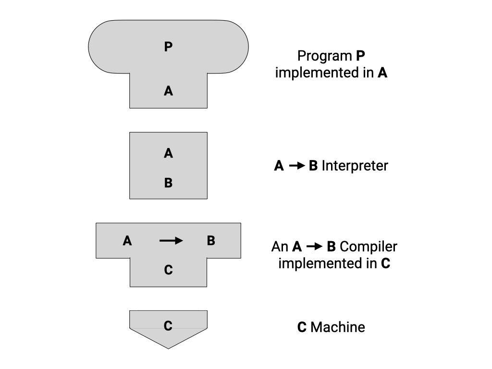
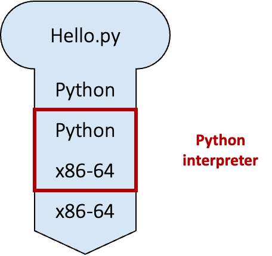
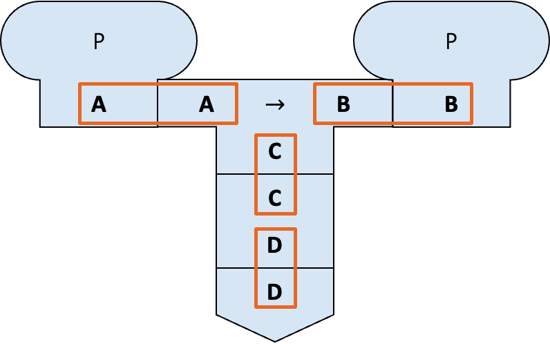
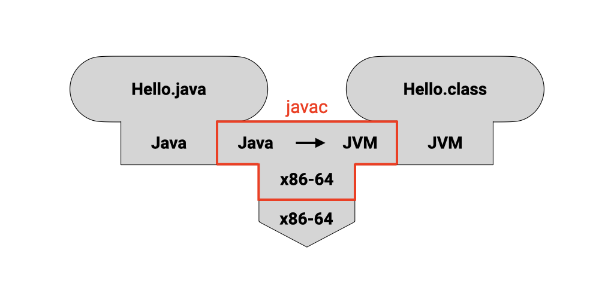
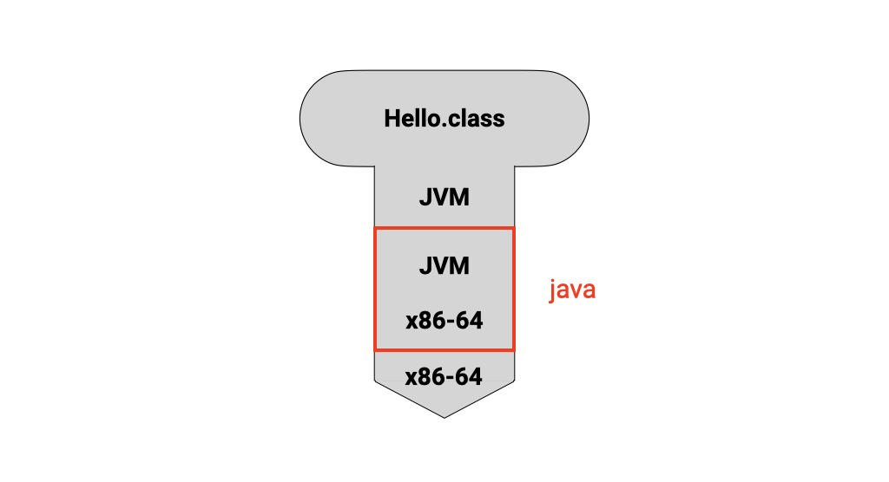
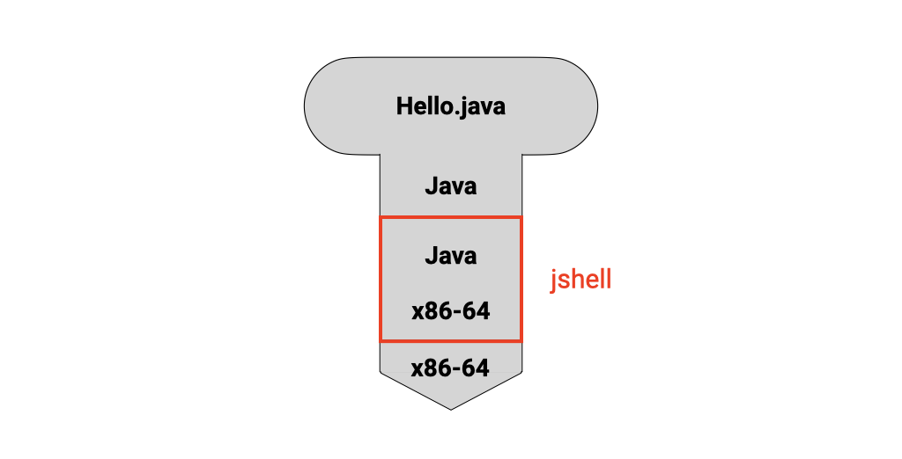

# Unit 1: Program and Compiler


!!! abstract "Learning Objectives"

    After this unit, students should
    
    - recap some fundamental programming concepts, including the concept of a program, a programming language, a compiler, and an interpreter.
    - be aware of two modes of running a Java program (compiled vs. interpreted).
    - be aware that compile-time errors are better than run-time errors, but the compiler cannot always detect errors during compile time.


## Software Program

A software program is a collection of data variables and instructions on how to modify these variables.  To dictate these instructions to the computer, programmers usually write down the instructions using a programming language, expressing their instructions in code that is made up of keywords, symbols, and names.  

A programming language is a formal language that helps programmers specify _precisely_ what the instructions are at a higher level of _abstraction_ (_i.e._, at a higher conceptual level) so that a programmer only needs to write a few lines of code to give complex instructions to the computer.  


## Compiled vs. Interpreted Programs

The processing unit of a computer can only accept and understand instructions written in machine code.  A program, written in a higher-level programming language, therefore needs to be translated into machine code before execution.  There are different approaches to how such translations can be done.  The first approach uses a _compiler_ -- a software tool that reads the entire program written in a higher-level programming language and translates it into machine code.  The machine code is then saved into an executable file, which can be executed later.  `clang`, a C/C++ compiler, is an example.  The second approach uses an _interpreter_ -- software that reads in the program one statement at a time interprets what the statement means, and executes it directly.   This is how Python and Javascript programs are executed. 

Modern programming systems for executing programs are, however, more sophisticated.  V8, for instance, is an open-source engine that executes Javascript, and it contains both an interpreter that first interprets a Javascript program into _bytecode_ (an intermediate, low-level representation) and its execution engine. A just-in-time compiler then reads in the bytecode and generates machine code dynamically at runtime with optimized performance. 

Java programs, on the other hand, can be executed in two ways:

1. The Java program can first be compiled into bytecode.  During execution, the bytecode is interpreted and compiled on the fly by the _Java Virtual Machine_ (JVM) into machine code.
2. The Java program can be interpreted by the Java interpreter.

To better understand this distinction, we will introduce a visual aid to describe the relationships between programs, compilers, interpreters, and machines.

### Tombstone Diagrams (T-Diagrams)
Tombstone Diagrams or T-diagrams consist of combinations of the following four components: 

- *Programs* which are implemented in a particular language (_i.e.,_ `Java`, `Python`, `C/C++`)
- Language **A** *Interpreters* implemented in language **B**
- Language **A** to language **B** *Compilers* which are implemented in a language **C**
- Physical *Machines* implementing a particular language (_i.e._, x86-64, ARM-64)

These components are represented in T-diagrams as shown in the figure below:

{ width=500 }

We can treat these components like "puzzle pieces" and build diagrams to describe various execution, compilation, or interpreted processes.  For example, in the diagram below, a Python script `Hello.py` is being interpreted by the Python interpreter running on the x86-64 architecture.

{ width=375 }

*Note:* In order for the diagram to be valid, adjacent connected diagram components need to match. This can be seen in the diagram below (highlighted with blue boxes).

{ width=700 }

Since CS2030/S uses Java, we will now look at the two approaches to execute a Java program in more detail (without worrying about how to write a single line of Java first).

### Compiling and Running Java Programs

Suppose we have a Java program called `Hello.java`.  To compile the program, we type[^1]

```
$ javac Hello.java
```

into the command line.  `javac` is the Java compiler.  This step will either lead to the bytecode called `Hello.class` being created or generate some errors.  This process can be seen in the figure below, where the `Hello.java` program is compiled from Java to the JVM language (_bytecode_). The Java compiler `javac` in this diagram is implemented in the x86-64 machine language.

{ width=700 }

Assuming that there is no error in compilation, we can now run

```
$ java Hello
```

to invoke the JVM `java` and execute the bytecode contained in the file `Hello.class`. This can be seen in the figure below, where the `Hello.class` program is interpreted from JVM language (_bytecode_) to the x86-64 machine language.

{ width=375 }

[^1]: The `$` represents the command prompt in a shell and you do not need to type this.

Beginners tend to confuse between `javac` and `java`, and whether to add the extension `.java` or `.class` when compiling and executing a Java program.  Do take note and refer back here if needed[^2].

[^2]: To add to the confusion, Java 11 introduces a shortcut where we can run `java Hello.java` directly.  This command causes `Hello.java` to be compiled and executed in a single step.  We won't do this in CS2030/S (i) to avoid confusion and (ii) to show you the steps explicitly.

!!! failure "Common Mistakes"
    A common mistake when compiling and running a Java program is to use the `java` command on a `.java` file instead of the `javac` command.
    To make matters worse, you can **sometimes** run the `.java` program using the `java` command seemingly bypassing the need for compilation using the `javac` command.
    This feature is called ["Launch Single-File Source-Code Programs"](https://openjdk.org/jeps/330).
    In general, avoid the following command:

    ```
    $ java Hello.java
    ```

### Interpreting a Java program

Java (version 8 or later) comes with an interpreter called `jshell` that can read Java statements, evaluate them, and print the results[^3]. `jshell` is useful for learning and experimenting with Java.   This can be seen in the figure below, where the `Hello.java` program is interpreted from Java directly to the x86-64 machine language. 

{ width=375 }

To run `jshell` in interactive mode, we type

```
$ jshell
```

on the command line, which causes an interactive prompt to appear:

```
$ jshell
|  Welcome to JShell -- Version 17
|  For an introduction type: /help intro

jshell>
```

We can now type in Java code on `jshell>`. 

Alternatively, we can also include all the Java statements that we want `jshell` to run in a file and pass it into jshell

```
$ jshell Hello.jsh
```

[^3]: Such a program is called REPL (Read-Evaluate-Print in a Loop) for short.

While `jshell` is a convenient way to test things out and play with new Java concepts as we learn, do keep in mind that `jshell` combines both compilation and run-time into a single step.  The error spewed out by `jshell` could be either a compile-time error or a run-time error, and this could be confusing to beginners who try to distinguish between the two phases of program execution.

!!! note "jsh vs java"
    Files intended to be run on `jshell` typically uses `.jsh` extension while files intended to be compiled and run use `.java` extension.  However, this difference is merely a convention.  You can still interpret `.java` program on `jshell`.

## Compiler

!!! quote
    _"One man's program is another program's data."_

    Olivier Danvy

The compiler does more than just translate source code into machine code or bytecode.  The compiler also needs to parse the source code written and check if it follows the precise specification of the programming language (called _grammar_) used, and produces a _syntax error_ if the grammar is violated.  It therefore can detect any syntax error before the program is run.

It is much better for a programmer to detect any error in its code during compilation -- since this is the phase when the program is still being developed and under the control of the programmer.  Runtime error, on the other hand, might occur when the customers are running the program, and so are much less desirable.  As such, we try to detect errors as much as possible during compilation.  The compiler is a powerful friend for any programmer if used properly.

The power of the compiler, however, is limited.  A compiler can only read and analyze the source code without actually running it.  Without running the program, the compiler cannot always tell if a particular statement in the source code will ever be executed; it cannot always tell what values a variable will take.

To deal with this, the compiler can either be _conservative_, and report an error as long as _there is a possibility_ that a particular statement is incorrect; or, the compiler can be more _permissive_, reporting an error only if _there _is no _possibility_ that a particular statement is correct.  If there is a possibility that a particular statement is correct, it does not throw an error but relies on the programmer to do the right thing.  We will further contrast these two behaviors later in this module.
