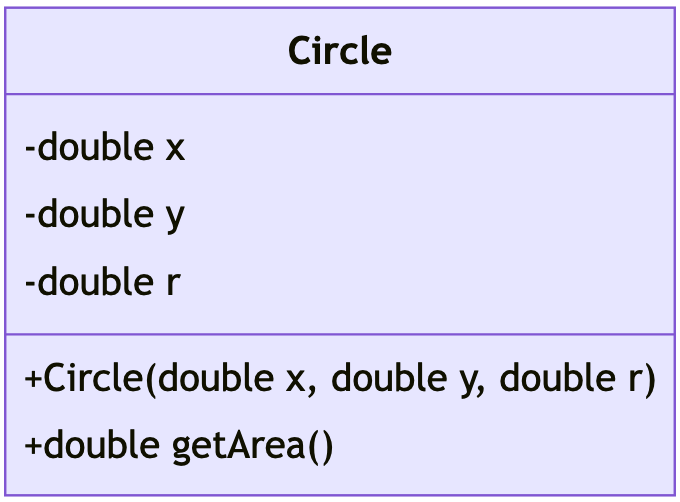

# Unit 5: Information Hiding

!!! abstract "Learning Objectives"

    Students should

    - understand the drawback of breaking the abstraction barrier.
    - understand the concept of information hiding to enforce the abstraction barrier.
    - understand how Java uses access modifiers to enforce information hiding.
    - understand what is a constructor and how to write one in Java.

## Breaking the Abstraction Barrier

In the ideal case, the code above the abstraction barrier would just call the provided interface to use the composite data type.  There may, however, be cases where a programmer intentionally or accidentally break the abstraction barrier.  

Consider the case of `Circle` from before, where we modify the radius `r` directly with `c.r = 10`.  In doing so, we, as the client to `Circle`, make an explicit assumption of how `Circle` implements a circle.  The implementation details have been leaked outside the abstraction barrier.   Now, if the implementer wishes to change the representation of the `Circle`, to say, store the diameter, instead.  This small implementation change would invalidate the code that the client has written!  The client will have to carefully change all the code that makes the assumption, and modify accordingly, increasing the chances of introducing a bug.

!!! example
    Imagine that we -- as a client -- wrote the following code:

    ```Java
    Circle c = new Circle();
    c.r = 10;
    ```

    There is an implicit assumption here that the field `r` is meant to be radius.  In fact, only one of the implementation of `Circle` below can work with the code above.  In other words, if the implementer changes the implementation details, the client code above will no longer work.  The changes can be: (i) changing the name of the field (_e.g., Implementation #2_) or (ii) changing the meaning of the field (_e.g., Implementation #3_).

    === "Implementation #1"
        ```Java
        class Circle {
          double x;
          double y;
          double r; // r for radius

          double getArea() {
            return 3.141592653589793 * r * r;
          }
        }
        ```

    === "Implementation #2"
        ```Java
        class Circle {
          double x;
          double y;
          double d; // d for diameter

          double getArea() {
            return 3.141592653589793 * d * d / 4.0;
          }
        }
        ```

    === "Implementation #3"
        ```Java
        class Circle {
          double x;
          double y;
          double r; // r but for radiameter? anyway, it's just a name so please use meaningful name!

          double getArea() {
            return 3.141592653589793 * r * r / 4;
          }
        }
        ```

From the perspective of the implementer, we want to expose as few fields/methods as possible.  This can be achieved via data hiding.  From the client's perspective, you should only follow the behavior as stated in the actual specification such as [Java API](https://docs.oracle.com/en/java/javase/17/docs/api/index.html).  Whenever possible, do not rely too much on observable behavior or any changes to the implementation of the API will break your program.

!!! quote "[Hyrum's Law](https://www.hyrumslaw.com/)"
    _"With a sufficient number of users of an API, it does not matter what you promise in the contract: all observable behaviors of your system will be depended on by somebody."_

    As an anecdote, the story goes that Windows operating system skips Windows 9 and went straight from Windows 8.1 to Windows 9 because some developers perform the following compatibility check:

    ```java
    if (version.startsWith("Windows 9") {
      // Windows 95 and 98
    } else { /* .. */ }
    ```

## Data Hiding

Many OO languages allow programmers to explicitly specify if a field or a method can be accessed from outside the abstraction barrier.  Java, for instance, supports `private` and `public` access modifiers.  A field or a method that is declared as `private` cannot be accessed from outside the class, and can only be accessed within the class.  On the other hand, as you can guess, a `public` field or method can be accessed, modified, or invoked from outside the class.

Such a mechanism to protect the abstraction barrier from being broken is called _data hiding_ or _information hiding_.  This protection is enforced by the _compiler_ at compile time.

In our original `Circle` class (_v0.1_) in [Unit 4](04-encapsulation.md), we did not specify any access modifier -- this amounts to using the _default_ modifier, the meaning of which is not our concern right now[^1]  For a start, we will explicitly indicate `private` or `public` for all our methods and fields.

=== "Private Field"
    ```Java
    // Circle v0.2
    class Circle {
      private double x;
      private double y;
      private double r;

      public double getArea() {
        return 3.141592653589793 * r * r;
      }
    }
    ```

    Testing
    ```Java
    Circle c = new Circle();
    c.r = 10; // error
    ```

    ---

=== "Public Field"
    ```Java
    // Bad Circle
    class Circle {
      public double x;
      public double y;
      public double r;

      public double getArea() {
        return 3.141592653589793 * r * r;
      }
    }
    ```

    Testing
    ```Java
    Circle c = new Circle();
    c.r = 10; // ok
    ```

    ---

[^1]: The other access modifier is `protected`.  Again, we do not want to worry about this modifier for now.

Now the fields `x`, `y`, and `r` are hidden behind the abstraction barrier of the class `Circle`.  Note that these fields are not accessible and modifiable outside of the class `Circle`, but they can be accessed and modified within `Circle` (_inside the abstraction barrier_), such as in the methods `getArea`.

!!! note "Within the Class or Within the Object?"
    Note the wording that we used.  Fields and methods with `private` access modifier can only be accessed from within the **class**.  This means that we can access a field belonging to a different object as long as the other object has the same class!

    Why is this the case?  In abstraction barrier, the difference between implementer and client is about who is **writing the class**.  So the implementer write the code for `Circle` and she is responsible for the behavior of `Circle`, even when relating to other circles.  As such, the following code is allowed and does not break the abstraction barrier because the implementer only works with `Circle`, even if the circle is from a different object.

    ```Java
    // Circle v0.2.5
    class Circle {
      private double x;
      private double y;
      private double r;

      public double getArea() {
        return 3.141592653589793 * r * r;
      }

      public boolean isLarger(Circle c) {
        return this.r > c.r;  // ok even if c.r is private because c is Circle and we are inside the Circle class!
      }
    }
    ```

!!! bug "Breaking Python's Abstraction Barrier"
    Python tries to prevent _accidental_ access to internal representation by having a convention of prefixing the internal variables with `_` (_one underscore_) or `__` (_two underscores_).   This method, however, does not prevent a lazy programmer from directly accessing the variables and possibly planting a bug/error that will surface later.

So, as a quick summary, the two access modifiers are shown below.

| Acessed from | `private` | `public` |
|--------------|-----------|----------|
| _inside the class_ | :material-check: | :material-check: |
| _outside the class_ | :material-close: | :material-check: |

## Constructors

With data hiding, we completely isolate the internal representation of a class using an abstraction barrier.  But, with no way for the client of the class to modify the fields directly, how can the client initialize the fields in a class?  To get around this, it is common for a class to provide methods to initialize these internal fields.

A method that initializes an object is called a _constructor_.

A constructor method is a special method within the class.  It cannot be called directly but is invoked automatically when an object is instantiated (_i.e., when the keyword_ `new` _is used_).  In Java, a constructor method _has the same name as the class_ and _has no return type_.  A constructor can take in arguments just like other functions.  Let's add a constructor to our `Circle` class:

```Java
// Circle v0.3
class Circle {
  private double x;
  private double y;
  private double r;

  // Constructor
  public Circle(double x, double y, double r) {
    this.x = x;
    this.y = y;
    this.r = r;
  }

  public double getArea() {
    return 3.141592653589793 * this.r * this.r;
  }
}
```

Let us see the constructor in more details.  Notice what we have in the constructor.  Besides the parameters and function body, We only have access modifiers and the function name.  Additionally, the function name is exactly the same as the class name (_i.e.,_ `Circle`).

```Java
// access modifiers   function name   parameters
   public             Circle          (double x, double y, double r) {
       : // omitted
   }
```

As we have seen from [Unit 4](04-encapsulation.md), the access modifiers can actually be omitted.  So minimally, the constructor can simply be the following:

```Java
// function name   parameters
   Circle          (double x, double y, double r) {
       : // omitted
   }
```

Now, to create a `Circle` object, we need to pass in three arguments:

```Java
Circle c = new Circle(0.0, 0.5, 10.0);
```

!!! note "Constructor in Python and JavaScript"
    In Python, the constructor is the `__init__` method.   In JavaScript, the constructor is simply called `constructor`.

### Default Constructor

Our original circle v0.1 does not have constructor.  But as you will see below, the use of `new` keyword actually invokes a constructor.  So how does it work if there is no constructor written?  Java has a rule that adds _default_ constructor if no constructor is given at all.

!!! info "Default Constructor"
    If there is no constructor given, then a default constructor is added automatically.  The default constructor takes no parameter and has no code written for the body.  In the case of circle v0.1, the default constructor would be the following.

    ```Java
    Circle() {
    }
    ```

    Notice the condition "_if no constructor is given at all_".  Therefore, if there is at least one constructor written, then the default constructor will not be added automatically.

## The `this` Keyword

The code above also introduces the `this` keyword.  `this` is a reference variable that refers back to self, and is used to distinguish between two variables of the same name.  In the example above, `this.x = x` means we want to set the field `x` of this object to the parameter `x` passed into the constructor.

Without the use of `this` keyword, our constructor looks like the following.

```Java
// Constructor
public Circle(double x, double y, double r) {
  x = x;
  y = y;
  r = r;
}
```

Think about that for a moment.  What is the expected behavior of `x = x`?  In this case, because `x` is a parameter, we are actually assigning the value of the parameter `x` back to the parameter `x`.  In other words, it is doing nothing!  The field has not been updated with the value of parameter `x`.

Now that you have been introduced to `this`, we have also updated the method body of `getArea` and replaced `r` with `this.r`.  Although there is nothing syntactically incorrect about using `r`, sticking to the idiom of referring to members through the `this` reference makes the code easier to understand to readers.  We are making it explicit that we are referring to a field in the class, rather than a local variable or a parameter.

So the keyword `this` can be automatically added if there is no ambiguity that we are referring to the field.  In the method `getArea`, we do not have parameter `r`.  So, all occurrences of `r` must refer to the name `r` from the _outer scope_.  The outer scope is the scope of the class for which the name `r` refers to the field.  This is why the statement

```Java
return 3.141592653589793 * r * r;
```

is equivalent to

```Java
return 3.141592653589793 * this.r * this.r;
```

So `this` keyword will be assigned the current instance.  But what exactly is the current instance when the method `getArea` is invoked?  The code snippet below shows how the method is actually invoked.

```Java
Circle c1 = new Circle(0.0, 0.0, 1.0);
Circle c2 = new Circle(0.0, 0.0, 2.0);
double area = c1.getArea();
```

So what should the value of `area` be?  Is it the area from `c1` (_i.e., approximately $\pi$_) or is it the area from `c2` (_i.e., approximately $4\pi$_)?  Looking at the way the method is invoked, (_i.e.,_ `c1.getArea()`), we can see that the relevant instance is `c1`.  So we should expect the result to be approximately $\pi$.

More generally, given the following method invocation

```Java
obj.f(..)
```

the value of `this` keyword will be `obj` within the method `f`.

### Fully Qualified Name

We have seen how Java compiler does a little bit of renaming to remove ambiguity.  In the example before, the compiler replaces `r` with `this.r`.  Of course this replacement is done automatically and uses a simple set of rule based on the nearest scope.  So we can say that `this.r` is less ambiguous than `r`.

Unfortunately, as you will see in the future, even `this.r` may still be ambiguous.  Fortunately, there is a name that can always be used to unambiguously refer to a specific name, be it variable or field.  This is called the fully qualified name (FQN).

- FQN always starts with a sequence of class names separated by a dot.
- If the name refers to a field, the FQN is then followed by the keyword `this`.  Otherwise, there is no keyword `this`.
- Finally, the FQN is followed by the actual name used.

For example, in the case of `this.r`, the fully qualified name is actually `Circle.this.r`.  For now, we only have a single class name, which is `Circle`.  To understand this better, we have split the FQN into its components.

```Java
// class name  (dot)  refer to field  (dot)  name
   Circle        .    this              .    r;
```

In most cases, we do not need to write the FQN.  However, it is a good practice to always keep in mind that such renaming may happen and to hopefully understand that it may lead to unexpected problem (_e.g., not actually updating the field if we write_ `x = x` _in constructor_).

## Checking

Violations to access modifiers are checked by the compiler.  In particular, trying to access, update, or invoke fields or methods with `private` modifier will give a compilation error.

!!! example "Example of Violation"
    Class `C1` in a class `C1.java`.

    ```Java
    class C1 {
      private int x;

      public C1(int x) {
        this.x = x;
      }
    }
    ```

    Class `C2` in a class `C2.java`.

    ```Java
    class C2 {
      private int y;

      public C2(int y) {
        this.y = y;
      }

      public boolean isEqual(C1 c) {
        return this.y == c.x;
      }
    }
    ```

    Try compiling them using `javac C1.java C2.java` and you will see the following error message.

    ```
    C1.java:9: error: x has private access in C1
            return this.y == c.x;
                              ^
    ```

## When is Constructor Called?

You may be wondering why there is no return type or why there is not even a `return` statement on constructor.  If a constructor does not return anything, how can we even assign `new Circle(..)` into a variable `Circle c` in the code snippet above?  The answer lies in the keyword `new`.  This keyword does the heavy-lifting.  We can explain the behavior of a constructor in 3 steps:

1. Allocate sufficient memory location to store all the fields of the class and assign this reference to the keyword `this`.
2. Invoke the constructor function and passing the keyword `this` _implicitly_.
3. Once the constructor is done, return the reference pointed to by `this` back.

Firstly, this is why constructor does not have a `return` statement or the return type.  It does not even use the keyword `void`.  Secondly, this is why `new Circle(..)` can be assigned to `Circle c` because the `new` keyword returns the reference to the newly created object in step 3.


!!! note "Class Diagram (_Part 2_)"

    Now that we have access modifiers, we can add a visualisation for these access modifiers in our class diagram.

    | Modifier | Symbol |
    |----------|--------|
    | `private` | `-` |
    | `public` | `+` |

    And so the class `Circle` (_reproduced below_)

    ```Java
    // Circle v0.3
    class Circle {
      private double x;
      private double y;
      private double r;

      // Constructor
      public Circle(double x, double y, double r) {
        this.x = x;
        this.y = y;
        this.r = r;
      }

      public double getArea() {
        return 3.141592653589793 * this.r * this.r;
      }
    }
    ```

    has the following class diagram.

    { width=300px }

    Here we can also see that the constructor is represented as a method `+Circle(double x, double y, double r)`.  Note how this method does not have return type.  Assuming some _common sense_, we can guess that the code for the constructor is likely to simply be 3 assignments where the parameters are assigned to the fields with the same name.

    Additionally, we can see that the fields `x`, `y`, and `r` are all `private`.  Coupled with the only public method `+double getArea()` and assuming _common sense_ that the method `getArea` does not change any of the fields, we can also guess that properties of a circle cannot be modified once it is created.

    Of course our guesses might be wrong.  But we can already see the usefulness of class diagram in narrowing down some possibilities.  In fact, if you are the implementer of the class `Circle`, the class diagram can guide you on what your code would look like without actually coding.