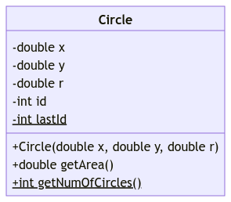

# Unit 8: Class Methods

!!! abstract "Learning Objectives"

    Students should

    - understand the differences between instance methods and class methods.
    - be able to define and use a class method.
    - know that the `main` method is the entry point to a Java program.
    - the modifies and parameters required for a `main` method.

## Static Methods

Let's suppose that, in our program, we wish to assign a unique integer identifier to every `Circle` object ever created.  Without using class fields, we might attempt the following.

```Java hl_lines="5"
class Circle {
  private double x;  // x-coordinate of the center
  private double y;  // y-coordinate of the center
  private double r;  // the length of the radius
  private final int id; // identifier

  public Circle(double x, double y, double r, int id) {
    this.x = x;
    this.y = y;
    this.r = r;
    this.id = id;
  }

    : // code omitted
}
```

Then, on every instantiation of circle, we will have to explicitly supply the latest value for `id`.

```Java
Circle c = new Circle(x, y, lastId);
```

Of course this can be tedious and prone to error especially if we may instantiate `Circle` in multiple places.  Then we will have to ensure that the latest value of `id` is communicated on these places correctly.

As an improvement, we may actually just let the value of the latest `id` be stored in the class `Circle` itself as a class field.

```Java hl_lines="6"
class Circle {
  private double x;  // x-coordinate of the center
  private double y;  // y-coordinate of the center
  private double r;  // the length of the radius
  private final int id; // identifier
  public static int lastId = 0; // the id of the latest circle instance

  public Circle(double x, double y, double r) {
    this.x = x;
    this.y = y;
    this.r = r;
    this.id = id;
  }

    : // code omitted
}
```

Then, each time we instantiate a circle, we have to: (i) retrieve the value of `lastId` and (ii) update the value of `lastId`.

```Java
Circle c = new Circle(x, y, Circle.lastId);
Circle.lastId++;
```

While better, this is still prone to error as it relies on the fact that the client should not forget to use and update.  Furthermore, it requires the client to update it correctly and not just set the value of `lastId` to some random value.  But this can be done better if this is the responsibility of the implementer instead.  This can be done with the use of class method.

```Java hl_lines="5 6 15 16 22 23 24"
class Circle {
  private double x;  // x-coordinate of the center
  private double y;  // y-coordinate of the center
  private double r;  // the length of the radius
  private final int id; // identifier
  private static int lastId = 0; // the id of the latest circle instance

  /**
   * Create a circle centered on (x, y) with a given radius
   */
  public Circle(double x, double y, double r) {
    this.x = x;
    this.y = y;
    this.r = r;
    this.id = Circle.lastId;
    Circle.lastId += 1;
  }

  /**
   * Return how many circles have ever existed.
   */
  public static int getNumOfCircles() {
    return Circle.lastId;
  }
}
```

- On Line 5, we added a new instance field `id` to store the identifier of the circle.  Note that, since the identifier of a circle should not change once it is created, we use the keyword `final` here.
- On Line 6, we added a new class field `lastId` to remember that the `lastId` of the latest circle instance.  This field is maintained as part of the class `Circle` and is initialized to 0.  Now this class field is `private` instead of `public` because it is only accessed and updated within the constructor.
- On Line 15 and 16, as part of the constructor, we initialize `id` to `lastId` and increment `lastId`.   We explicitly access `lastId` through `Circle` to make it clear that `lastId` is a class field.

Note that all of the above are done privately beneath the abstraction barrier.  In other words, the class field that we have added is actually set to `private`.  Additionally, now it does not matter what the client does, the value of `lastId` will correctly reflect the number of circle that has been created.  The client need not even know about the existence of this class field.

Since `lastId` is incremented by one every time a circle is created, we can also interpret `lastId` as the number of circles created so far.  On Line 22-24, we added a method `getNumOfCircles` to return its value.

The interesting thing here is that we declare `getNumOfCircles` with a `static` keyword.  Similar to a `static` field, a `static` method is associated with a class, not to an instance of the class.  Such method is called a _class method_.  A class method is always invoked without being attached to an instance, and so it cannot access its instance fields or call other of its instance methods.  The reference `this` has no meaning within a class method.  Furthermore, just like a class field, a class method should be accessed through the class.  For example, `#!Java Circle.getNumOfCircles()`.

Other examples of class methods include the methods provided in `java.lang.Math`: `sqrt`, `min`, etc.  These methods can be invoked through the `Math` class: e.g., `Math.sqrt(x)`.

### Non-Static from Static

Recap that for static fields (_i.e., class fields_), we only have exactly one instance of it throughout the lifetime of the program.  More generally, a field or method with modifier `static` belongs to the class rather than the specific instance.  In other words, they can be accessed/updated (_for fields, assuming proper access modifier_) or invoked (_for methods, assuming proper access modifier_) without even instantiating the class.

Think for a moment about the consequence of this.  If we have not instantiate the class, it means that there is no instance.  The keyword `this` captures the _current instance_.  If there is no instance, the keyword `this` cannot be referring to any instance.  Therefore, it is not reasonable to assign a specific value to `this` keyword.

Since we have no reasonable value for `this` within the context of `static` method, Java actually prevents the use of `this` from any method with `static` modifier.

```Java
  public static int getLastId() {
    return this.id;  // what is "this" if no Circle has been created?  what if there are 100 circles?
  }
```

Try it out, you will get the following error.

```
_.java:_: error: non-static variable this cannot be referenced from a static context
  	return this.id;
               ^
```

The opposite is not true.  We can access class fields from non-static methods.

## The `main` method

The most common class method you will use is probably the `main` method.

Every Java program has a class method called `main`, which serves as the entry point to the program.  To run a Java program, we need to tell the JVM the class whose `main` method should be invoked first.  In the example that we have seen,
```
java Hello
```

will invoke the `main` method defined within the class `Hello` to kick start the execution of the program.

The `main` method must be defined in the following way:
```Java
public static final void main(String[] args) {
}
```

You have learned what `public` and `static` means.  The return type `void` indicates that `main` must not return a value.  We have discussed what `final` means on a field, but are not ready to explain what `final` means on a method yet.  In fact, this is an _optional_ modifier for the `main` method.

The `main` method takes in an array (`[]`) of strings as parameters.  These are the command-line arguments that we can pass in when invoking `java`.  [`String`](https://docs.oracle.com/en/java/javase/11/docs/api/java.base/java/lang/String.html) (_or_ `java.lang.String`) is another class provided by the Java library that encapsulates a sequence of characters.


!!! note "Class Diagram (_Part 3_)"

    Static fields and/or methods are represented by underline in class diagram.  The current version of `Circle` has the following class diagram.

    { width=300px }

    If the number of constructs for class diagram is getting too much, do not worry, we will have a unit added to the Java Guide specifically to revise class diagram with application on designing solutions to problems.