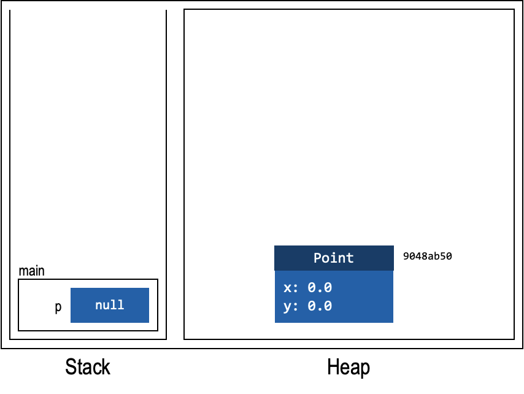
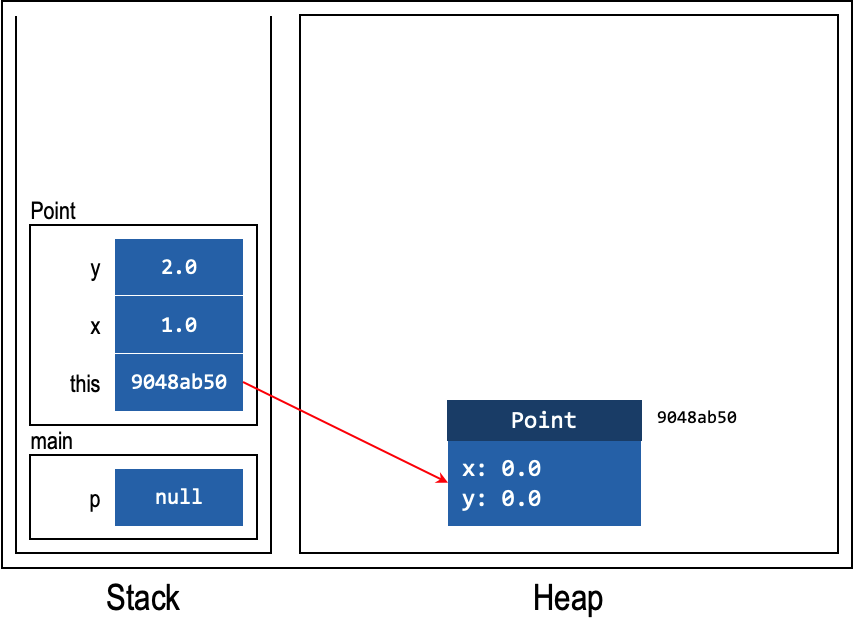
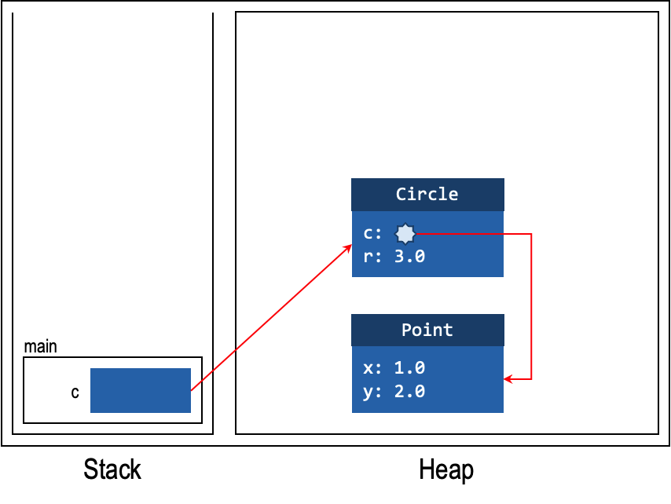
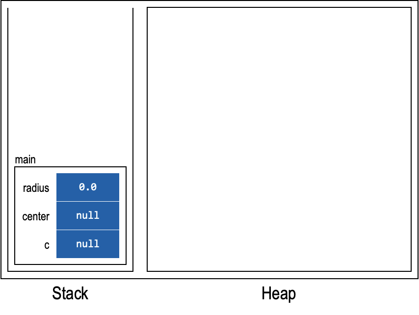
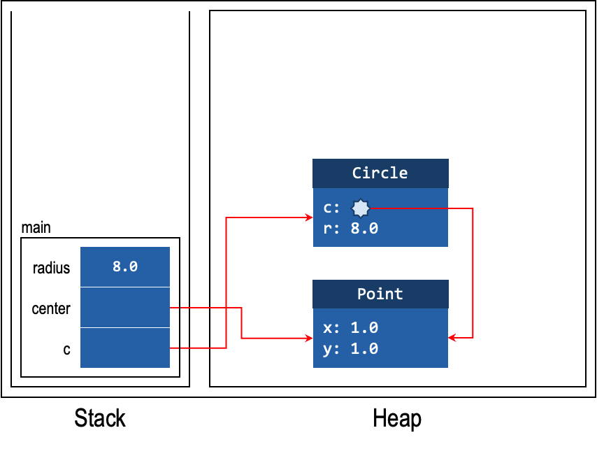
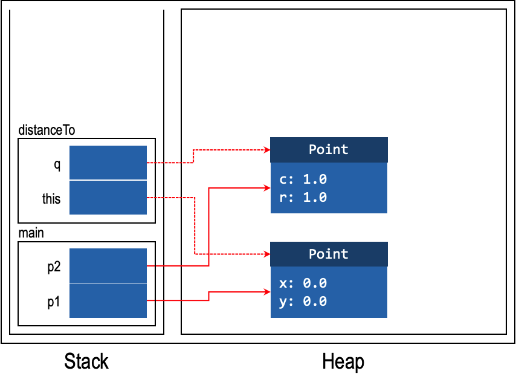
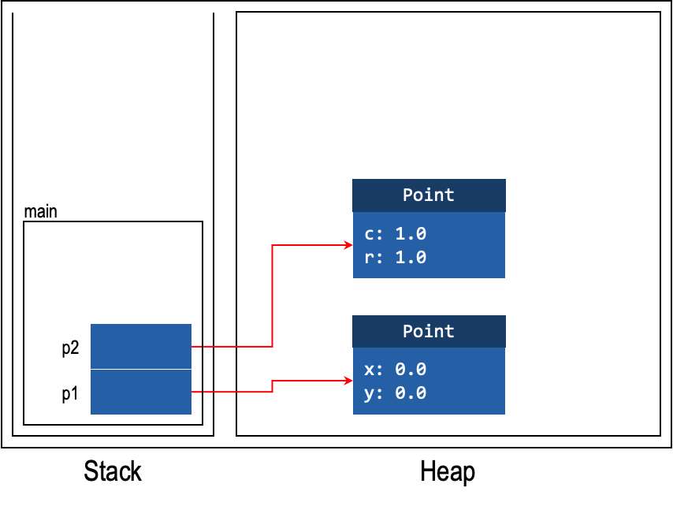
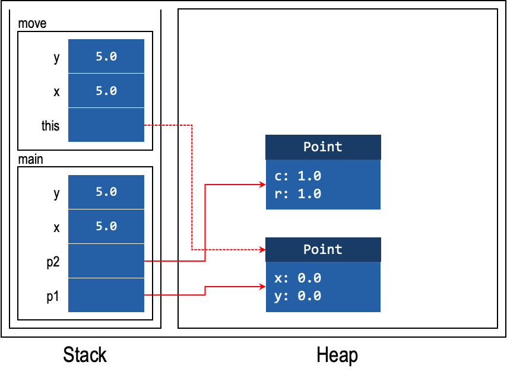
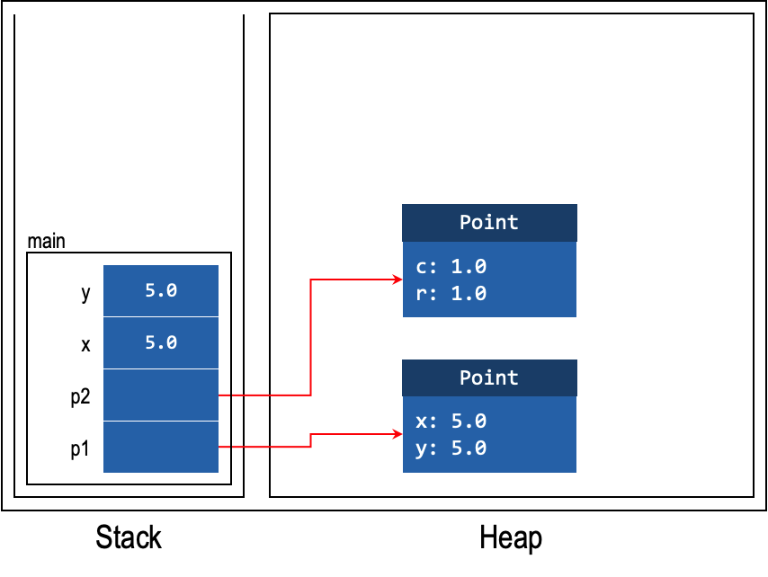

# Unit 10: Heap and Stack

!!! abstract "Learning Objectives"

    After taking this unit, students should:

    - understand when memory is allocated/deallocated from the heap and from the stack
    - understand the concept of call stack in JVM


## Heap and Stack

The Java Virtual Machine (JVM) manages the memory of Java programs while its bytecode instructions are interpreted and executed.  Different JVM implementations may implement these differently, but typically a JVM implementation partitions the memory into several regions, including:

- _method area_ for storing the code for the methods;
- _metaspace_ for storing meta information about classes;
- _heap_ for storing dynamically allocated objects;
- _stack_ for local variables and call frames.

Since the concepts of heap and stack are common to all execution environments (either based on bytecode or machine code), we will focus on them here.

The _heap_ is the region in memory where all objects are allocated and stored, while the _stack_ is the region where all variables (including primitive types and object references) are allocated and stored.

### Stack

The stack contains variables.  Please note that instance and class fields are **not** variables.  As such, fields are not in the stack.

Recall that the same variable names can exist in the program as long as they are in different methods.  This means that the variables are contained within the _call frames_.  Call frames are created when we invoke a method and are removed when the method completes.

Like a "stack of books" where we can only take the book at the top and can only put more books at the top, the call frames in the stack can only be added or removed from the top.  This behavior is also called Last-In First-Out (LIFO).  In other words, the last element that is inserted (i.e., Last-In) is the first element to be removed (i.e., First-Out).

{ width=500px }

### Heap

The heap stores dynamically allocated objects.  To put it simply, whenever you use the keyword `new`, a new object is created in the heap.

Unlike the stack, there is no concept of LIFO.  So, an object can persist across multiple method invocations.  This also means that an object can be shared between multiple method invocations.

An object in the heap contains the following information:

- Class name.
- Instance fields and the respective values.
- Captured variables (more on this in later units).

{ width=150px }

## Examples

### Constructor
Consider the following two lines of code.
```Java
Point p;
p = new Point(1, 2);
```

Line 1 declares a variable `p`.  When the JVM executes this line of code, it allocates some memory space for an object reference for `p`, the content is currently _uninitialized_.  We show uninitialized variables with the content having the symbol ∅.  Since `p` is a variable, it resides in the stack.

Line 2 creates a new `Point` object.  When the JVM executes this line of code, it (i) allocates some memory space for a `Point` object on the heap, (ii) invokes the constructor, and (iii) returns the reference to the newly allocated memory space back.  The returned memory address of this memory space becomes the reference of the object and is assigned to the variable `p`.

This is shown in the figures below in three steps.  Note that we assume that the code snippet above is in the static method called `main`.  Although technically there should be a parameter in the call frame of `main` usually called `args` due to the typical main method `public static void main(String[] args)`, we will often omit this because the name and values are unknown.

Note the crucial difference between the static method `main` and the constructor.  A static method does not have `this` in its call frame.  On the other hand, non-static methods, including constructors, have `this` in their call frames.

Although we mentioned that `this` is a keyword, it behaves mostly like a variable[^1].  As such, we have its representation in the stack.  Further, note that the parameters are ordered with the leftmost parameter appearing at the bottom of the call frame after the keyword `this` (if any).

[^1]: It can also behave like a function/method in the sense that it can be invoked (_e.g.,_ `this(..)`).  In this case, the keyword `this` represents the constructor of the current class.  We will illustrate more of this on the topic of overloading.

=== "After Line 1"
    

    ---

=== "Allocate Memory"
    

    ---

=== "Invoke Constructor"
    

    ---

=== "End of Constructor"
    

    ---

=== "Return from Constructor"
    

    ---

Note that we use the symbol ∅ to indicate that the variable is not yet initialized.  Java differentiates between uninitialized variables and variables initialized to `null`.  Uninitialized variables cannot be used.  Further, note that uninitialized fields have default values but not uninitialized variables.

Also, we will often simplify the presentation.  First, we will omit the memory address (e.g., 9048ab50).  The arrow from the variable `p` containing the value 9048ab50 to an object located at 9048ab50 is already an abstraction of this.  Furthermore, we do not know where the actual address will be and it will be different on different runs.  So, we can omit both memory addresses stored in the variable and of the object.

Secondly, we are often interested only in the snapshot of the stack and heap diagram at a particular moment.  As such, the intermediate call frames (e.g., Point constructor) that are inserted and then removed can be omitted.  Only the final effect matters.

Let us illustrate this further with the following code snippet.

```Java
Circle c;
c = new Circle(new Point(1, 2), 3);
```

In this case, the `new Point(1, 2)` is evaluated first to create an object in the heap.  Then, we evaluate `new Circle(.., 3)`.  The reference to this object is then assigned to the variable `c`.  The final effect is shown below.  Note that the field `c` in the class `Circle` is an arrow to the point object in the heap.



### Aliasing

Now, let's look at an example of aliasing in the stack and heap diagram with the following example.

```Java
Circle c;
Point center;
double radius;
radius = 8;
center = new Point(1, 1);
c = new Circle(center, radius);
center.moveto(2, 2);
```

In this example, we have three variables, `c`, `center`, and `radius`.  Lines 1-3 declare the variables, and as a result, we have three variables allocated on the stack.  Again, we assume that the code is in the static method `main`.  Do note the order of these variables in the stack.  Since we declared `c` first, it is located at the bottom of the stack.

Recall that, object references are initialized to `null`.  Primitive type variables (e.g., `radius`) are initialized to 0.0 because it is of type `double`.  If it is an `int`, then it will be initialized to 0 instead,

=== "After Lines 1-3"
    

    ---

=== "After Lines 4-6"
    

    ---

=== "After Line 7"
    

    ---


There is a clear example of aliasing here.  Note that the field `c` of variable `c` is referencing the same object as the variable `center`.  Hence, we can say that the expression `c.c` is an _alias_ of `center`.  In the stack and heap diagram, this is illustrated by having two different arrows pointing to the same location.

In this case, the expression `c.c` consists of two arrows.  The first is from variable `c` to the object `Circle`.  The second is from the field `c` to the object `Point`.  On the other hand, the variable `center` is pointing directly to the object `Point`.

We can also see that after Line 7, although the changes are done via `center.moveTo(..)`, the same object referenced by the expression `c.c` can see this change.


### Call Stack

Now, let's look at what happens when we invoke a method.  Take the `distanceTo` method in `Point` as an example:

```Java
class Point {
  private double x;
  private double y;

  public Point(double x, double y) {
    this.x = x;
    this.y = y;
  }

  public double distanceTo(Point q) {
    return Math.sqrt((q.x - this.x)*(q.x - this.x)+(q.y - this.y)*(q.y - this.y));
  }
}
```
and the invocation:
```Java
Point p1 = new Point(0, 0);
Point p2 = new Point(1, 1);
p1.distanceTo(p2);
```

After declaring `p1` and `p2` and creating both objects, we have:


When `distanceTo` is called, the JVM creates a _stack frame_ for this instance method call.  This stack frame is a region of memory that tentatively contains (i) the `this` reference, (ii) the method arguments, and (iii) local variables within the method, among other things[^2][^3].  When a class method is called, the stack frame does not contain the `this` reference.

[^2]: This is not that different from how an OS handles function calls in a machine code, as you will see in CS2100/CS2106.
[^3]: The other things are JVM implementation independent and not relevant to our discussion here.



You can see that the _references_ to the objects `p1` and `p2` are copied onto the stack frame. `p1` and `this` point to the same object, and `p2` and `q` point to the same object.
Within the method, any modification done to `this` would change the object referenced to by `p1`, and any change made to `q` would change the object referenced to by `p2` as well.
After the method returns, the stack frame for that method is destroyed.

Let's consider a new `move` method for the class `Point` that has two parameters `(double x, double y)` and moves the `x` and `y` coordinates of the `Point`.

```Java
class Point {
  private double x;
  private double y;

  public Point(double x, double y) {
    this.x = x;
    this.y = y;
  }

  public void move(double x, double y) {
    this.x = x;
    this.y = y;
  }
}
```

```Java
Point p1 = new Point(0, 0);
Point p2 = new Point(1, 1);
double x = 5;
double y = 5;
p1.move(x, y);
```

Again, we create a stack frame, copy the reference to object `p1` into `this`, copy `x` from the calling method to `x` the argument within the method, and copy `y` from the calling method to `y` the argument within the method.

=== "After Lines 1-2"
    

    ---

=== "After Lines 3-4"
    

    ---

=== "Method Invocation at Line 5"
    

    ---

=== "After Line 5"
    

    ---

What is important here is that, as `x` and `y` are primitive types instead of references, we copy the values onto the stack.  If we change `x` or `y` within `move`, the `x` and `y` of the calling function will not change.  This behavior is the same as you would expect in C.  However, unlike in C where you can pass in a pointer to a variable, you cannot pass in a reference to a primitive type in any way in Java.  If you want to pass a variable of primitive type into a method and have its value changed, you will have to use a _wrapper class_.  The details of how to do this are left as an exercise.

## Summary

To summarize, Java uses _call by value_ for primitive types, and _call by reference_ for objects[^4].

[^4]: Alternatively, you can think of Java as always using _call by value_.  It's just that the value of a reference is, in fact, just a reference.

If we make multiple nested method calls, as we usually do, the stack frames get stacked on top of each other. 

__One final note:__ the memory allocated on the stack is deallocated when a method returns.  The memory allocated on the heap, however, stays there as long as there is a reference to it (either from another object or from a variable in the stack).  Unlike C or C++, in Java, you do not have to free the memory allocated to objects.  The JVM runs a _garbage collector_ that checks for unreferenced objects on the heap and cleans up the memory automatically.