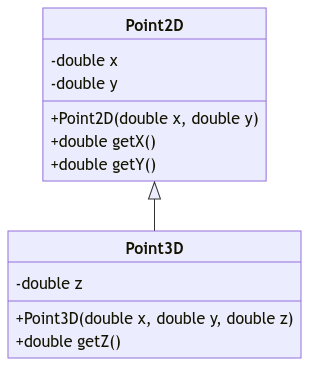
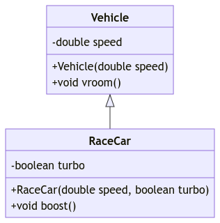

# Unit 11: Inheritance

!!! abstract "Learning Objectives"

    Students should

    - understand inheritance as a mechanism to extend existing code.
    - understand how inheritance models the IS-A relationship.
    - know how to use the `extends` keyword for inheritance.
    - understand inheritance as a subtype.
    - be able to determine the run-time type and compile-time type of a variable.

## Extension with Composition

We have seen how composition allows us to compose a new more complex class out of existing classes, without breaking the abstraction barrier of existing classes.  Sometimes, however, composition is not the right approach.  Let's consider the following example.  Let's suppose that we, as a client, want to add color as a property to our `Circle`.   

Without penetrating the abstraction barrier of `Circle`, we can do the following:

```Java
// version 0.1 (using composition)
class ColoredCircle {
  private Circle circle;
  private Color color;

  public ColoredCircle(Circle circle, Color color) {
    this.circle = circle;
    this.color = color;
  }
}
```

where `Color` is another abstraction representing the color of shapes.

What should we do if we want to calculate the area of our colored circle?  Suppose we already have a `ColoredCircle` instance called `coloredCircle`. We could make `circle` public and call `#!Java coloredCircle.circle.getArea()`, or we could add an accessor and call `#!Java coloredCircle.getCircle().getArea()`.  Both of these are not ideal, since it breaks the abstraction barrier and reveals that the `ColoredCircle` class stores a `circle` (_the latter being slightly better than the first_).

A better alternative is to let `ColoredCircle` provide its own `getArea()` method, and _forward_ its call to `Circle`.

```Java
// version 0.2 (using composition)
class ColoredCircle {
  private Circle circle;
  private Color color;

  public ColoredCircle(Circle circle, Color color) {
    this.circle = circle;
    this.color = color;
  }

  public double getArea() {
    return circle.getArea();
  }
}
```

Then, the client to `ColoredCircle` can just call `#!Java coloredCircle.getArea()` without knowing or needing to know how a colored circle is represented internally.  The drawback of this approach is that we might end up with many such boilerplate forwarding methods.  In fact, we need one boilerplate forwarding method for each method from `Circle` we want to access from `ColouredCircle`.

## Extension with Inheritance

Recall the concept of subtyping.  We say that $S <: T$ if any piece of code written for type $T$ also works for type $S$.  There is a quote that you can use to remember this.

!!! quote "Inheritance"
    _"Whenever a superclass is needed, a subclass can be given."_

    The reason the quote above works is because due to inheritance, the subclass _inherits_ all the (_public_) methods from the superclass.  Put it another way, given $S <: T$, if we know that $T$ has a (_public_) method called `foo`, we are sure that $S$ also has a (_public_) method called `foo` because the method is inherited by $S$.

Now, think about `ColoredCircle` and `Circle`.  If someone has written a piece of code that operates on `Circle` objects.  Do we expect the same code to work on `ColoredCircle`?  In this example, yes!  A `ColoredCircle` object should behave just like a circle -- we can calculate its area, circumference, check if two circles intersect, check if a point falls within the circle, etc.  The only difference, or more precisely, extension, is that it has a color, and perhaps has some methods related to this additional field.  So, `ColoredCircle` _is a subtype of_ `Circle`.

We now show you how we can introduce this subtype relationship in Java, using the `extends` keyword.  We can reimplement our `ColoredCircle` class this way:

```Java
// version 0.3 (using inheritance)
class ColoredCircle extends Circle {
  private Color color;

  public ColoredCircle(Point center, double radius, Color color) {
    super(center, radius);  // call the parent's constructor
    this.color = color;
  }
}
```

We have just created a new type called `ColoredCircle` as a class that extends from `Circle`.  We call `Circle` the _parent class_ or _superclass_ of `ColoredCircle`; and `ColoredCircle` a _subclass_ of `Circle`.  

We also say that `ColoredCircle` _inherits_ from `Circle`, since all the public fields of `Circle` (_center and radius_) and public methods (_like_ `getArea()`) are now accessible to `ColoredCircle`.  Just like a parent-child relationship in real-life, however, anything private to the parent remains inaccessible to the child.  This privacy veil maintains the abstraction barrier of the parent from the child, and creates a bit of a tricky situation -- technically a child `ColoredCircle` object has a center and a radius, but it has no access to it!

Line 6 of the code above introduces another keyword in Java: `super`.  Here, we use `super` to call the constructor of the superclass, to initialize its center and radius (_since the child has no direct access to these fields that it inherited_).

The concept we have shown you is called _inheritance_ and is one of the four pillars of OOP.  We can think of inheritance as a model for the "_is a_" relationship between two entities.

With inheritance, we can call `#!Java coloredCircle.getArea()` without knowing or needing to know how a colored circle is represented internally and without forwarding methods.

### `super` Limitation

In Java, if the call to `super` appears in a constructor, it has to appear as the first line in the constructor.  The reasoning is that the call to super instantiate (_i.e., allocate memory and invoke the constructor of superclass instance_) the superclass object.  Technically the current instance cannot exist without the existence of the superclass.  More importantly, if the constructor invokes the method or access the fields of the superclass, they will be successful[^1].

[^1]: Truthfully, this reasoning is _faulty_ because (i) it is too restrictive and (ii) it does not solve the problem stated.  Java allows the call to super to invoke another function (_e.g.,_ `super(f(x))`).  Then, `f(x)` can actually invoke methods from superclass.  In any case, that's the typical reasoning given by Java, but just take it with a grain of salt.

You will see later that if a given class does not explicitly inherit another class, it will _implicitly_ inherit from the `Object` class.  So, the constructor we have written so far does not -- as its first line -- invoke the `super` keyword.  How can it still work if we have the rule above?  The answer is that similar to default constructor, if there is no call to `super`, Java will automatically add the default `super()`.

In combination with default constructor (_or lack thereof_), this may lead to potential problem that can be difficult to debug.  Furthermore, the error messages may not be easy to understand as they do not give hint at a possibility of missing `super(..)`.

!!! bug "Example Error"
    === "No Constructor"
        In this example, we omit the constructor for `ColoredCircle`.  As such, the default constructor is added automatically.  Since default constructor has no method body, the default `super()` is also automatically added.

        ```Java
        class ColoredCircle extends Circle {
          private Color color;

          // no constructor
        }
        ```

        Error message

        ```
        _.java:_: error: constructor Circle in class Circle cannot be applied to given types;
        class ColoredCircle extends Circle {
        ^
          required: Point,double
          found: no arguments
          reason: actual and formal argument lists differ in length
        1 error
        ```

    === "No `super`"
        In this example, we will omit the call to `super(..)`.  Therefore, the default `super()` is added.  But this would have invoked the constructor of `Circle` that accepts no parameter.  Unfortunately, no such constructor is available.  Hence, the error message seen.

        ```Java
        class ColoredCircle extends Circle {
          private Color color;

          public ColoredCircle(Point center, double radius, Color color) {
            // missing super(center, radius)
            this.color = color;
          }
        }
        ```

        Error message

        ```
        _.java:_: error: constructor Circle in class Circle cannot be applied to given types;
        	public ColoredCircle(Point c, double r, String color) {
        	                                                      ^
          required: Point,double
          found: no arguments
          reason: actual and formal argument lists differ in length
        1 error
        ```

    === "Non-First `super`"
        Finally, if we did not call `super(..)` as the first statement in the constructor but call it after the first statement, we will have an additional error message shown on top of other error messages.

        ```Java
        class ColoredCircle extends Circle {
          private Color color;

          public ColoredCircle(Point center, double radius, Color color) {
            this.color = color;
            super(center, radius)
          }
        }
        ```

        Error message

        ```
        _.java:_: error: call to super must be first statement in constructor
		super(center, radius);
		     ^
        2 errors
        ```

!!! warning "Exception to the Rule"
    There is an exception to this rule.  We do not require a call to `super(..)` and a default `super()` will not be added if the first statement in the constructor is a call to `this(..)`.  But since this is related to method overloading, we will revisit this concept again in the unit for overloading.

## When NOT to Use Inheritance

Inheritance tends to get overused.  _In practice, we seldom use inheritance_.  Let's look at some examples of how _not_ to use inheritance, and why.

You may come across examples online or in books that look like the following:

```Java
class Point {
  private double x;
  private double y;
    :
}

class Circle extends Point {
  private double radius;
    :
}

class Cylinder extends Circle {
  private double height;
    :
}
```

The difference between these implementations and the one you have seen in [Unit 9](09-composition.md) is that it uses inheritance rather than composition.  

`Circle` implemented like the above would have the center coordinate inherited from the parent (_so it has three fields, x, y, and radius_); `Cylinder` would have the fields corresponding to a circle, which is its base and height.  In terms of modeling the properties of circle and cylinder, we have all the right properties in the right class.

When we start to consider methods encapsulated with each object, things start to break down. Consider a piece of code written as follows:
```Java
void foo(Circle c, Point p) {
  if (c.contains(p)) {
    // do something
  }
}
```

Since `Cylinder` is a subtype of `Point` according to the implementation above, the code above should still work also if we replace `Point` with a `Cylinder` (_according to the semantic of subtyping_).   But it gets weird -- what is the meaning of a `Circle` (_in 2D_) containing a Cylinder (_in 3D_)?  We could come up with a convoluted meaning that explains this, but it is likely not what the original implementer of `foo` expects.

The message here is this: _Use composition to model a has-a relationship; inheritance for a is-a relationship_.  _Make sure inheritance preserves the meaning of subtyping_.  

## Type Checking

### Run-Time Type

Recall that Java allows a variable of type $T$ to hold a value from a variable of type $S$ only if $S <: T$.  Since `ColoredCircle` <: `Circle`, the following is not allowed in Java:

```Java
ColoredCircle c = new Circle(p, 0); // error
```

but this is OK:

```Java
Circle c = new ColoredCircle(p, 0, blue); // OK
```

where `p` is a `Point` object and `blue` is a `Color` object.  But wait, how do we know are they really ok or not?

Consider the first case.  Notice how `ColoredCircle` potentially has _more_ methods than `Circle`.  First, `ColoredCircle` inherits all the methods from `Circle` and we may also add new methods related to the `Color`.  So if we instantiate a `ColoredCircle` as a `Circle`, how do we fill in the missing functionality?  Since we cannot, Java simply says that this is an error.

On the other hand, the second case is really ok because `Circle` has fewer methods than `ColoredCircle`.  In fact, because of inheritance, whatever a `Circle` can do, a `ColoredCircle` can also do.  After all, the methods in `Circle` can be used automatically in `ColoredCircle` without boilerplate forwarding.

Also, recall that `Circle` is called the compile-time type of `c`.  Here, we see that `c` is now referencing an object of subtype `ColoredCircle`.  Since this assignment happens during run-time, we say that the _run-time type_ of `c` is `ColoredCircle`.  The distinction between these two types will be important later.

In short, assuming $S <: T$ and the following assignment

```Java
T x = new S();
```

- Compile-time type of `x` is `T`.
- Run-time type of `x` is `S`.

To put it in a broader picture, we can look at what happened on assignment `lhs = rhs`.  We can deduce the compile-time type of `lhs` and `rhs` independently.  Then, the allowed assignment happen if the type of `rhs` is the subtype of `lhs`.  So, assuming $S <: T$, we have the following table.

| Assignment | Allowed? |
|------------|----------|
| `T x = new T()` | :material-check: |
| `T x = new S()` | :material-check: |
| `S x = new T()` | :material-close: |
| `S x = new S()` | :material-check: |

### Compile-Time Type

A common confusion made by programmers who are more familiar with dynamic typing like Python and JavaScript is to confuse compile-time type and run-time type.  The compile-time type is the type during the declaration while run-time type is the type actually created using the `#!Java new` keyword.

We will use the following class declarations for our example.

```Java
class T {
  public int foo() {
    return 0;
  }
}
class S1 extends T {
  public int bar() {
    return 1;
  }
}
class S2 extends T {
  public int baz() {
    return 2;
  }
}
```

Now consider the following code snippet:

```Java
T x = new S1();
x = new S2();  // re-assignment
```

Such a re-assignment is allowed because the compile-time type of `x` is `T`.  The assignment at Line 1 is allowed because `S1` <: `T`.  Similarly, the assignment at Line 2 is allowed because `S2` <: `T`.  The common mistake is to think _mentally_ that the compile-time type of `x` is `S1` because that's actually the run-time type.

Java cannot use the information from run-time type because the analysis involving run-time type can be extremely complicated.  As such, Java will only use compile-time type information for its type checking.  To illustrate the potential complexity, consider the following method where we have `S1` <: `T` and `S2` <: `T`.

```Java
T makeT(boolean check) {
  if (riemannHypothesis() == check) {
    return new S1();
  } else {
    return new S2();
  }
}
```

Here, we to know the actual run-time type, Java compiler will have to actually proof that the [Riemann hypothesis](https://en.wikipedia.org/wiki/Riemann_hypothesis) is true.  Unfortunately, it is currently still an open problem in Mathematics[^2].

[^2]: If you do solve it, there is a $1 million prize for it.  Please kindly remember who introduced you to this problem and share the prize.

So the only thing known about `x` from the perspective of the compiler is that it is of compile-time type `T`.  We can extend this reasoning further to the following code snippet.

```Java
T x = new S1();
x.bar();
```

The code snippet above will give the following compilation error:

```
_.java:_: error: cannot find symbol
  	x.bar();
  	 ^
  symbol:   method bar()
  location: variable x of type T
1 error
```

To reiterate, the reason is because from the point of view of the compiler, `x` is of compile-time type `T`.  Since the type `T` has no method called `bar`, we have a (_potential_) error.  Note how the run-time type information is not used at all for the analysis.

The run-time type is actually `S1` which actually has the method `bar`.  But this information is irrelevant for compile-time type checking.  The reason is the same as above, imagine that we replace Line 1 with `T x = makeT()`, then the compiler will have to proof Riemann hypothesis.  Our poor compiler has to be smarter than all the Mathematicians.

## Nominal Subtyping

Java subtyping relationship is known as nominal subtyping.  This means that the subtyping relationship has to be explicitly declared.  The keyword to declare this is `extends`.  So, we may have two classes that somehow incidentally have the same public methods and they are still treated as two incompatible types.  Consider the two badly named implementation below.

=== "Point 3D"
    ```java
    class Point3D {
      private double data1; // x-coordinate
      private double data2; // y-coordinate
      private double data3; // z-coordinate

      public Point3D(double data1, double data2, double data3) {
        this.data1 = data1;
        this.data2 = data2;
        this.data3 = data3;
      }

      public double getData1() {
        return this.data1;
      }

      public double getData2() {
        return this.data2;
      }

      public double getData3() {
        return this.data3;
      }
    }
    ```

    ---

=== "Color RGB"
    ```java
    class ColorRGB {
      private double data1; // red color (r)
      private double data2; // green color (g)
      private double data3; // blue color (b)

      public ColorRGB(double data1, double data2, double data3) {
        this.data1 = data1;
        this.data2 = data2;
        this.data3 = data3;
      }

      public double getData1() {
        return this.data1;
      }

      public double getData2() {
        return this.data2;
      }

      public double getData3() {
        return this.data3;
      }
    }
    ```

    ---

Looking only at the accessible public methods, we may think that a function written to work with `Point3D` should work with `ColorRGB` and vice versa.  All the methods that are available in `Point3D` are also available in `ColorRGB`.  In fact, the codes are identical except for the class name.

```java
public void display(Point3D point) {
  System.out.println("(" + point.getData1() + ", " + point.getData2() + ", " + point.getData3() + ")");
}
```

Unfortunately, unless we explicitly add a subtyping relationship between `Point3D` and `ColorRGB`, they remain incompatible classes.  So the method `display` above cannot be used for `ColorRGB`.  We have to write a different method that accepts `ColorRGB` as parameter.

This also relates to the _anti-symmetry_ property of subtyping relationship in Java.  Java prevents a cyclic subtyping relationship.  Try the example below and see the error message from the compiler.

!!! bug "Cycling Inheritance"
    ```java
    class A extends B {
    }

    class B extends A {
    }
    ```

    __Compilation Error__
    ```
    _.java:_: error: cyclic inheritance involving A
    class A extends B {}
    ^
    1 error
    ```

!!! note "Class Diagram (_Part 4_)"

    So far, we have learnt how to draw a class diagram for a single class.  With inheritance, we will need to connect two or more classes.  We have seen this idea in [subtyping between primitive types](02-type.md#subtyping-between-java-primitive-types) where we use a solid arrow to connect two types.  The same idea applies here but instead of connecting two primitive types, we connect reference types.

    Consider the following classes:

    ```Java
    class Point2D {
      private double x;
      private double y;

      public Point2D(double x, double y) {
        this.x = x;
        this.y = y;
      }

      public double getX() {
        return this.x;
      }

      public double getY() {
        return this.y;
      }
    }

    class Point3D extends Point2D {
      private double z;

      public Point3D(double x, double y, double z) {
        super(x, y);
        this.z = z;
      }

      public double getZ() {
        return this.z;
      }
    }
    ```

    As a good practice, we will draw the supertype on top of the subtypes.

    { width=300px }

    __Analysis of Class Diagram__

    The advantage of using class diagram for our design is that we can analyze class diagram without the actual implementation.  Take for instance, the class diagram below.

    { width=300px }

    Without even looking at the code, we can see that a `Vehicle` can go vroom vroom.  Additionally, we can also see that a `RaceCar` can also go vroom vroom.  Although `RaceCar` has no method called `vroom()` to go vroom vroom, it inherits the method from the class `Vehicle`.  We can also see that `RaceCar` has an additional method called `boost`.