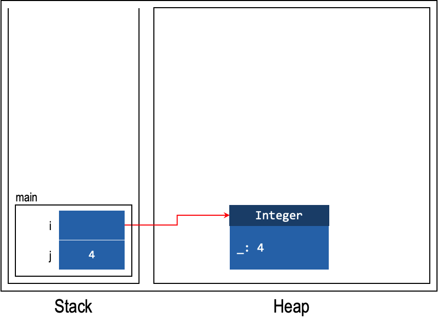

# Unit 19: Wrapper Class

!!! abstract "Learning Objectives"

    Students should

    - be aware that Java provides wrapper classes around the primitive types.
    - be aware that Java will transparently and automatically box and unbox between primitive types and their corresponding wrapper classes.

## Writing General Code for Primitive Types

We have seen the following general code that takes in an array of `Object` objects, and searches if another object `obj` is in the given `array`.

```Java
// version 0.1 (with polymorphism)
boolean contains(Object[] array, Object obj) {
  for (Object curr : array) {
    if (curr.equals(obj)) {
      return true;
    }
  }
  return false;
}
```

Through polymorphism and overriding of the `equals` method, we can make sure that it is general enough to work on any reference type.  But what about primitive types?  Do we need to write a separate function for each primitive type, like this?
```Java
// version 0.4 (for int, a primitive type)
boolean contains(int[] array, int obj) {
  for (int curr : array) {
    if (curr == obj) {
      return true;
    }
  }
  return false;
}
```

## Making Primitive Types Less Primitive

Java provides wrapper classes for each of its primitive types.  A _wrapper class_ is a class that encapsulates a _type_, rather than fields and methods.  The wrapper class for `int` is called `Integer`, for `double` is called `Double`, etc.  A wrapper class can be used just like every other class in Java and behave just like every other class in Java.  In particular, they are reference types and their instances can be created with `new`; instances are stored on the heap, etc.  

For instance,

```java
Integer i = Integer.valueOf(4); // new Integer(4) is "deprecated"
int j = i.intValue();
```

The code snippet above shows how we can convert a primitive `int` value to a wrapper instance `i` of type `Integer`, and how the `intValue` method can retrieve the `int` value from an `Integer` instance.  

With the wrapper type, we can reuse our `contains` method that takes in an `Object` array as a parameter to operate on an array of integers -- we just need to pass our integers into the method in an `Integer` array instead of an `int` array.

All primitive wrapper class objects are _immutable_ -- once you create an object, it cannot be changed.

| Primitive | Wrapper     |
|-----------|-------------|
| `byte`    | `Byte`      |
| `short`   | `Short`     |
| `int`     | `Integer`   |
| `long`    | `Long`      |
| `float`   | `Float`     |
| `double`  | `Double`    |
| `char`    | `Character` |
| `boolean` | `Boolean`   |


### Primitive vs Wrapper

To see the main difference between primitive types and their wrapper classes, we can look at the stack and heap diagram.  Consider the code above, the stack and heap diagram is as follows.



In the diagram, we do not know the name of the private field of `Integer`.  Therefore, we use the placeholder `_`.  Although we may look at the implementation to know the name, we decide to use the placeholder `_` to emphasise that it is irrelevant due to abstraction barrier.

Now, what this means is that there are different steps taken to retrieve the value depending on whether the value comes from primitive type or from wrapper class.  In the case of primitive, we simply open the box and retrieve the value.  On the other hand, for wrapper class, we need to open the box, follow the arrow, and only then we can retrieve the value.

## Auto-boxing and Unboxing

As conversion back-and-forth between a primitive type and its wrapper class is pretty common, Java provides a feature called auto-boxing/unboxing to perform type conversion between primitive type and its wrapper class.

For instance,

```java
Integer i = 4;
int j = i;
```

The first statement is an example of auto-boxing, where the primitive value `int` of 4 is converted into an instance of `Integer`.  The second statement converts an instance of `Integer` back to `int` (_without affecting its value of 4_).

!!! info "Single Step Auto-Boxing"
    An important thing about auto-boxing and unboxing is that they are a single step process.  Recap from above that all wrapper class has no subtyping relationship with one another.  So the following will be an error.

    ```java
    Double d = 2;
    ```

    ```
    _.java:_: error: incompatible types: int cannot be converted to Double
    		Double d = 2;
    		           ^
    1 error
    ```

    This is because `int` can only be auto-boxed into `Integer` and not `Double`.  Since the auto-boxing is a single-step process, Java cannot infer that the following conversion is actually possible: `int` $\rightarrow$ `double` $\rightarrow$ `Double`.

    On the other hand, auto-unboxing happen whenever we need to convert the wrapper class to primitive type.  This can then be followed with the usual primitive subtyping.

    ```java
    Integer x = 4; // auto-boxing
    double d = x;  // auto-unboxing + primitive subtyping
    ```

    The code above compiles.

## Performance

Since the wrapper classes allow us to write flexible programs, why not use them all the time and forget about primitive types?

The answer: _performance_. Because using an object comes with the cost of allocating memory for the object and collecting garbage afterward, it is less efficient than primitive types.   

Consider the following two programs:

```Java
Double sum = 0.0;
for (int i = 0; i < Integer.MAX_VALUE; i++) {
  sum += i;
}
```

vs.

```Java
double sum = 0.0;
for (int i = 0; i < Integer.MAX_VALUE; i++) {
  sum += i;
}
```

The second one can be about or even more than 2 times faster[^1].  The following is a sample run with the timing in _milliseconds_.

[^1]: There might actually be additional optimizations performed when executing the above code multiple times (_e.g., wrapping it in a method_ `f()` _and invoking_ `f()` multiple times within a method_ `h()`).  It also kind of makes sense to perform this additional optimizations only when the method is invoked multiple times because the time taken to optimize this will be paid off by the increase in speed as now the benefit can be reaped multiple times!

| Run | Using `Double` | Using `double` |
|-----|----------------|----------------|
| 1 | 7888 ms | 1860 ms+7 |
| 2 | 7763 ms | 1862 ms |
| 3 | 7737 ms | 1864 ms |
| 4 | 7733 ms | 1863 ms |
| ___Average___ | ___7780.25 ms___ | ___1862.25 ms___ |

This makes sense if we think about it in terms of the stack/heap diagram.  When we are using wrapper class, to retrieve the value, we require at least two operations: (i) look for the variable in the stack and retrieve the value (_i.e., reference to instance_) and (ii) follow the reference into an instance and retrieve the value from the heap.

On the other hand, using primitive values, we can simply retrieve the value with one operation: (i) look for the variable in the stack and retrieve the value.  That's it, there is no step (ii).

All primitive wrapper class objects are immutable -- once you create an object, it cannot be changed. Thus, every time the sum in the first example above is updated, a new `Double` object gets created.
Due to autoboxing and unboxing, the cost of creating objects becomes hidden and is often forgotten.

The Java API in fact, provides multiple versions of the same method, one for all the reference types using `Object`, and one for each of the primitive types.  This decision leads to multiple versions of the same code, but with the benefits of better performance.  See the [Arrays](https://docs.oracle.com/en/java/javase/17/docs/api/java.base/java/util/Arrays.html) class for instance.