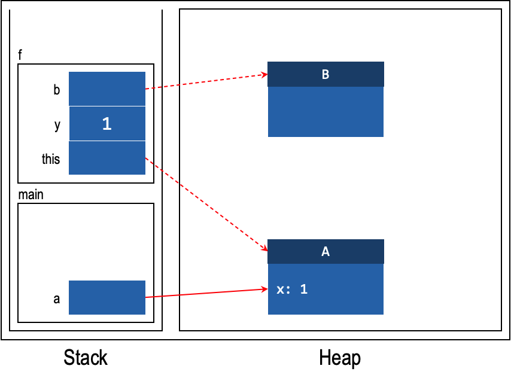
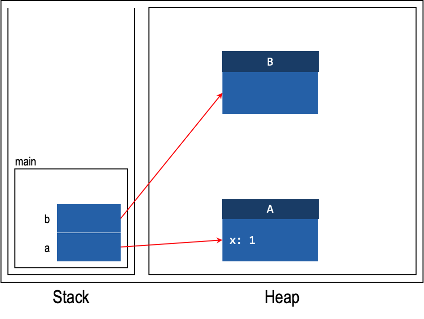
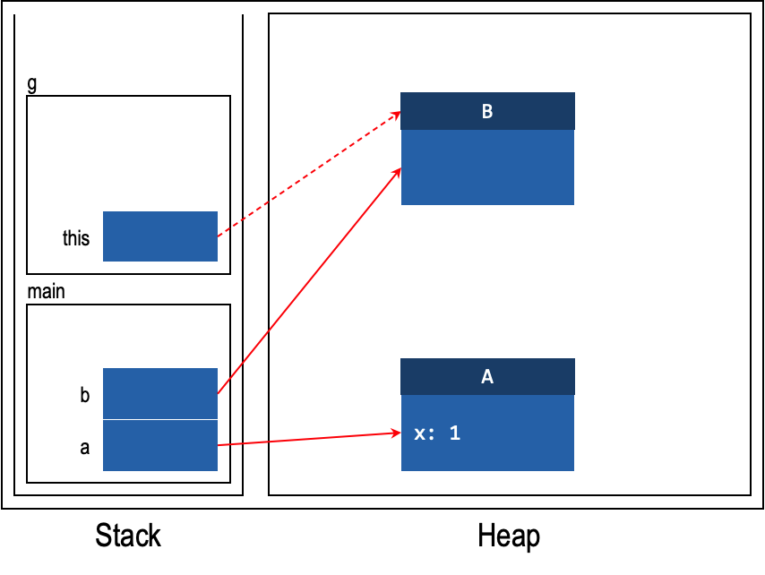
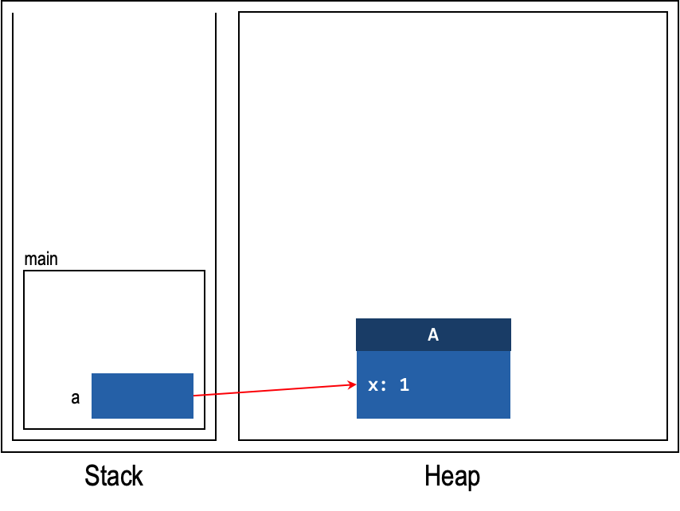
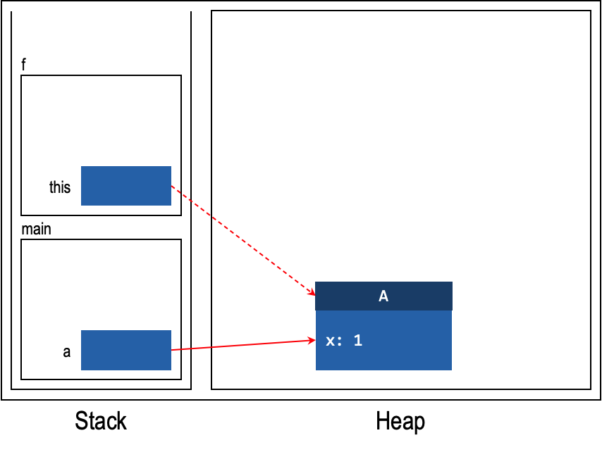
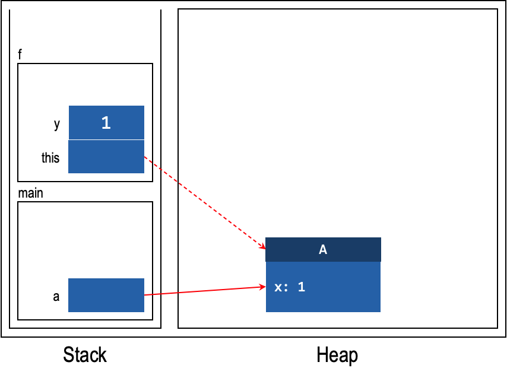
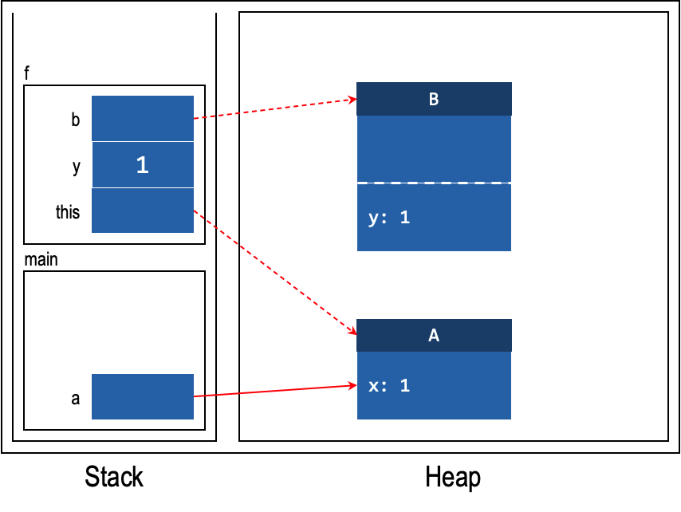
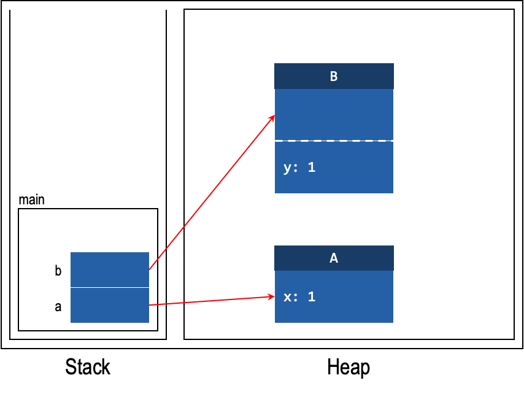
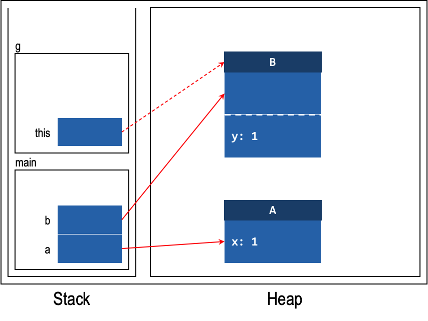

# Unit 29: Nested Class

!!! abstract "Learning Objectives"

    Students should

    - understand the need for nested class.
    - understand the behavior of the different kinds of nested class.
    - be able to write nested classes.

## Matryoshka Doll

So far, we have defined a class only at the "top-level" of our program.  Java allows us to define a class within another class, or within a method.

A nested class is a class defined within another containing class.  For example, the following declaration declares a private nested class named `B` within the class `A`.

```Java
class A {
  private class B {
      :
  }
}
```

Nested classes are used to group logically relevant classes together.  Typically, a nested class is tightly coupled with the container class and would have no use outside of the container class.  Nested classes can be used to encapsulate information within a container class, for instance, when the implementation of the container class becomes too complex.  As such, it is useful for "helper" classes that serve specific purposes.

A nested class is a field of the containing class and can access fields and methods of the container class, including those declared as `private`.  We can keep the nested class within the abstraction barrier by declaring the nested class as `private` if there is no need for it to be exposed to the client outside the barrier.  

Since the nested class can access the private fields of the container class, we should introduce a nested class only if the nested class belongs to the same encapsulation as the container class.  Otherwise, the container class would leak its implementation details to the nested class.

Take the `HashMap<K,V>` class for instance.  [The implementation of `HashMap<K,V>`](https://github.com/openjdk-mirror/jdk7u-jdk/blob/master/src/share/classes/java/util/HashMap.java) contains one top-level class `HashMap<K,V>` (_at Line 124_) and several nested classes, including the `HashIterator<E>` abstract class (_at Line 178_), which implement an `Iterator<E>` interface for iterating through the key and value pairs in the map, and a static `Entry<K,V>` class (_at Line 687_), which encapsulates a key-value pair in the map.  Some of these classes are declared `private` if they are only used within the `HashMap<K,V>` class.

!!! note "Example from CS2030S This Semester"

    We can take another example from your labs on network.  In one of many possible designs, the subclasses of `Sender`: `SingleSender`, `MultiSender`, _etc_. are only ever mentioned in the declaration in the `Network` class.  They can be safely encapsulated within `Sender` as inner classes, so that these classes can access the fields within the `Sender` class, simplifying their implementation.  How many times have you wished that the `id` can be accessed directly?

    With this design, since we cannot access the constructor of `SingleSender` and `MultiSender` directly, we have to create a (_possibly overloaded_) static method in `Sender` that creates either `SingleSender` or `MultiSender` depending on the input.  Something along the following:

    ```java
    public static Sender make(int actionTime, String message) {
      return new SingleSender(actionTime, message);
    }
    public static Sender make(int actionTime, String[] messages) {
      return new MultiSender(actionTime, messages);
    }
    ```

A nested class can be either static or non-static.  Just like static fields and static methods, a _static nested class_ is associated with the containing _class_, NOT an _instance_.  So, it can only access static fields and static methods of the containing class.  A _non-static nested class_, on the other hand, can access all fields and methods of the containing class.  A _non-static nested class_ is also known as an _inner class_.

!!! info "Static vs Non-Static"
    Recap the following access behavior:

    | From | Access Static | Access Non-Static |
    |------|---------------|-------------------|
    | Static | :material-check: | :material-close: |
    | Non-Static | :material-check: | :material-check: |

The example below shows a container class `A` with two nested classes, a non-static inner class `B`, and a static nested class `C`.  `B` can access instance fields, instance methods, class fields, and class methods in `A`.  `C` can only access the class fields and class methods in `A`.

```Java hl_lines="14"
class A {
  private int x;
  static int y;

  class B {
    void foo() {
      x = 1; // accessing x in A is OK
      y = 1; // accessing y in A is OK
    }
  }

  static class C {
    void bar() {
      x = 1; // accessing x in A is not OK since C is static
      y = 1; // accessing y is OK
    }
  }
}
```

Recall that we recommend that all access to instance fields be done through the `this` reference.  In the example above, however, we can't access `this.x` from within `B`.

```Java
class A {
 private int x;

 class B {
   void foo() {
     this.x = 1; // error
   }
 }
}
```

Since `this.x` is called within a method of `B`, `this` would refer to the instance of `B`, rather than the instance of `A`.  Java has a piece of syntax called qualified `this` to resolve this.  A qualified `this` reference is prefixed with the enclosing class name, to differentiate between the `this` of the inner class and the `this` of the enclosing class.  In the example above, we can access `x` from `A` through the `A.this` reference.

```Java
class A {
 private int x;

 class B {
   void foo() {
     A.this.x = 1; // ok
   }
 }
}
```

!!! note "Fully Qualified Name"
    Recap the [fully qualified name](http://localhost:8000/2324-s1/05-infohiding.html#fully-qualified-name).  The example above shows how fully qualified name can remove any ambiguity at all.

    `A.this.x` is the fully qualified name for instance field `x` in the class `A`.  This is how the use of fully qualified name can remove ambiguity.  In comparison, using `this.x` may have ambiguity and even leads to an error.
    
    If we have a field `y` in class `B`, the fully qualified name to refer to it is `A.B.this.y`.

### More on Static Nested Class

Recap that from static context we cannot access non-static elements.  As the _instance_ fields of the outer class is a non-static element, we cannot access them.  But also recap that to access the instance field `x` of the outer class where there is a conflicting name `x` with a field of the inner class, we require the use of qualified name `A.this.x`.

The two implies that `A.this` is not going to be used at all by the static nested class.  As such, we should omit them from the stack and heap diagram as well.  To illustrate this difference, consider the following class reproduced from above.

```java
class A {
  private int x = 0;
  static int y = 1;

  class B {
    void foo() {
      x = 1; // accessing x in A is OK (equivalent to A.this.x)
      y = 1; // accessing y in A is OK (equivalent to A.y)
    }
  }

  static class C {
    void bar() {
      // x = 1; // removed because we cannot access this
      y = 1; // accessing y is OK (equivalent to A.y)
    }
  }
  
  void baz() {
    B b = new B();
    C c = new C();
    // Line A
  }
}
```

Now consider the following code snippet.

```java
A a = new A();
a.baz();
```

The stack and heap diagram at the line marked Line A is shown below.  The diagram below also illustrates the use of _meta space_ to store the class field `A.y`.


### Local Class

We can also declare a class within a function, just like a local variable.  

To motivate this, let's consider how one would use the [`java.util.Comparator`](https://docs.oracle.com/en/java/javase/17/docs/api/java.base/java/util/Comparator.html) interface.    
The `Comparator` interface allows us to specify how to compare two elements, by implementing this interface with a customized `compare()` method.  `compare(o1,o2)` should return

| Return Value | Meaning |
|--------------|---------|
| A negative integer | `o1` is "_less than_" `o2` |
| The integer `0` | `o1` is "_equal_" `o2` |
| A positive integer | `o1` is "_greater than_" `o2` |

Suppose we have a list of strings, and we want to sort them in the order of their length, we can write the following method:

```Java
void sortNames(List<String> names) {
  class NameComparator implements Comparator<String> {
    public int compare(String s1, String s2) {
      return s1.length() - s2.length();
    }
  }

  names.sort(new NameComparator());
}
```

This makes the code easier to read since we keep the definition of the class and its usage closer together.

Classes like `NameComparator` that are declared inside a method (_or to be more precise, inside a block of code between_ `{` _and_ `}`, _but not directly inside a class_) is called a ___local class___.  Just like a local variable, a local class is scoped within the method.  Like a nested class, a local class has access to the variables of the enclosing class through the qualified `this` reference (_or fully qualified name_).  Further, it can access the local variables of the enclosing method.

For example,

```Java
class A {
  int x = 1;

  void f() {
    int y = 1;

    class B {
      void g() {
        x = y; // accessing x and y is OK.
      }
    }

    new B().g();
  }
}
```

Here, `B` is a local class defined in method `f()`.  It has access to all the local variables accessible from within `f`, as well as the fields of its enclosing class.

### Variable Capture

Recall that when a method returns, all local variables of the methods are removed from the stack.  But, an instance of that local class might still exist.  Consider the following example:

```Java
interface C {
  void g();
}

class A {
  int x = 1;

  C f() {
    int y = 1;
 
    class B implements C {
      void g() {
        x = y; // accessing x and y is OK.
      }
    }

    B b = new B();
    return b;
  }
}
```

Calling
```Java
A a = new A();
C b = a.f();
b.g();
```

will give us a reference to an object of type `B` now.  But, if we call `b.g()`, what is the value of `y`?  Without _variable capture_, the stack and heap diagram is something like the following.  Notice how we have no access to `y` anymore!

=== "After `A a = new A()`"
    
=== "Invoking `a.f()`"
    
=== "After `int y = 1`"
    
=== "After `B b = new B()`"
    
=== "After `C b = a.f()`"
    
=== "Invoking `b.g()`"
    

For this reason, even though a local class can access the local variables in the enclosing method, the local class makes _a copy of local variables_ inside itself.  We say that a local class _captures_ the local variables.   Note that local variables are variables declared within a method.  These variables are local to the method.  Fields can always be accessed and need not be captured through this means.

Visually, we will include the captured variables after the fields in the stack and heap diagram.  We will use a dashed line to separate the fields and captured variables.  Note that captured variables are __NOT__ part of the fields, so it cannot be accessed with the dot operator (_e.g.,_ `this.y`).

=== "After `A a = new A()`"
    
=== "Invoking `a.f()`"
    
=== "After `int y = 1`"
    
=== "After `B b = new B()`"
    
=== "After `C b = a.f()`"
    
=== "Invoking `b.g()`"
    

Variables are only captured when they are (i) local to the method and (ii) used in local class.  Consider the following modification to the previous example:

```java hl_lines="10"
interface C {
  void g();
}

class A {
  int x = 1;

  C f() {
    int y = 1;
    int z = 2;

    class B implements C {
      void g() {
        x = y; // accessing x and y is OK.
      }
    }

    B b = new B();
    return b;
  }
}
```

We have added another local variable `z`.  However, this variable is not used within the local class `B`.  As such, the instance of `B` does not capture the variable `z` and only captures the variable `y`.  This capture can only be shown after we have discussed the next subsection on effectively `final`.

### Effectively `final`

Variable captures can be confusing.  Consider the following code:

```Java
void sortNames(List<String> names) {
  boolean ascendingOrder = true;
  class NameComparator implements Comparator<String> {
    public int compare(String s1, String s2) {
      if (ascendingOrder)
        return s1.length() - s2.length();
      else
        return s2.length() - s1.length();
    }
  }

  ascendingOrder = false;
  names.sort(new NameComparator());
}
```

Will `sort` sorts in ascending order or descending order?  Furthermore, in the example above, we are only creating a single instance of `NameComparator`.  What if we have a thousand of those?  Should the statement `ascendingOrder = false` modify all thousand variables that are captured?  What if there are no instance of `NameComparator`?

To avoid confusing code like this, Java only allows a local class to access variables that are explicitly declared `final` or implicitly final (_a.k.a. effectively final_).  An implicitly final variable cannot be re-assigned after initialization.  Therefore, Java saves us from such a hair-pulling situation above and disallows such code -- `ascendingOrder` is effectively final so the assignment `ascendingOrder = false` will cause compilation error.


**Breaking the Limitation of Effectively `final`.** &nbsp;&nbsp; The limitation of effectively final only happen because the value is of a primitive type.  So, if we captures the value and forbids re-assigning the value, there is nothing we can do to change primitive value.

On the other hand, reference type can be mutated without assignment statement! So if we use our own implementation of `Bool` class below instead of `boolean` primitive type, we can modify the code above to allow the "value" in variable `ascendingOrder` to be changed. However, this change is via mutation and not re-assignment to the variable.

This also saves us the problem of figuring out what will happen if we have a thousand instances of `NameComparator`.  In the previous case, because the variables are captured, we need to dynamically add a thousand different assignment statements to assign the new value to all thousand different instances.

On the other hand, using reference type `Bool`, the value of the captured variable is a reference to a memory location in the heap.  Therefore, all thousand instances of `NameComparator` captures this reference.  This is where ___aliasing___ helps us.  The thousand instances has the same alias to this memory location.  So, changes in this memory location can have effect on the instance.

```Java
void sortNames(List<String> names) {
  Bool ascendingOrder = new Bool(true);
  class NameComparator implements Comparator<String> {
    public int compare(String s1, String s2) {
      if (ascendingOrder.val)
        return s1.length() - s2.length();
      else
        return s2.length() - s1.length();
    }
  }

  ascendingOrder.val = false;
  names.sort(new NameComparator());
}
class Bool {
  boolean val;
}
```

The code above does compile but now we are no longer save from such a hair-pulling situation.  So please exercise this with extreme caution.

!!! note "Variable Capture in Javascript"
    Those of you who did CS1101S or otherwise familiar with Javascript might want to note that this is different from Javascript, which does not enforce the final/effectively final restriction in variable captures.  This is because there is no concept of primitive value in Javascript.
    
    Every single primitive type is automatically boxed in Javascript. The unboxed variant is not available to the programmer directly.  So, if we write `x = 1` in Javascript, the value `1` is boxed and put into the heap.  Then, the variable `x` in the stack points to this box in the heap unlike Java primitive type.

### Anonymous Class

An anonymous class is one where you declare a class and instantiate it in a single statement.  It's anonymous since we do not even have to give the class a name.

```Java
names.sort(new Comparator<String>() {
  public int compare(String s1, String s2) {
    return s1.length() - s2.length();
 }
});
```

The example above removes the need to declare a class just to compare two strings.  

An anonymous class has the following format: `new X (arguments) { body }`, where:

- _X_ is a class that the anonymous class extends or an interface that the anonymous class implements.  X cannot be empty.  This syntax also implies an anonymous class cannot extend another class and implement an interface at the same time.  Furthermore, an anonymous class cannot implement more than one interface.
    - Put it simply, you cannot have `extends` and `implements` keyword in between `X` and `(arguments)`.
- _arguments_ are the arguments that you want to pass into the constructor of the anonymous class.  If the anonymous class is extending an interface, then there is no constructor, but we still need `()`.
- _body_ is the body of the class as per normal, except that we cannot have a constructor for an anonymous class.

The syntax might look overwhelming at the beginning, but we can also write it as:

```Java
Comparator<String> cmp = new Comparator<String>() {
  public int compare(String s1, String s2) {
    return s1.length() - s2.length();
  }
};
names.sort(cmp);
```

Line 1 above looks just like what we do when we instantiate a class, except that we are instantiating an interface with a `{ .. }` body.

An anonymous class is just like a local class, it captures the variables of the enclosing scope as well -- the same rules to variable access as local classes applies.
