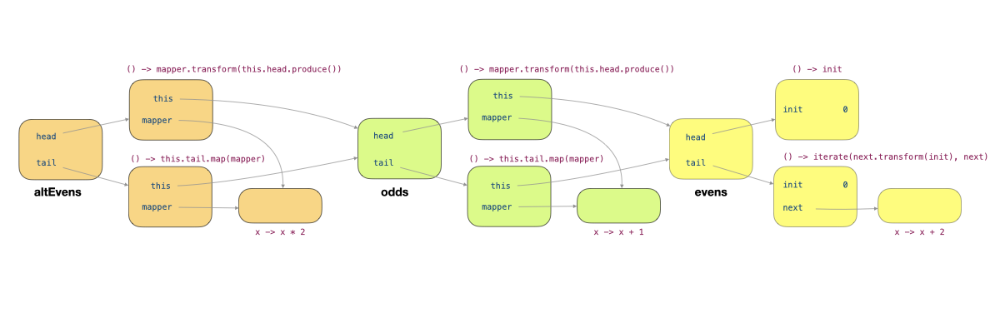

# Unit 33: Infinite List

!!! abstract "Learning Objectives"

    After this unit, students should understand:

    - how infinite lists can be constructed using a lazy evaluation.

## Preliminary: An Eagerly Evaluated List

Let's consider first how we can represent an eagerly evaluated, finite list, recursively.  A simple way is to treat the list as a recursive structure, containing a `head` and a `tail`, with the `tail` being a list itself.  We have a special terminating list called `Sentinel` that we use to terminate the EagerList.

```Java
class EagerList<T> {
  private final T head;
  private final EagerList<T> tail;
  private static EagerList<?> EMPTY = new Sentinel(); 

  public EagerList(T head, EagerList<T> tail) {
    this.head = head;
    this.tail = tail;
  }

  public T head() {    // be careful, the method name
    return this.head;  // is the same as the field name
  }

  public EagerList<T> tail() { // same here, method name
    return this.tail;          // is the same as field name
  }
  
  public T get(int n) {
    if (n == 0) {
      return this.head();          // be careful!
    }                              //   use the methods
    return this.tail().get(n - 1); //   instead of fields
  }

  public static <T> EagerList<T> empty() {
    @SuppressWarnings("unchecked")
    EagerList<T> temp = (EagerList<T>) EMPTY;
    return temp;
  }

  private static class Sentinel extends EagerList<Object> {
    Sentinel() {
      super(null, null);
    }

    @Override
    public Object head() {
      throw new java.util.NoSuchElementException();
    }

    @Override
    public EagerList<Object> tail() {
      throw new java.util.NoSuchElementException();
    }
  
    @Override
    public Object get(int n) {
      throw new java.util.NoSuchElementException();
    }
  }
}
```

Let's provide two factory methods called `generate` and `iterate`, that will populate our EagerList for us.

```Java
  public static <T> EagerList<T> generate(T t, int size) {
    if (size == 0) {
      return empty();
    }
    return new EagerList<>(t, generate(t, size - 1));
  }

  public static <T> EagerList<T> iterate(T init, BooleanCondition<? super T> cond, Transformer<? super T, ? extends T> op) {
    if (!cond.test(init)) {
      return empty();
    }
    return new EagerList<>(init, iterate(op.transform(init), cond, op));
  }
```

Let's now provide the standard operation `map` so that we can transform the items in the list.
The `map` method takes a lambda expression as the parameter, applies it recursively to every element in the list, and returns the resulting new list. 

```Java
  public <R> EagerList<R> map(Transformer<? super T, ? extends R> mapper) {
    return new EagerList<>(mapper.transform(this.head()), this.tail().map(mapper));
  }
```

We can also provide the `filter` method, that takes in lambda expression as a parameter and tests if each element in the list passes the test.  We return the list containing only the elements that pass the given test.

```Java
  public EagerList<T> filter(BooleanCondition<? super T> cond) {
    if (cond.test(this.head())) {
      return new EagerList<>(this.head(), this.tail().filter(cond));
    }
    return this.tail().filter(cond);
  }
```

We have the special `Sentinel` cases,
```Java
  @Override
  public <R> EagerList<R> map(Transformer<? super Object, ? extends R> mapper) {
    return empty();
  }

  @Override
  public EagerList<Object> filter(BooleanCondition<? super Object> cond) {
    return empty();
  }
```

The resulting list can be used this way:
```Java
EagerList<Integer> l = EagerList.iterate(1, i -> i < 10, i -> i + 1) // [1, ..., 9]
    .filter(i -> i % 3 == 0)  // [3, 6, 9]
    .map(i -> i * 2);  // [6, 12, 18]
l.head();        // 6
l.tail().head(); // 12
l.tail().tail().head(); // 18
l.get(2);               // 18
```

## An Infinite List

Lazy evaluation allows us to delay the computation that produces data until the data is needed.  This powerful concept enables us to build computationally efficient data structures.  We will focus on building a list with a possibly infinite number of elements &mdash; something that couldn't be done without lazy evaluation.  Any eager-evaluation-based solution will just run in an infinite loop if the list is infinitely long.  For instance,

```Java
EagerList.iterate("", s -> s.length() >= 0, s -> s + "a"); // infinite loop
```

Just as we saw in the previous unit, we can delay a computation by using the `Producer` functional interface (or anything equivalent).  Instead of doing `compute()` which is immediately evaluated when executed, we replace it with a `Producer` `() -> compute()`, which "stores" the computation in an instance of `Producer`, and we only call it when we invoke the `produce()` method.

Instead of storing the head and tail of the list, we can think of an infinite list as consisting of two functions, the first is a function that generates the head, and the second is a function that generates the tail.  Our `InfiniteList` looks like this:

```Java
class InfiniteList<T> {
  private final Producer<T> head;
  private final Producer<InfiniteList<T>> tail;

  public InfiniteList(Producer<T> head, Producer<InfiniteList<T>> tail) {
    this.head = head;
    this.tail = tail;
  }

  public T head() {             // be careful, the method name
    return this.head.produce(); // is the same as the field name
  }

  public InfiniteList<T> tail() { // same here, method name
    return this.tail.produce();   // is the same as field name
  }
  
  public T get(int n) {
    if (n == 0) {
      return this.head();          // be careful!
    }                              //   use the methods
    return this.tail().get(n - 1); //   instead of fields
  }
}
```

Note that we don't need a `Sentinel` for now.  We will need it if we have operations that truncate the list to a finite one, but let's not worry about it yet.

We now change the `generate` method to be lazy, by passing in a producer instead.  We no longer need to pass in the size, since the list can be infinitely long!
```Java
  public static <T> InfiniteList<T> generate(Producer<T> producer) {
    return new InfiniteList<T>(producer,
        () -> generate(producer));
  }
```

We can change `iterate` as well to only iterate through and generate the next element when we need it.  Note that we no longer need to provide the terminating condition `cond`.
```Java
  public static <T> InfiniteList<T> iterate(T init, Transformer<T, T> next) {
    return new InfiniteList<T>(() -> init,
        () -> iterate(next.transform(init), next));
  }
```

Here are some examples of how to use the two methods above:

```Java
InfiniteList<Integer> ones = InfiniteList.generate(() -> 1); // 1, 1, 1, 1, ....
InfiniteList<Integer> evens = InfiniteList.iterate(0, x -> x + 2); // 0, 2, 4, 6, ...
evens.head(); // -> 0
evens.get(5); // -> 10
evens = evens.tail(); 
evens.head(); // -> 2
evens.get(6); // -> 14
```

Both the lists `ones` and `evens` are infinitely long, but due to lazy evaluation, we do not generate all the elements in advance, but only when an element is needed.  

## Map

Let's now write the lazy version of the `map` method as well:

```Java
public <R> InfiniteList<R> map(Transformer<? super T, ? extends R> mapper) {
  return new InfiniteList<>(
      () -> mapper.transform(this.head()),
      () -> this.tail().map(mapper));
}
```

The `map` method is lazy. All it does is create a new list initialized with a new lambda expression that applies the given lambda expression `mapper` to the head and the tail.

When we run:
```Java
evens.map(x -> x + 1);
evens.map(x -> x + 1).map(x -> x * 2);
```

We get an infinite list with elements 1, 3, 5, 7, etc, but the values in the list are not realized until they are needed, just like before.  Only when we call `head()` will we evaluate the lambda expressions and obtain the results:

```Java
evens.map(x -> x + 1).map(x -> x * 2).head(); // 2
```

## Under The Hood
It is worthwhile to trace through the code and understand how `head()` works.  For simplicity, let's put all our code together for easy reference.

```Java
class InfiniteList<T> {
  private final Producer<T> head;
  private final Producer<InfiniteList<T>> tail;

  public static <T> InfiniteList<T> generate(Producer<T> producer) {
    return new InfiniteList<T>(producer,
        () -> InfiniteList.generate(producer));
  }

  public static <T> InfiniteList<T> iterate(T init, Transformer<T, T> next) {
      return new InfiniteList<T>(() -> init,
      () -> InfiniteList.iterate(next.transform(init), next));
  }

  public InfiniteList(Producer<T> head, Producer<InfiniteList<T>> tail) {
    this.head = head;
    this.tail = tail;
  }

  public T head() {             // be careful, the method name
    return this.head.produce(); // is the same as the field name
  }

  public InfiniteList<T> tail() { // same here, method name
    return this.tail.produce();   // is the same as field name
  }
  
  public T get(int n) {
    if (n == 0) {
      return this.head();          // be careful!
    }                              //   use the methods
    return this.tail().get(n - 1); //   instead of fields
  }

  public <R> InfiniteList<R> map(Transformer<? super T, ? extends R> mapper) {
    return new InfiniteList<>(
        () -> mapper.transform(this.head()),
        () -> this.tail().map(mapper));
  }
}
```

Let's rewrite the statement
```Java
evens.map(x -> x + 1).map(x -> x * 2).head(); // 2
```

into something uglier and more verbose, but with intermediate variables to help us explain what happens when the statement above is invoked.

```Java
InfiniteList<Integer> evens = InfiniteList.iterate(0, x -> x + 2); // 0, 2, 4, 6, ...
InfiniteList<Integer> odds = evens.map(x -> x + 1); // 1, 3, 5, ...
InfiniteList<Integer> altEvens = odds.map(x -> x * 2); // 2, 6, 10, .. 
altEvens.head();
```

Let's look at what gets created on the heap when we run

```Java
InfiniteList<Integer> evens = InfiniteList.iterate(0, x -> x + 2); // 0, 2, 4, 6, ...
```


The figure above shows the objects created.  `evens` is an instance of `InfiniteList`, with two fields, `head` and `tail`, each pointing to an instance of `Producer<T>`.  The two instances of `Producer<T>` capture the variable `init`.  The `tail` additionally captures the variable `next`, which itself is an instance of `Transformer<T, T>`. 

Next, let's look at what gets created on the heap when we run

```Java
InfiniteList<Integer> odds = evens.map(x -> x + 1); // 1, 3, 5, ...
```


The figure above shows the objects added.  `odds` is an instance of `InfiniteList`, with two fields, `head` and `tail`, each pointing to an instance of `Producer<T>`.  The two instances of `Producer<T>` capture the local variables, `this` and `mapper`, of the method `map`.  `mapper` refers to an instance of `Transformer<T, T>`.  Since the method `map` of `evens` is called, the `this` reference refers to the object `evens`. 

After calling 
```Java
InfiniteList<Integer> altEvens = odds.map(x -> x * 2); // 2, 6, 10, .. 
```

We have the following objects set up.



Let's now trace through what happens when we call `altEvens.head()`.  This method leads to the call `this.head().produce()`, where `this` refers to `altEvens`.  The call to `produce` invoked `mapper.transform(this.head.produce())` of the producer labeled 1 in the figure below.  This leads to `this.head.produce()` of this producer being called.  Within this producer, `this` refers to `odds`, and so `this.head.produce()` invoked `mapper.transform(this.head.produce())` of the producer labelled 2.   Now, `this` refers to `evens`, and `this.head.produce()` causes the producer `() -> `init` (labeled 3) to produce 0.


The execution now returns to the invocation of `mapper.transform(this.head.produce())` and call `mapper.transform(0)` (labeled 4).  This returns the value 1, which we pass into the `mapper.transform(1)` (labeled 5).  The `mapper` is `x -> x * 2` so we have the result 2, which we return from `altEvens.head()`.

This process shows a very different order of execution than `EagerList`.
If we run, 
```Java
EagerList.iterate(0, x -> x < 10, x -> x + 2)
    .map(x -> x + 1)
    .map(x -> x * 2)
    .head();
```

The method `iterate` generates all the elements first, then all the elements get `map`-ed with `x -> x + 1`, then with `x -> x + 2`, and then the first element is retrieved.  

When we run, 
```Java
InfiniteList.iterate(0, x -> x + 2)
    .map(x -> x + 1)
    .map(x -> x * 2)
    .head();
```

The method calls `iterate` and `map` only set up the producers that call other producers.  The call to `head()` is the trigger that causes the chain of producers to produce a value.

## Filtering A Lazy List

Now, let's consider how we would filter an `InfiniteList`.  This is a bit trickier.  The following naive version does not work.
```Java
  // wrong
  public InfiniteList<T> filter(BooleanCondition<? super T> cond) {
    if (cond.test(this.head())) {
      return new InfiniteList<>(this.head, () -> this.tail().filter(cond));
    }
    return this.tail().filter(cond);
  }
```

There are two things wrong with this.  First,  Line 3 `cond.test(this.head()`)` is eager.  It computes the head to test if it passes the given condition.  Second, Line 6 is eager, it produces the tail to recursively filter it.

To make `filter` lazy, we have to perform the test in the producer that produces the head. But if the test fails, we have to mark the head as filtered.

```Java
  public InfiniteList<T> filter(BooleanCondition<? super T> cond) {
    Producer<T> newHead = () -> cond.test(this.head()) ? this.head() : null;
    return new InfiniteList<>(newHead, () -> this.tail().filter(cond));
  }
```

In the code above, we use `null` to indicate that the `head` is filtered for simplicity.  It is not a good practice, however, since `null` could be a valid value in an infinite list.

Putting the abuse of `null` aside, the possibility that the head produces a value that is filtered affects other methods. The methods `head` and `tail` have to be changed to:
```Java
  public T head() {
    T h = this.head.produce();
    return h == null ? this.tail.produce().head() : h;  
  }

  public InfiniteList<T> tail() {
    T h = this.head.produce();
    return h == null ? this.tail.produce().tail() : this.tail.produce();  
  }
```

## Further Improvements

We have seen `Maybe<T>` as an abstraction that encapsulates a value that is either there or is missing.  Instead of using `null` to present a value that is not there, it is better to use `Maybe<T>` to encapsulate the value of the head.

Further, our implementation of `InfiniteList<T>` so far does not make use of memoization.  The same value keeps getting produced repeatedly.  We have built the class `Lazy<T>` that encapsulates a value that is produced on-demand with memoization to guarantee that it is produced at most once.  It is better to use `Lazy<T>` to encapsulate the value of the head as well.

We leave the construction of an `InfiniteList<T>` that uses `Lazy<Maybe<T>>` for its head as an exercise.
