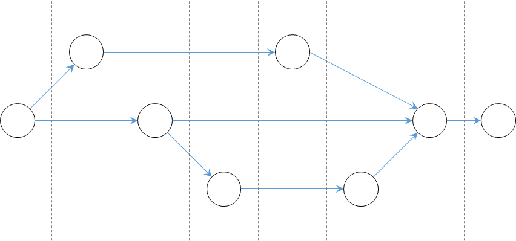
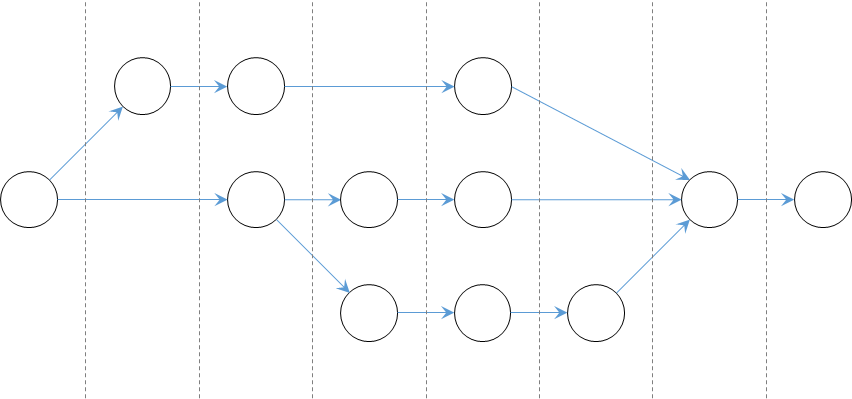

# Unit 37: Parallel Streams

After this unit, students should:

- be aware that a program can be broken into subtasks to run parallelly and/or concurrently 
- be aware of the issues caused by running subtasks parallelly and concurrently.
- be aware that there exist tradeoffs in the number of subtasks and the processing overhead.
- be familiar with how to process a stream parallelly and correctly.

## Parallel and Concurrent Programming

So far, the programs that we have written in CS2030S run _sequentially_.  What this means is that at any one time, there is only one instruction of the program running on a processor.


### What is Concurrency?

A single-core processor can only execute one instruction at one time &mdash; this means that only one _process_ (or less precisely speaking, one application) can run at any one time.  Yet, when we use the computer, it _feels_ as if we are running multiple processes at the same time.  The operating system, behind the scenes, is switching between the different processes, to give the user the illusion that they are running at the same time.



We can write a program so that it runs concurrently &mdash; by dividing the computation into subtasks called _threads_. Such multi-thread programs are useful in two ways: (i) it allows us, the programmers, to separate unrelated tasks into threads, and write each thread separately; (ii) it improves the utilization of the processor.  For instance, if I/O is in one thread, and UI rendering is in another, then when the processor is waiting for I/O to complete, it can switch to the rendering thread to make sure that the slow I/O does not affect the responsiveness of UI.

### What is Parallelism?

While concurrency gives the illusion of subtasks running at the same time, parallel computing refers to the scenario where multiple subtasks are truly running at the same time &mdash; either we have a processor that is capable of running multiple instructions at the same time, or we have multiple cores/processors and dispatch the instructions to the cores/processors so that they are executed at the same time.



All parallel programs are concurrent, but not all concurrent programs are parallel.

Modern computers have more than one core/processor[^1].  As such, the line between parallelism and concurrency is blurred.

[^1]: iPhone 12 comes with an A14 Bionic chip with six cores.  The fastest supercomputer in the world as of this writing, the [Frontier](https://en.wikipedia.org/wiki/Frontier_(supercomputer)), has 9,472 processors, each has 64 cores (total of 606,208 CPU cores) as well as 37,888 GPUs each has 220 cores (total of 8,335,360 GPU cores).

### Parallel Computing

Parallel computing is one of the major topics in computer science.  One can teach a whole module (or a focus area) on this topic alone.  The goal of this lecture is not to cover it in-depth but is to expose students in CS2030S to the concept of parallel computing in relation to the Stream abstraction in Java.

## Parallel Stream 

We have seen that the Java `Stream` class is a powerful and useful class for processing data in a declarative style.  But, we have not fully unleashed the power of `Stream`.  The neatest thing about `Stream` is that it allows parallel operations on the elements of the stream in one single line of code.

Let's consider the following program that prints out all the prime numbers between 2,030,000 and 2,040,000.

```Java
IntStream.range(2_030_000, 2_040_000)
    .filter(x -> isPrime(x))
    .forEach(System.out::println);
```

We can parallelize the code by adding the call `parallel()` into the stream.

```Java hl_lines="3"
IntStream.range(2_030_000, 2_040_000)
    .filter(x -> isPrime(x))
    .parallel()
    .forEach(System.out::println);
```

You may observe that the output has been reordered, although the same set of numbers are still being produced.  This is because `Stream` has broken down the numbers into subsequences, and run `filter` and `forEach` for each subsequence in parallel.  Since there is no coordination among the parallel tasks on the order of the printing, whichever parallel tasks that complete first will output the result to screen first, causing the sequence of numbers to be reordered.

If you want to produce the output in the order of input, use `forEachOrdered` instead of `forEach`, we will lose some benefits of parallelization because of this.

Suppose now that we want to compute the number of primes between 2,030,000 and 2,040,000.  We can run:

```Java
IntStream.range(2_030_000, 2_040_000)
    .filter(x -> isPrime(x))
    .parallel()
    .count();
```

The code above produces the same output regardless if it is being parallelized or not.

Note that the task above is stateless and does not produce any side effects.  Furthermore, each element is processed individually without depending on other elements.  Such computation is sometimes known as _embarrassingly parallel_.  The only communication needed for each of the parallel subtasks is to combine the result of `count()` from the subtasks into the final count (which has been implemented in `Stream` for us).

### How to Parallelize a Stream

You have seen that adding `parallel()` to the pipeline of calls in a stream enables parallel processing of the stream.  Note that `parallel()` is a lazy operation &mdash; it merely marks the stream to be processed in parallel.  As such, you can insert the call to `parallel()` anywhere in the pipeline after the _data source_ and before the _terminal operation_.

!!! note "sequential()"
    There is a method `sequential()` which marks the stream to be process sequentially.  If you call both `parallel()` and `sequential()` in a stream,
    the last call "wins".  The example below processes the stream 
    sequentially:
    ```
    s.parallel().filter(x -> x < 0).sequential().forEach(..); 
    ```

Another way to create a parallel stream is to call the method `parallelStream()` instead of `stream()` of the `Collector` class.  Doing so would create a stream that will be processed in parallel from the collection.

### What Can be Parallelized?

To ensure that the output of the parallel execution is correct, the stream operations must not _interfere_ with the stream data, and most of the time must be _stateless_.  Side-effects should be kept to a minimum.

#### Interference

Interference means that one of the stream operations modifies the source of the stream during the execution of the terminal operation.  For instance:

```Java
List<String> list = new ArrayList<>(List.of("Luke", "Leia", "Han"));
list.stream()
    .peek(name -> {
         if (name.equals("Han")) {
           list.add("Chewie"); // they belong together
         }
      })
    .forEach(i -> {});
```

would cause `ConcurrentModificationException` to be thrown.  Note that this non-interference rule applies even if we are using `stream()` instead of `parallelStream()`.

#### Stateful vs. Stateless

A stateful lambda is one where the result depends on any state that might change during the execution of the stream.

For instance, the `generate` and `map` operations below are stateful, since they depend on the state of the standard input. Parallelizing this may lead to incorrect output.  To ensure that the output is correct, additional work needs to be done to ensure that state updates are visible to all parallel subtasks.

```Java
Stream.generate(scanner::nextInt)
    .map(i -> i + scanner.nextInt())
    .forEach(System.out::println)
```

#### Side Effects

Side-effects can lead to incorrect results in parallel execution.  Consider the following code:

```Java
List<Integer> list = new ArrayList<>(
    Arrays.asList(1,3,5,7,9,11,13,15,17,19));
List<Integer> result = new ArrayList<>();
list.parallelStream()
    .filter(x -> isPrime(x))
    .forEach(x -> result.add(x));
```

The `forEach` lambda generates a side effect &mdash; it modifies `result`.  `ArrayList` is what we call a non-thread-safe data structure.  If two threads manipulate it at the same time, an incorrect result may result.

There are three ways to resolve this.  One, we can use the [`.collect`](https://docs.oracle.com/en/java/javase/17/docs/api/java.base/java/util/stream/Stream.html#collect(java.util.function.Supplier,java.util.function.BiConsumer,java.util.function.BiConsumer)) method.
```Java
list.parallelStream()
    .filter(x -> isPrime(x))
    .collect(Collectors.toList())
```

Second, we can use a thread-safe data structure.  Java provides several in `java.util.concurrent` package, including [`CopyOnWriteArrayList`](https://docs.oracle.com/en/java/javase/17/docs/api/java.base/java/util/concurrent/CopyOnWriteArrayList.html).

```Java
List<Integer> result = new CopyOnWriteArrayList<>();
list.parallelStream()
    .filter(x -> isPrime(x))
    .forEach(x -> result.add(x));
```

Lastly, in Java 17, there is a [`.toList`](https://docs.oracle.com/en/java/javase/17/docs/api/java.base/java/util/stream/Stream.html#toList()) method that simply returns a list in the same order as the stream.
```Java
list.parallelStream()
    .filter(x -> isPrime(x))
    .toList()
```

#### Associativity

The `reduce` operation is inherently parallelizable, as we can easily reduce each sub-stream and then use the `combiner` to combine the results.  Consider this example:

```Java
Stream.of(1,2,3,4).reduce(1, (x, y) -> x * y, (x, y) -> x * y);
```

To allow us to run `reduce` in parallel, however, there are several rules that the `identity`, the `accumulator`, and the `combiner` must follow:

- `combiner.apply(identity, i)` must be equal to `i`.
- The `combiner` and the `accumulator` must be associative &mdash; the order of applying must not matter.
- The `combiner` and the `accumulator` must be compatible &mdash; `combiner.apply(u, accumulator.apply(identity, t))` must equal to `accumulator.apply(u, t)`

The multiplication example above meetings the three rules:
    
- `i * 1` equals `i`
- `(x * y) * z` equals `x * (y * z)`
- `u * (1 * t)` equals `u * t`

## Performance of Parallel Stream

Let's go back to:

```Java
IntStream.range(2_030_000, 2_040_000)
    .filter(x -> isPrime(x))
    .parallel()
    .count();
```
 
How much time can we save by parallelizing the code above?

Let's use the [`Instant`](https://docs.oracle.com/en/java/javase/17/docs/api/java.base/java/time/Instant.html) and [`Duration`](https://docs.oracle.com/en/java/javase/17/docs/api/java.base/java/time/Duration.html) class from Java to help us:

```Java
Instant start = Instant.now();
long howMany = IntStream.range(2_000_000, 3_000_000)
    .filter(x -> isPrime(x))
    .parallel()
    .count();
Instant stop = Instant.now();
System.out.println(howMany + " " + Duration.between(start,stop).toMillis() + " ms");
```

The code above measures roughly the time it takes to count the number of primes between 2 million and 3 million.  On my iMac, it takes 450-550 ms.  If I remove `parallel()`, it takes slightly more than 1 second.  So with `parallel()` we gain about 50% performance.

Can we parallelize some more?  Remember how we implement `isPrime`[^2]

```Java
boolean isPrime(int n) {
  return IntStream.range(2, (int)Math.sqrt(n) + 1)
      .noneMatch(x -> n % x == 0);
}
```

Let's parallelize this to make this even faster!

```Java hl_lines="3"
boolean isPrime(int n) {
  return IntStream.range(2, (int)Math.sqrt(n) + 1)
      .parallel()
      .noneMatch(x -> n % x == 0);
}
```

[^2]: This is a more efficient version of the code you have seen since it stops testing after the square root of the $n$.

If you run the code above, however, you will find that the code is not as fast as we expect. On my iMac, it takes about 18s, about 18 times slower!

_Parallelizing a stream does not always improve the performance_.  Creating a thread to run a task incurs some overhead, and the overhead of creating too many threads might outweigh the benefits of parallelization.

## Ordered vs. Unordered Source

Whether or not the stream elements are _ordered_ or _unordered_ also plays a role in the performance of parallel stream operations.  A stream may define an _encounter order_.  Streams created from `iterate`, ordered collections (e.g., `List` or arrays), from `of`, are ordered.  Stream created from `generate` or unordered collections (e.g., `Set`) are unordered.

Some stream operations respect the encounter order.  For instance, both `distinct` and `sorted` preserve the original order of elements (if ordering is preserved, we say that an operation is _stable_).

The parallel version of `findFirst`, `limit`, and `skip` can be expensive on an ordered stream, since it needs to coordinate between the streams to maintain the order.

If we have an ordered stream and respecting the original order is not important, we can call `unordered()` as part of the chain command to make the parallel operations much more efficient.

The following, for example, takes about 700 ms on my iMac:

```Java
Stream.iterate(0, i -> i + 7)
    .parallel()
    .limit(10_000_000)
    .filter(i -> i % 64 == 0)
    .forEachOrdered(i -> { });
```

But, with `unordered()` inserted, it takes about 350ms, a 2x speedup!

```Java hl_lines="3"
Stream.iterate(0, i -> i + 7)
    .parallel()
    .unordered()
    .limit(10_000_000)
    .filter(i -> i % 64 == 0)
    .forEachOrdered(i -> { });
```
