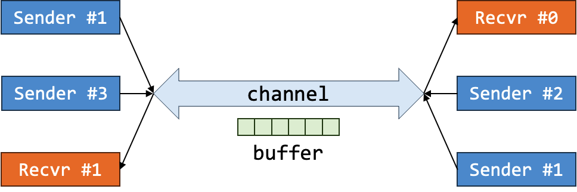

# Lab 1: Network and Agents

!!! abstract "Basic Information"
    - __Deadline:__ 5 September 2023, Tuesday, 23:59 SST
    - __Marks:__ 20
    - __Weightage:__ 2%

!!! info "Prerequisite"
    - Completed Lab 0.
    - Caught up to [Unit 17](../17-abstract.md) of Online Notes.

!!! note "Files"
    In the directory, you should see the following files:

    1. __Java Files:__
        - `Agent.java`: An abstract agent.
        - `Buffer.java`: A message buffer.
        - `Network.java`: A network simulation.
        - `NetworkAgent.java`: A badly written agent for the network simulation.
        - `Sender.java`: A potential first step.
        - `Lab1.java`: The main program.
    2. __Input/Output Files:__
        - `inputs/Lab1.k.in` for the input files.
        - `outputs/Lab1.k.out` for the output files.
    3. __Bash Script:__
        - `test.sh`: Testing `Lab1` by comparing the output when running `Lab0` on `inputs/Lab0.k.in` with the expected output in `outputs/Lab0.k.out`.

## Background

A network can be simulated by the behavior of sender and receiver.  A sender can send message(s) and a receiver can receive message(s).  The communications are done via a common channel.  Since the channel is common, it has a bandwidth (_i.e., the maximum number of messages that can be in the channel at the same time_).  This can be represented by the buffer.



So as an abstraction, senders write into the buffer if it can (_i.e., the buffer is not full_) and receiver receive from the buffer if it can (_i.e., the buffer is not empty_).  Note that this is a simplified view as the sender does not send a message to a specific receiver.  The receiver also do not expect to receive a message from a specific sender.

The notion of "time" in this simulation is an abstract concept.  Time may not run linearly but you are guaranteed that time will order the events.  In particular, an agent acting at time $n$ will act before an agent acting at time $m$ if and only if $n < m$.  You are also guaranteed that no two agents will act at the same time.

In Lab 1, we provide you with four classes: `Agent`, `Buffer`, `Network`, `NetworkAgent`.

### The `Agent` Class

!!! failure "Do NOT Edit This Class"
    The following is for your information only.  This restriction may be lifted in future labs.

The `Agent` class is an abstract class with a single field called `actionTime`.  This field indicates the time in which the agent will take an action (_i.e., will have its_ `act(Buffer)` _method invoked_).  The `Agent::toString()` method returns the time as a string enclosed in parentheses.  The `Agent::getTime(int)` method returns the time + some increment.

This class has a single abstract method `Agent::act(Buffer)`.  The method accepts a buffer which may be mutated by the action.  The method may return `null` or may generate another agent that act at a later time.  Since this method is abstract, all subclasses of this class will have to override this method.

You may ignore the superclass `Comparable<Agent>` for now.  It will be made clearer later.  What you need to know about that is simply that we need to override the method `compareTo(Agent)`.  This method is used by `PriorityQueue` to determine the ordering of agents.

### The `Buffer` Class

!!! failure "Do NOT Edit This Class"
    The following is for your information only.  This restriction may be lifted in future labs.

The `Buffer` class encapsulates a buffer.  This is an abstraction of the channel with some capacity.  A buffer can be created by specifying the maximum capacity of the buffer.

It has two important methods:

- `boolean Buffer::send(String)` that allows agents to send a non-null message (`String`) by writing it into the buffer if possible.
    - The message is stored at the back of the buffer.
    - If the message is stored in the buffer, the method returns `true`.
    - Otherwise, the method returns `false`.
- `String Buffer::receive()` that allows agents to receive a message (`String`) from the buffer if possible.
    - If there is a message, the message will be returned from the front of the buffer.
    - If there is no message, a `null` value will be returned.

### The `Network` Class

!!! success "Edit This Class"
    Please read carefully about what you need to do.

This class is at the core of the simulation of a network.  It has several functionalities.

#### Initializing the Starting State of the Network

A network is initialized with an ordered sequence of agents to act.  The ordering will be based in ascending order of action time of the agent.  To initialize the network into some starting state, it will have to read the user input.  This is done in the method `void Network::init(Scanner)`.

A `Scanner` is a class that allows us to read from user input.  It will read sequence of characters and potentially translate them into a primitive data type according to the method used.  We are only interested in reading until a separator (_white space, tabs, or newline_) is encountered.

- `String Scanner::next()` reads until white space, tabs, or newline and returns the sequence of characters as a string.
- `int Scanner::nextInt()` reads until white space, tabs, or newline and returns the sequence of characters as an integer.

In the explanation below, `<type>` indicates a token (_ends with white space, tabs, or newline_) that can be represented as a given type.  We may optionally give it a name to be referred to later by `<n : type>`.  We may also write a specific character (_e.g.,_ `CS2030S`) to mean that the input will be exactly that sequence of character.

The expected input format is as follows.

- The first line is `<n : int>` where `n` is the capacity of the buffer.
- The next line is `<m : int>` where `m` is the number of agents.
- The next `m` lines is the input for the agents with the following possible format.
    - `SS <t : int> <msg : String>`
        - `SS` represents a sender that sends a single message.
        - `t` represents the action time of this sender.
        - `msg ` represents the message to be sent by this sender.
    - `MS <t : int> <k : int> <msg_1 : String> <...> <msg_k : String>`
        - `MS` represents a sender that sends multiple messages.
        - `t` represents the action time of this sender.
        - `k` represents the number of messages.
        - `msg_1` ... `msg_k` represents the messages to be sent by this sender.
    - `SR <t : int> <nt : int>`
        - `SR` represents a receiver that receives a single message.
        - `t` represents the action time of this receiver.
        - `nt` represents the increment of time (_to be explained later_).

The last `m` lines of the input will be ordered in ascending order of action time.

!!! example "Sample Input"
    ```
    2
    3
    SS 1 CS
    MS 3 2 2030 S
    SR 4 5
    ```

    - The buffer has capacity 2 (_first line_)
    - There are 3 agents (_second line_)
        - The first agent is a sender that will send a single message "CS" at time 1 (_third line_).
        - The second agent is a sender that will send two messages "2030" and "S" both at time 3 (_fourth line_).
        - The third agent is a receiver that will receive one message at time 4 and will subsequently try to receive more messages every 5 time units until it fails to receive a message (_fifth line_).

#### Running the Network Simulation

The simulation runs by looking at the `PriorityQueue`.  You do not have to worry about the implementation of this.  What you need to know is that the method `PriorityQueue::poll()` will return the next agent to take action according to their action time.

We then perform the action of this agent by invoking `agent.act(buffer)`.  This method may return a new agent.  If it does, we add this to newly created agent into the queue again.  At this point, the queue may reorder its content to ensure that the next agent taken out is really the agent that is supposed to take action.

After each agent performs its task, the current state of the agent is printed using `System.out.println(agent)`.  Recap that this will implicitly invoke the `toString()` method.

#### Your Task

Currently, the class uses `NetworkAgent` class.  As you will learn later, the `NetworkAgent` class is badly written.  You will need to remove that class.

Your task for this `Network` class is to replace the use of `NetworkAgent` class with whatever classes you created to replace `NetworkAgent`.

### The `NetworkAgent` Class

!!! success "Delete This Class"
    Please read carefully about what you need to do.

The `NetworkAgent` class is very badly written class for agent.  It extends the abstract class `Agent` so that it can be used by `PriorityQueue<Agent>` but it does not follow the good OOP principles: _information hiding_, _tell, don't ask_, _LSP_, _polymorphism_, _etc_.

We separate the agent into two broad class of agents called __Sender__ and __Receiver__.  All __Sender__ will have unique contiguous id.  So the first sender will have id of 0, the second sender will have id of 1, and so on.  Similarly, all __Receiver__ will have unique contiguous id.  So if we have a sequence of: _sender_, _receiver_, _sender_.  Their id will be: _sender[0]_, _receiver[0]_, _sender[1]_.

The current implementation of `NetworkAgent` is a mix of three different agents:

#### Single Sender Agent

The action of this agent is to send a single message into the buffer if possible.  If the action fails (_e.g., the buffer is full_), then this sender does not perform anything.  The action of this sender does not generate additional agent.

When printed, this agent remembers if it successfully send a message or not and prints accordingly.


#### Multi Sender Agent

The action of this agent is to send multiple messages into the buffer if possible.  As soon as the action fails (_e.g., it fails to send the second message out of four messages_), the agent will stop trying to send.  The action of this sender does not generate additional agent.

When printed, this agent remembers how many messages it successfully sent and prints accordingly.


#### Single Receiver Agent

The action of this agent is to try to receive a single message from the buffer if possible.  If it receives a message, this receiver will generate a (_potentially the same_) receiver with the same id to act at another time.  The time is computed from the input `t` and `nt` of `SR`.  On the other hand, if it fails to receive a message (_e.g., the buffer is empty_), the agent will not generate additional agent.

When printed, this agent remembers how many messages it successfully sent and prints accordingly.


## Task 1: OOP

The `NetworkAgent` class is badly written.  Your main task is to rewrite this using OOP principles: _abstraction_, _encapsulation_, _information hiding_, _tell, don't ask_, _composition_, _inheritance_, _polymorphism_, _LSP_, _abstract class_, _etc.

A brief overview:

- Group relevant fields and methods into new classes for encapsulation.
- Model "has a" relationship with composition.
- Model "is a" relationship with inheritance.
- Hide internal details for information hiding.
- Avoid accessor and mutators when possible and use tell, don't ask instead.
- Use polymorphism to make code more succinct and extendable in the future while adhering to LSP.

Here are some hints:

- Think about the problem that you are solving: what are the nouns? These are good candidates for new classes.
- For each class, what are the attributes/properties relevant to the class? These are good candidates for fields in the class.
- Do the classes relate to each other via IS-A or HAS-A relationship?
- For each class, what are their responsibilities? What can they do? These are good candidates for methods in the class.
- How do the objects of each class interact? These are good candidates for public methods.
- What are some behavior that changes depending on the specific type of objects?

Note that the goal of this lab and, and of CS2030S in general, is _NOT to solve the problem with the cleverest and the shortest piece of code possible_. For instance, you might notice that you can solve Lab 1 with only a few variables and an array. But such a solution is hard to extend and modify. In CS2030S, our goal is to produce software that can easily evolve and be modified, with a reduced risk of introducing bugs while doing so.

Note that Lab 1 is the first of a series of labs, where we introduce new requirements or modify existing ones in every lab (_not unlike what software engineers face in the real world_). We will modify the behavior for the agents and buffer In particular, in the future,

- a different receiver may be added that tries to receive multiple messages with one of the following possible behavior.
    - Receive one at a time (_i.e., receive one now and act at a later time to receive again until a specified number of messages have been received_).
    - Receive all at the same time.
- a different sender may be added that retries sending messages as long as it failed to send messages until it is successful with the following possible behavior.
    - It may retry at a constant time.
    - It may retry with longer time for each failure (_exponential backoff_).
- a different buffer may be needed with the following behavior.
    - A priority buffer may be added with priority sender and/or receiver.
    - A buffer with maximum capacity that depends on the number of characters in the channel instead of number of messages.

Note that not all of the above changes may be executed.  A mixture of those or similar changes may be executed instead.  Thus, making sure that your code will be able to adapt to the new problem statements is the key.  Trying to solve the lab without considering this and you will likely find yourself painted into a corner and have to re-write much of your solution to handle any new requirements.

### First Step

To help you in your design, we will show a potential first step.  This may not be the step that you choose in the end but it can be a candidate.  This step is taken based on the following specification:

> We separate the agent into two broad class of agents called __Sender__ and __Receiver__.  All __Sender__ will have unique contiguous id.  So the first sender will have id of 0, the second sender will have id of 1, and so on.  Similarly, all __Receiver__ will have unique contiguous id.  So if we have a sequence of: _sender_, _receiver_, _sender_.  Their id will be: _sender[0]_, _receiver[0]_, _sender[1]_.

This brings us to the creation of an _abstract_ class `Sender` with a specific responsibilities of ensuring that in the normal case, the id of all sender will be contiguous starting from 0.  You will see this class in the file `Sender.java`.

{ width=250px }

From here, you may decide to continue this path by adding the other necessary classes or you may reject this design and come up with your own design.

## Workflow

### Compilation

To compile your code,

```sh
javac *.java
```

!!! warning "Warning"
    You may want to make sure ___at least once___ before submission that you can compile from scratch by first removing all `.class` files.

### Running and Testing

You should not test your code manually by entering the inputs.  Instead, enter the inputs into a file, and run

```sh
java Lab1 < file
```

A set of test inputs is provided as part of the skeleton, named `Lab1.x.in` under the `inputs` directory.  You can run them with, for instance,

```sh
java Lab1 < inputs/Lab1.9.in
```

You can save the output by redirecting it into a file (_e.g., a file called_ `OUT`).

```sh
java Lab1 < inputs/Lab1.9.in > OUT
```

You can then look for the difference using the `diff` command.

```sh
diff OUT outputs/Lab1.9.out
```

Alternatively, you can automatically test your code against all the given inputs/outputs by running.

```sh
./test.sh Lab1
```

or, you may need to specify the use of `bash` to run the `.sh` file.

```sh
bash ./test.sh Lab1
```

### Debugging

The expected outputs are given in the `outputs` directory.  You can compare `OUT` with the expected output with `diff` or `vim`. Using `vim`,

```sh
vim -d OUT output/Lab1.9.out
```

will open both files and highlight the differences.

As the output becomes too long, you can focus on tracing a particular agent with the help of `grep`. Suppose you want to focus on what happened to Sender #1 in `OUT`, run

```
$ grep -i 'Receiver\[0\]' OUT
(@4) Receiver[0] received 'CS2030S' 
(@7) Receiver[0] received 'really' 
(@10) Receiver[0] received 'that' 
(@13) Receiver[0] received 'actually' 
(@16) Receiver[0] failed to receive message 
```

## Grading

This lab is worth 20 marks and contribute 2% to your Lab Assignment component.  The marking scheme is as follows:

- Correctness: 4 marks.
- OO Principles: 16 marks.

We may make additional deductions for other issues or errors in your code such as compilation error, failure to follow instructions, etc.