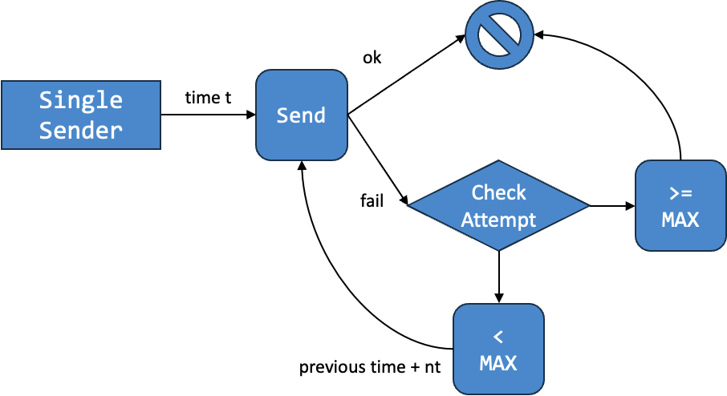

# Lab 2: Errors and Retries

!!! abstract "Basic Information"
    - __Deadline:__ 12 September 2023, Tuesday, 23:59 SST
    - __Marks:__ 20
    - __Weightage:__ 2%

!!! info "Prerequisite"
    - Completed Lab 1.
    - Caught up to [Unit 22](../22-exception.md) of Online Notes.

!!! note "Files"
    In the directory, you should see the following files:

    1. __Java Files:__
        - `BufferFullException.java`: A template for a checked exception.
        - `BufferEmptyException.java`: A template for a checked exception.
        - `Lab2.java`: The main program that is simply a renaming of `Lab1.java`.
    2. __Input/Output Files:__
        - `inputs/Lab1.k.in` for the _modified_ input files.
        - `outputs/Lab1.k.out` for the _modified_ output files.
        - `inputs/Lab2.k.in` for the input files.
        - `outputs/Lab2.k.out` for the output files.
    3. __Bash Script:__
        - `test.sh`: Testing `Lab2` by comparing the output when running `Lab2` on `inputs/Lab2.k.in` with the expected output in `outputs/Lab2.k.out`.

## Preliminary

Currently, our sender will give up if the buffer is full.  But you should not give up on the lab!  To help the sender, we are going to modify the behavior of a single sender agent to repeat until some number of tries.

Additionally, the way we receive a message from a buffer is not quite good because we have to check for `null` value.  We want to try to avoid this by using a checked exception instead.

Lastly, we will illustrate the benefit of good design by showing how some changes can localized to a small segment of a code while having big impact overall.

Please design your solution before coding.  If done correctly, the changes from Lab 1 to Lab 2 is approximately 40 lines of codes excluding the line of codes needed for the new classes.

!!! info "Unique Time"
    Note that we will still assume that no two agents will act at the same time if the implementation is done correctly.  Since there are some retries, it is possible for incorrect implementation to accidentally schedule two agents to act the same time.

    If you find in your output that two agents are acting at the same time, then you may have a mistake in your implementation.  A possibility is that your agent should not retry an attempt at sending/receiving.

## Task 0: Preparation

!!! note "Continuation"
    You are required to build on top of your Lab 1 submission for this lab.  However, to help you in case you are struggling with Lab 1 design, you can use the following design.

    

    A few notes about the design:

    - We have two constructor for `Receiver`.
        - `Receiver::Receiver(int)` ensures sequential id.
        - `Receiver::Receiver(int, int)` specifies the id to allow for reuse of id.
    - We have two constructor for `SingleReceiver` for similar reason.


### Copy

Assuming you have `lab1-<username>` and `lab2-<username>` under the same directory.  And assuming `lab2-<username>` is your current working directory (_you can check with_ `pwd` _command_).  You can execute the following command to copy the `.java` files from your Lab 1 to Lab 2.

```bash
cp -i ../lab1-<username>/*.java .
```

It might be better to keep `Lab1.java`.  We also provide a modified input/output pairs that can be run on agents from Lab 1.  The change to single sender in [Task 3](#task-3-retries) is done by having a maximum attempt of 1.

The new test cases for Lab 2 is provided for the modified single sender with maximum attempt greater than 1.

### Starting

You are encouraged to consider your tutor's feedback and fix any issues with your design for your Lab 1 submission before you embark on your Lab 2 journey.  Some of the feedback are based on marks deduction.  In this case, if you still have the same problem for Lab 2, your marks will be deducted again.  Some feedback may also correspond to problems that are not currently carry any marks deduction but will in the future.  This may include deduction in Lab 2.

Alternatively, you may first modify your design to follow our suggested design.  Note that it is not required to follow the design we offer.

## Task 1: Errors

Our first change is to attempt to remove the awkward `null` value from `Buffer::receive()`.  `null` values are dangerous.  The inventor of `null` value -- Tony Hoare -- calls it ["The Billion Dollar Mistake"](https://qconlondon.com/london-2009/qconlondon.com/london-2009/speaker/Tony+Hoare.html).  So our first task is to remove this.

The way we are going to remove `null` value is to replace it with exception.  While we are at it, we will also change `Buffer::send(String)` for uniformity.  We have provided two template files: `BufferFullException.java` and `BufferEmptyException.java` for two __checked__ exceptions that we are going to implement.

As a recap, there are two constructors for the class `Exception`.

- `Exception()`: constructs a new exception with `null` as its detail message.
- `Exception(String message)`: constructs a new exception with the specified detail message.

Additionally, `Exception` has an accessor for its message called the `getMessage()` method.

### Buffer Empty

First, create a checked exception `BufferEmptyException`.  It is a very simple exception that can be created without any argument.  Here is some sample usage:

```
jshell> BufferEmptyException e = new BufferEmptyException();
e ==> BufferEmptyException: Buffer is empty

jshell> try {
   ...>     throw e;
   ...> } catch(BufferEmptyException e) {
   ...>     System.out.println(e.getMessage());
   ...> }
Buffer is empty
```

Once you have created the checked exception `BufferEmptyException`, we can modify `Buffer::receive()` method.

- If the buffer is empty, throw a new `BufferEmptyException`.
- Otherwise,
    - retrieve the message from the front of the buffer,
    - remove the message from the buffer, and
    - return the retrieved message.

In this way, we will not return any `null` value anymore.  However, the price to pay is that we throw an exception.  Since this is a checked exception, you will also have to modify the code everywhere `Buffer::receive()` is used.  The changes to make is to add `try`-`catch` block around the use of `Buffer:receive()`.

### Buffer Full

Second, create a checked exception `BufferFullException`.  Similar to `BufferEmptyException`, it is also a very simple exception.

```
jshell> BufferFullException e = new BufferFullException();
e ==> BufferFullException: Buffer is full

jshell> try {
   ...>     throw e;
   ...> } catch(BufferFullException e) {
   ...>     System.out.println(e.getMessage());
   ...> }
Buffer is full
```

Once you have created the checked exception `BufferFullException `, we can modify `Buffer::send(String)` method.

- If the buffer is full, throw a new `BufferFullException`.
- Otherwise,
    - insert the message into the end of the buffer.

Since we assume no `null` value, we should also assume that `message` will not be `null`.  So, you can remove the check if `message` is `null` from `Buffer::send(String)`.  Also, since we handle success/failure via exception, we have no need for return value.  As such, change the return type from `boolean` to `void` as well as remove any `return` statement.

Since this is a checked exception, you will also have to modify the code everywhere `Buffer::send(String)` is used.  The changes to make is to add `try`-`catch` block around the use of `Buffer:send(String)`.

!!! note "Control Flow?"
    If you are wondering if this is not considered a violation of our rule that says exception should not be used as control flow, note that you are currently the "_client_" of the `Buffer` class.  Since the `Buffer` class has no method to check if it is empty or full, we can only communicate via exception.  You will not know if it is empty or full unless you try and check if there is an exception or not.  Fortunately, there is no "clean up" code necessary.


## Task 2: Printing

Our second change involve a change in the way we are printing the agents.  The changes are summarized below:

1. To standardize the printing, we will print the time with exactly 3 digits.  You may assume that our simulation of the network will definitely no produce time with 4 digit numbers.  Consider the examples below:
    - Instead of printing `(@2)`, we will print `(@002)` instead.
    - Instead of printing `(@12)`, we will print `(@012)` instead.
    - There is no change to printing `(@100)` up to `(@999)`.
2. We will simplify the printing of receiver and sender.
    - Receiver will be printed `R#n` instead of `Receive[n]`.
    - Sender will be printed `S#n` instead of `Sender[n]`.

So a sample output is as follows:

```
(@001) S#0 successfully sent 'CS2030S'
(@003) S#1 sent all messages
(@004) R#0 received 'CS2030S'
(@005) S#2 successfully sent 'actually'
(@006) R#1 received 'is'
(@007) R#0 received 'really'
(@009) R#1 received 'not'
(@010) R#0 received 'that'
(@012) R#1 received 'hard'
(@013) R#0 received 'actually'
(@015) R#1 failed to receive message
(@016) R#0 failed to receive message
```

## Task 3: Retries

The next task is to change the behavior of the single sender agent.  Currently, single sender agent gives up when it failed to send message through the buffer.  Now, we wish for the single sender agent to retry up to some number of times before giving up.  The changes you have to make are as follows:

1. Single sender input format will be changed from `SS <t : int> <msg : String>` to the following:
    - Format: `SSC <t : int> <nt : int> <max : int> <msg : String>`, where
        - `SSC` represents a sender that sends a single message with retries after a constant time.
        - `t` represents the initial action time of this sender.
        - `nt` represents the increment of time when failed to send.  If the sender fails once, it will retry at time `t + nt`.  If the sender fails twice, it will retry at time `t + nt + nt`.  And so on.
        - `max` represents the maximum number of retries.  After `max` number of failures, the sender will not attempt to send the message anymore.
        - `msg` represents the message to be sent by this sender.
    - The changes for this is to be made in `Network.java`.
2. The action of the single sender may produce another single sender such that:
    - The id of the produced single sender is the same.
    - The changes for this is to be made in the class representing single sender.  In other words, you should not create new class.

Consider a single sender created according to the following input format:

```
SSC 3 4 5 hello
```

Assuming this single sender always fail to send a message, the attempts are at the following timing:

- Time 3: The first attempt by the sender.
- Time 7: The second attempt computed as 3 + 4.
- Time 11: The third attempt computed as 3 + 4 + 4.
- Time 15: The fourth attempt computed as 3 + 4 + 4 + 4.
- Time 19: The fifth attempt computed as 3 + 4 + 4 + 4 + 4.

Note that there is no sixth attempt as the maximum number of failed attempts is 5.  Note that the old single sender is equivalent to single sender that has a maximum number of failed attempts of 1 (_i.e.,_ `SS 3 hello` _is equivalent to_ `SSC 3 1 1 hello`).  You may assume that the maximum number of failed attempt is at least 1.

We can summarize this behavior using the following diagram.



## Task 4: Multi Receiver

The final task is to implement a new a multi receiver agent that may receive multiple messages at the same time.  The changes you have to make are as follows:

1. Multi receiver input format is as follows:
    - Format: `MR <t : int> <k : int>`, where
        - `MR` represents a receiver that receives a multiple messages at the same time.
        - `t` represents the action time of this receiver.
        - `k` represents the number of messages to receive.
    - The changes for this is to be made in `Network.java`.
2. The action of the multi receiver will not produce another agent:
    - As this is a receiver, it follows the sequential id of receiver.
    - The receiver will try to receive as many messages as possible up to `k` messages.
    - As soon as the action fails (_e.g., it fails to receive the third out of four messages_), the agent will stop trying to receive.
    - When printed, this agent remembers how many messages it successfully received as well as the concatenation of the messages received and prints accordingly.

For instance, if a multi receiver is supposed to receive 4 messages but only receive the following three messages: `"CS2030S"`, `"_is_"`, and `"Easy"`, then the following message is potentially displayed when the multi receiver is printed.

```
(@009) R#0 received 3/4 messages: CS2030S_is_Easy
```


## Grading

This lab is worth 20 marks and contribute 2% to your Lab Assignment component.  The marking scheme is as follows:

| Component | Sub-Component | Marks |
|-----------|---------------|-------|
| Correctness | | 4 marks |
| OO Principles | | 16 marks |
| | _Information Hiding<br>Encapsulation<br>LSP<br>Polymorphism<br>Tell, Don't Ask_ | _2 marks<br>3 marks<br>3 marks<br>4 marks<br>4 marks_ |

Correctness mark will only be awarded if your code compiles and there are sufficient encapsulation (_i.e., you have created classes and used them_).  Note that the original code will have passed all test cases.  Additionally, if your code cannot compile __for any reason__, you will only get __50%__ of the mark for OO principles.  This penalty will be increased in subsequent labs.

We may make additional deductions for other issues or errors in your code such as run-time error, failure to follow instructions, errors from Lab 1 not corrected, etc.

## Submission

To submit the lab, run the following command from the directory containing your lab 2 code.

```sh
~cs2030s/submit-lab2
```

Please check your repo after running the submission script to ensure that your files have been added correctly.  The URL to your repo is given after you run the submission script.

!!! danger "Do NOT Use Other Git Command"
    While you may be familiar with git commands, please do not use them.  Please use only the submission script `submit-labX` to ensure that your submissions are recorded properly.