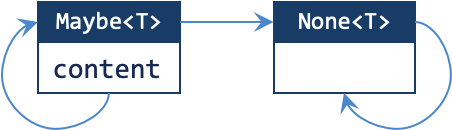

# Lab 5: Call me Maybe

!!! abstract "Basic Information"
    - __Deadline:__ 17 October 2023, Tuesday, 23:59 SST
    - __Marks:__ 20
    - __Weightage:__ 2%

!!! info "Prerequisite"
    - Completed Lab 4.
    - Caught up to [Unit 29](../29-nested-classes.md) of Online Notes.

!!! note "Files"
    In the directory, you should see the following files:

    - __Java Files:__
        - `cs2030s/fp/Producer.java`: A template for `Producer`.
        - `cs2030s/fp/Consumer.java`: A template for `Consumer`.
        - `cs2030s/fp/BooleanCondition.java`: A template for `BooleanCondition`.
        - `CS2030STest.java`: The main tester class.
        - `Test1.java` - `Test6.java`: A tester.

## Preliminary

This is a follow-up from Lab 4. In Lab 4, we have constructed a generic class `Some<T>`, which is a container for an item of type `T`.  Beyond being an exercise for teaching about generics, `Some<T>` is not a very useful type.  In this lab we are going to modify `Some<T>` into a more useful class.  We are also going to build our own Java packages using these useful classes.

### Java Package

Java package mechanism allows us to group relevant classes and interfaces under a namespace. You have seen two packages so far: `java.util`, where we import `List` and `Arrays` from.  There is also `java.lang` where we import the `Math` class from.  These are provided by Java as standard libraries.  We can also create our package and put the classes and interfaces into the same package. We (_and the clients_) can then import and use the classes and interfaces that we provide.

Java package provides a higher-layer of abstraction barrier. We can designate a class to be used outside a package by prefixing the keyword `class` with the access modifier `public`.  We can further fine-tune which fields and methods are accessible from other classes in the same package using the `protected` access modifier.

You can read more about [java packages](https://docs.oracle.com/javase/tutorial/java/package/index.html) and the [`protected` modifier](https://docs.oracle.com/javase/tutorial/java/javaOO/accesscontrol.html) yourself through Oracle's Java tutorial.

As a summary, the access levels are as follows.

| Modifier | Access from same class | Access from same package<br>(_or the same directory_) | Access from subclass<br>(_other directory_) | Access from other class<br>(_other directory_) |
|----------|------------------------|--------------------------------------|----------------------------------------|-------------------------|
| `public` | :material-check: | :material-check: | :material-check: | :material-check: |
| `protected` | :material-check: | :material-check: | :material-check: | :material-close: |
| `private` | :material-check: | :material-close: | :material-close: | :material-close: |

The table above is also the reason why we do not allow `protected` keyword in earlier labs.  Unless we are creating a proper package with proper directory structure, `protected` offer no additional benefit and is equivalent to `public`.  The class have to be created inside another directory to make full use of `protected`, which is what we are going to do in this lab.

We will create a package named `cs2030s.fp` to be used for this and the next few labs.

First, we need to add the line:

```java
package cs2030s.fp;
```

on top of every `.java` file that we would like to include in the package.

The package name is typically written in a hierarchical manner using the "." notation. The name also indicates the location of the `.java` files and the `.class` files.  For this reason, you can no longer store the `.java` files under labX-username directly. Instead, you should put them in a subdirectory called `cs2030s/fp` under `labX-username`.

To start, our `cs2030s.fp` package will contain the interface `Transformer` that you have written in Lab 4.

If you have set up everything correctly, you should be able to run the following in `jshell` (_remember to always compile your code first!_) from your `labX-username` directory:

```
jshell> import cs2030s.fp.Transformer;
```

without error.

## Task 1: More Interfaces

Now, we are going to add three more interfaces into our package:

- `Producer<T>` is an interface with a single `produce` method that takes in no parameter and returns a value of type `T`.
- `Consumer<T>` is an interface with a single `consume` method that takes in a parameter of type `T` and returns _nothing_.
- `BooleanCondition<T>` is an interface with a single `test` method that takes in a parameter of type `T` and returns a primitive `boolean` value.

### Sample Usage

If you have set up everything correctly, you should be able to run the following in `jshell` without errors (_remember to always compile your code first!_).

```
jshell> import cs2030s.fp.Producer;
jshell> import cs2030s.fp.Consumer;
jshell> import cs2030s.fp.BooleanCondition;
jshell> Producer<String> p;
jshell> p = new Producer<>() {
   ...>   public String produce() { return ""; }
   ...> }
jshell> Consumer<Boolean> c;
jshell> c = new Consumer<>() {
   ...>   public void consume(Boolean b) { }
   ...> }
jshell> BooleanCondition<Integer> b;
jshell> b = new BooleanCondition<>() {
   ...>   public boolean test(Integer x) { return x > 0; }
   ...> }
```


## Task 2: Call me Maybe

Now, we are going to implement a type called `Maybe<T>` in the `cs2030s.fp` package. Our `Maybe<T>` is an _option_ type, a common abstraction in programming languages (`java.util.Optional` _in Java,_ `option` _in Scala,_ `Maybe` _in Haskell,_ `Nullable<T>` _in C#, etc_) that is a wrapper around a value that might be missing. In other words, it represents either _some_ value, or _none_.

### Step 0: Packaging Some

1. Copy your implementation of `Some.java` into `labX-username/cs2030s/fp` directory.
2. Add `package cs2030s.fp;` as the first line on `Some.java`.

We will create our `Maybe<T>` class as part of `cs2030s.fp` package.

### Step 1: Inner Class

1. Rename your `Some.java` into `Maybe.java`.
2. Rename the class `Some<T>` into `Maybe<T>`.  This entails some other corrections too:
    - Rename all occurrences of `Some` into `Maybe` including the private constructor and the return type.
    - Do __NOT__ change the name of the factory method `some`.

If you have done this correctly, your directory structure should look something like the following:

```
labX-username/
├─ cs2030s/
│  ├─ fp/
│  │  ├─ Maybe.java
│  │  ├─ Transformer.java
├─ CS2030STest.java
├─ Test1.java
```

Additionally, you should be able to compile both `Maybe.java` and `Transformer.java` from within the `cs2030s/fp` directory using the following command without any warning.

```
javac -Xlint:rawtypes -Xlint:unchecked *.java
```

You can test this changes to `Maybe<T>` more comprehensively by running the following __from__ your `labX-username` directory.  This test case is simply the same as `Test2.java` from Lab 4 renamed to fit the current Lab 5.

```
javac -Xlint:rawtypes -Xlint:unchecked Test1.java
java Test1
```

There shouldn't be any compilation warning or error when you compile `Test1.java` and all tests should prints `ok`.

### Step 2: Adding None Class

Now we want to loosen the restriction of having no `null` value for our input.  We want to be able to handle `null` input to our factory method `Maybe::of`.  To do this, we want to first create a private _static nested_ class called `None<T>`.  The types `None<T>` is an internal implementation details of `Maybe<T>` and must not be used directly by the client.  Hence, it must be declared private.  Here is the requirement for `None<T>`.

- `None<T>` is a _generic_ private inner class that inherits from `Maybe<T>`.
    - Why is it generic if it represents `null` value?  Because we will need to be able to re-convert this back to the `Maybe<T>` with the same `T` later on.
- `None<T>` has no instance field.
- `None<T>` has private constructor that takes in no argument.
- `None<T>` overrides the `equals` method from `Maybe<T>`.
    - Any instance of `None<T>` is _equal_ to any other instance of `None<T>`.
    - We also need to _modify_ `Maybe<T>` to include a case where we are comparing `Maybe<T>` with `None<T>`.  In such cases, it should return `false`.
- `None<T>` overrides the `toString` method from `Maybe<T>`.
    - It simply prints `[]`.
- `None<T>` overrides the `map` method from `Maybe<T>`.
    - This simply returns _itself_.
    - You may add `@SuppressWarnings` here with explanation on why it is safe.
- `None<T>` (_and by extension_ `Maybe<T>`) must be immutable up to `T`.

### Step 3: Handling Nothing in Maybe

After you have created the `None<T>` class, we want to start handling the possibility that we create `Maybe<T>` with `null` value.

- Add the method `none()` that returns an instance of `None<T>`.
    - There should only be __ONE__ instance of `None<T>` such that multiple calls to `none()` should return the same instance.
    - You may add `@SuppressWarnings` here with explanation on why it is safe.
- Add the method `of` that returns:
    - an instance of `None<T>` if the input is `null`.
    - an instance of `Maybe<T>` (_that is not_ `None<T>`) if the input is not `null`.
- Modify the `map` method in `Maybe<T>` such that it returns:
    - an instance of `None<T>` if the result of applying the transformer is a `null` value.
    - an instance of `Maybe<T>` (_that is not_ `None<T>`) if the result of applying the transformer is not a `null` value.

Notice how the `map` may transform a `Maybe<T>` into a `None<T>` but never the other way around.  Here, by `Maybe<T>`, we really meant the `Maybe<T>` that is not `None<T>`.  This can be captured as the following "state diagram".



In fact, the arrow in the diagram above can be either `map`, `filter` (Task 3), or `flatMap` (Task 4).

Generally, the step for `map` method can be summarized below.

1. Open the "box".
2. Apply the function.
    - Obtain the result.
3. Put into new "box".
4. Return the result.

An illustration is shown below.

=== "Overview"
    
    
    ---

=== "Open the Box"
    

    By invoking `map`, you are already inside the "box".  So the "box" is already opened for you.
    
    ---

=== "Apply the Function"
    
    
    ---

=== "Obtain the Result"
    
    
    ---

=== "Put into new Box"
    
    
    ---

=== "Return the result"
    
    
    ---


#### Sample Usage #1

The sample usage for `none()` and `of()` is shown below.

```
jshell> Maybe.none().equals(Maybe.none())
$.. ==> true
jshell> Maybe.none().equals(Maybe.some("day"))
$.. ==> false
jshell> Maybe.none().equals(Maybe.some(null))
$.. ==> false
jshell> Maybe.none().equals(null)
$.. ==> false

jshell> Maybe.some("day").equals(Maybe.some("day"))
$.. ==> true
jshell> Maybe.some("day").equals(Maybe.none())
$.. ==> false
jshell> Maybe.some("day").equals(Maybe.some(null))
$.. ==> false

jshell> Maybe.some(null).equals(Maybe.some(null))  // be careful with this
$.. ==> false
jshell> Maybe.some(null).equals(Maybe.some("day"))
$.. ==> false
jshell> Maybe.some(null).equals(null)
$.. ==> false

jshell> Maybe.of(null).equals(Maybe.none())
$.. ==> true
jshell> Maybe.of(null).equals(Maybe.some(null))
$.. ==> false
jshell> Maybe.of(null) == Maybe.none()
$.. ==> true

jshell> Maybe.of(4).equals(Maybe.none())
$.. ==> false
jshell> Maybe.of(4).equals(Maybe.some(4))
$.. ==> true
```

You can test this addition to `Maybe<T>` more comprehensively by running the following __from__ your `labX-username` directory.

```
javac -Xlint:rawtypes -Xlint:unchecked Test2.java
java Test2
```

There shouldn't be any compilation warning or error when you compile `Test2.java` and all tests should prints `ok`.

#### Sample Usage #2

The sample usage for `map()` is shown below.

```
jshell> Transformer<Integer,Integer> incr = new Transformer<>() {
   ...>   public Integer transform(Integer x) {
   ...>     return x + 1;
   ...>   }
   ...> }
jshell> Maybe.<Integer>none().map(incr)
$.. ==> []
jshell> try {
   ...>   Maybe.<Integer>some(null).map(incr); // <- error expected
   ...> } catch (NullPointerException e) {
   ...>   System.out.println(e);
   ...> }
java.lang.NullPointerException
jshell> Maybe.<Integer>some(1).map(incr)
$.. ==> [2]

jshell> Map<String,Integer> map = Map.of("one", 1, "two", 2);
jshell> Transformer<String,Maybe<Integer>>  = new Transformer<>() {
   ...>   public String transform(String x) {
   ...>     return Maybe.some(map.get(x));
   ...>   }
   ...> }
jshell> Map<String,Integer> map = Map.of("one", 1, "two", 2);
jshell> Transformer<String,Integer> wordToInt = new Transformer<>() {
   ...>   public Integer transform(String x) {
   ...>     return map.get(x);
   ...>   }
   ...> }
jshell> Maybe.<String>none().map(wordToInt)
$.. ==> []
jshell> Maybe.<String>some("").map(wordToInt)
$.. ==> []
jshell> Maybe.<String>some("one").map(wordToInt)
$.. ==> [1]

jshell> Transformer<String,Maybe<Integer>> wordToMaybeInt = new Transformer<>() {
   ...>   public Maybe<Integer> transform(String x) {
   ...>     return Maybe.of(map.get(x));
   ...>   }
   ...> }
jshell> Maybe.<String>none().map(wordToMaybeInt)
$.. ==> []
jshell> Maybe.<String>some("").map(wordToMaybeInt)
$.. ==> [[]]
jshell> Maybe.<String>some("one").map(wordToMaybeInt)
$.. ==> [[1]]
jshell> Maybe<Maybe<Integer>> m = Maybe.<String>some("one").map(wordToMaybeInt)

jshell> Transformer<Object,Integer> toHashCode = new Transformer<>() {
   ...>   public Integer transform(Object x) {
   ...>     return x.hashCode();
   ...>   }
   ...> }
jshell> Maybe<Integer> m = Maybe.<String>none().map(toHashCode)
$.. ==> []
jshell> Maybe<Integer> m = Maybe.<String>some("cs2030s").map(toHashCode)
$.. ==> [1008560200]
```

You can test this addition to `Maybe<T>` more comprehensively by running the following __from__ your `labX-username` directory.

```
javac -Xlint:rawtypes -Xlint:unchecked Test3.java
java Test3
```

There shouldn't be any compilation warning or error when you compile `Test3.java` and all tests should prints `ok`.

## Task 3: Filtering

We now add the method `filter` to `Maybe<T>`.

- Add the method `filter` in `Maybe<T>` that takes in `BooleanCondition<..>` (_type parameter omitted_) as a parameter.
    - If the content of `Maybe<T>` is `null` or failed the test (_i.e., the call to_ `test` _returns_ `false`), return `None<T>`.
    - Otherwise, leaves `Maybe` untouched and return `Maybe` as it is.
- Override the method `filter` in` None<T>`.
    - Always returns a `None`.

### Sample Usage

```
jshell> import cs2030s.fp.BooleanCondition
jshell> import cs2030s.fp.Maybe

jshell> BooleanCondition<Number> isEven = new BooleanCondition<>() {
   ...>   public boolean test(Number x) {
   ...>     return x.shortValue() % 2 == 0;
   ...>   }
   ...> }
jshell> Maybe.<Integer>none().filter(isEven)
$.. ==> []
jshell> Maybe.<Integer>some(null).filter(isEven)
$.. ==> []
jshell> Maybe.<Integer>some(1).filter(isEven)
$.. ==> []
jshell> Maybe.<Integer>some(2).filter(isEven)
$.. ==> [2]
```

You can test this addition to `Maybe<T>` more comprehensively by running the following __from__ your `labX-username` directory.

```
javac -Xlint:rawtypes -Xlint:unchecked Test4.java
java Test4
```

There shouldn't be any compilation warning or error when you compile `Test4.java` and all tests should prints `ok`.

## Task 4: flatMap

Consider a `Transformer` that might return a `Maybe<T>` itself (as `wordToMaybeInt` above).  Using `map` on such a `Transformer` would lead to a value wrapped around a `Maybe` twice.  We want to add a method that is not doing this.

- Add a method `flatMap` in `Maybe<T>` that takes in a `Transfomer<..>` as the parameter.
    - The `Transformer` object transforms the value of type `T` in `Maybe<T>` into a value of type `Maybe<U>`, for some type `U`.
    - The method `flatMap`, however, returns a value of type `Maybe<U>` (instead of `Maybe<Maybe<U>>` as in the case of `map`).
    - You may add `@SuppressWarnings` here with explanation on why it is safe.
- Override the method `flatMap` in` None<T>`.
    - Always returns a `None`.

### Sample Usage

```
jshell> Map<String,Integer> map = Map.of("one", 1, "two", 2);
jshell> Transformer<String,Maybe<Integer>> wordToMaybeInt = new Transformer<>() {
   ...>   public Maybe<Integer> transform(String x) {
   ...>     return Maybe.of(map.get(x));
   ...>   }
   ...> }
jshell> Maybe.<String>none().flatMap(wordToMaybeInt)
$.. ==> []
jshell> Maybe.<String>some("").flatMap(wordToMaybeInt)
$.. ==> []
jshell> Maybe.<String>some("one").flatMap(wordToMaybeInt)
$.. ==> [1]
jshell> Maybe<Number> m = Maybe.<String>some("one").flatMap(wordToMaybeInt)
```

You can test this addition to `Maybe<T>` more comprehensively by running the following __from__ your `labX-username` directory.

```bash
javac -Xlint:rawtypes -Xlint:unchecked Test5.java
java Test5
```

There shouldn't be any compilation warning or error when you compile `Test5.java` and all tests should prints `ok`.

## Task 5: Back to T

Since Maybe is an abstraction for a possibly missing value, it would be useful to provide methods that decide what to do if the value is missing.

- Add a method `orElse` in `Maybe<T>` that takes in a `Producer<..>` as the parameter.
    - Always return the content.
- Override the method `orElse` in` None<T>`.
    - Returns the value of type `T` produced by the `Producer`.
- Add a method `ifPresent` in `Maybe<T>` that takes in a `Consumer<..>` as the parameter.
    - The `Consumer` consumes the content.
- Override the method `ifPresent` in` None<T>`.
    - Do nothing.

### Sample Usage

```
jshell> Producer<Double> zero = new Producer<>() {
   ...>   public Double produce() {
   ...>     return 0.0;
   ...>   }
   ...> }
jshell> Maybe.<Number>none().orElse(zero);
$.. ==> 0.0
jshell> Maybe.<Number>some(1).orElse(zero);
$.. ==> 1

jshell> List<Object> list = new ArrayList<>();
jshell> Consumer<Object> addToList = new Consumer<>() {
   ...>   public void consume(Object o) {
   ...>     list.add(o);
   ...>   }
   ...> }
jshell> Maybe.<Number>none().ifPresent(addToList);
jshell> list
list ==> []
jshell> Maybe.<Number>some(1).ifPresent(addToList);
jshell> list
list ==> [1]
```

You can test this addition to `Maybe<T>` more comprehensively by running the following __from__ your `labX-username` directory.

```bash
javac -Xlint:rawtypes -Xlint:unchecked Test6.java
java Test6
```

There shouldn't be any compilation warning or error when you compile `Test6.java` and all tests should prints `ok`.

### Flexible Type

Make sure you use PECS principle to make the `map` method as flexible as possible.  We have no explicit test case for this.  You are encouraged to make your own test case.


## Grading

This lab is worth 20 marks and contribute 2% to your Lab Assignment component.  The marking scheme is as follows:

| Component | Sub-Component | Marks |
|-----------|---------------|-------|
| Correctness | | 16 marks |
| Style | | 4 marks |

Correctness mark will be about general correctness with more manual checking of types satisfying PECS, doing the proper check (_e.g.,_ `null` _check_), _etc_.  This means that each `TestX.java` may carry different weights.  While we try to give you all the possible tests, there may be some tests we missed.  You should not hardcode any test cases.

Additionally, if your code cannot compile __for any reason__, you will get __0 mark for the lab__.  We will check for compilation with the following command run from `cs2030s/fp` directory.

```bash
javac -Xlint:unchecked -Xlint:rawtypes *.java
```

We may make additional deductions for other issues or errors in your code such as run-time error, failure to follow instructions, failure to correct errors from Lab 4, not commenting `@SuppressWarning`, misuse of `@SuppressWarning` (_unnecessary, not in smallest scope, etc_), etc.

## Submission

To submit the lab, run the following command from the directory containing your lab 5 code.

```sh
~cs2030s/submit-lab5
```

Please check your repo after running the submission script to ensure that your files have been added correctly.  The URL to your repo is given after you run the submission script.

!!! danger "Do NOT Use Other Git Command"
    While you may be familiar with git commands, please do not use them.  Please use only the submission script `submit-labX` to ensure that your submissions are recorded properly.