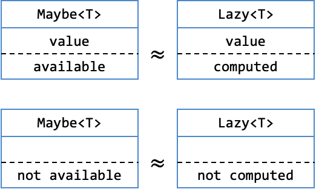

# Lab 6: The Art of Being Lazy

!!! abstract "Basic Information"
    - __Deadline:__ 24 October 2023, Tuesday, 23:59 SST
    - __Marks:__ 20
    - __Weightage:__ 2%

!!! info "Prerequisite"
    - Caught up to [Unit 32](../32-lazy.md) of Online Notes.

!!! note "Files"
    In the directory, you should see the following files:

    - __Java Files:__
        - `cs2030s/fp/BooleanCondition.class`: A `BooleanCondition` class.
        - `cs2030s/fp/Consumer.class`: A `Consumer` class.lab
        - `cs2030s/fp/Producer.class`: A `Producer` class.
        - `cs2030s/fp/Transformer.class`: A `Transfomer` class.
        - `cs2030s/fp/Maybe.class` and `cs2030s/fp/Maybe$None.class`: A `Maybe` class.
        - `cs2030s/fp/Lazy.java`: A template for `Lazy` class.
            - Please update the method signature to make the type more flexible.
        - `CS2030STest.java`: The main tester class.
        - `Test1.java` - `Test6.java`: A tester.

## Preliminary

This is a follow-up from Lab 5.  In Lab 5, we have constructed a generic class `Maybe<T>`, which is a container for an item of type `T` which may be `null`.  We are now going to use `Maybe<T>` class to construct `Lazy<T>`.

If you have not finished Lab 5, do not worry, we give a possible implementation of Lab 5 as a class file.  Note that this class file was compiled on PE node using Java 17 compiler.  If you are not using Java 17 or if you are not working on the PE node, you may get different result.  Unlikely, but the possibility is there.

### Maybe Class

The class `Maybe<T>` has the following `public` methods.  You cannot use any methods that are not `public` from outside the package.

| Method | Description |
|--------|-------------|
| `static <T> Maybe<T> of(T val)` | Creates a `Maybe<T>` with the given content `val` if `val` is not `null`.  Otherwise, returns the shared instance of `None<?>`. |
| `static <T> Maybe<T> some(T val)` | Creates a `Maybe<T>` with the given content `val` which may be `null`. |
| `static <T> Maybe<T> none()` | Creates a `Maybe<T>` without any content, this is guaranteed to return the shared instance of `None<?>`. |
| `String toString()` | Returns the string representation of `Maybe<T>`. |
| `boolean equals(Object obj)` | <ul><li>`Maybe<T>`: Returns `true` if the content is equal to the content of `obj`.  Otherwise returns `false`.</li><li>`None<T>`: Returns `true` if `obj` is also `None<T>`.  Otherwise returns `false`.</li></ul> |
| `<U> Maybe<U> map`<br>`(Transformer<? super T, ? extends U> fn)` | <ul><li>`Maybe<T>`: Create a new instance of `Maybe<T>` by applying the transformer `fn` to the content and wrapping it in `Maybe<T>`. If the result of applying the transformer is `null`, returns `None<T>`.</li><li>`None<T>`: Returns `None<T>`.</li></ul> |
| `Maybe<T> filter`<br>`(BooleanCondition<? super T> pred)` | <ul><li>`Maybe<T>`: If the content is not `null` and `pred.test(content)` returns `true`, we return the current instance.  Otherwise, returns `None<T>`.</li><li>`None<T>`: Returns `None<T>`.</li></ul> |
| `<U> Maybe<U> flatmap`<br>`(Transformer<? super T, ? extends Maybe<? extends U>> fn)` | <ul><li>`Maybe<T>`: Create a new instance of `Maybe<T>` by applying the transformer `fn` to the content _without_ wrapping it in `Maybe<T>` as `fn` already returns `Maybe<U>`.</li><li>`None<T>`: Returns `None<T>`.</li></ul> |
| `T orElse(Producer<? extends T> prod)` | <ul><li>`Maybe<T>`: Returns the content (_even if it is_ `null`).</li><li>`None<T>`: Returns the value produced by the producer `prod`.</li></ul> |
| `void ifPresent(Consumer<? super T> cons)` | <ul><li>`Maybe<T>`: Pass the content to the consumer `cons`.</li><li>`None<T>`: Do nothing.</li></ul> |

### The Basics of Being Lazy

Programming languages such as Scala support lazy values, where the expression that produces a lazy value is not evaluated until the value is needed. Lazy value is useful for cases where producing the value is expensive, but the value might not eventually be used. Java, however, does not provide a similar abstraction. So, you are going to build one.

This task is divided into several stages. You are highly encouraged to read through all the stages to see how the different levels are related.

You are required to design a single `Lazy<T>` class as part of the `cs2030s.fp` package with two fields. You are not allowed to add additional fields to `Lazy`.

```java
public class Lazy<T> {
  private Producer<? extends T> producer;
  private Maybe<T> value;

   :
}
```

!!! warning "Flexible Type"
    While you cannot add new fields, you should make the current field more flexible whenever possible.

    Furthermore, in all discussion below, the method signature given may not be the most flexible.  Your task is to determine if they can be made more flexible.

#### Constraints

You should minimize the use of conditional statements and conditional expressions.  In many cases, this can be done by using the appropriate methods from `Maybe<T>`.  You are also not allowed to have nested class within `Lazy<T>` to avoid conditional statements/expressions by using polymorphism.

If you have done the design correctly, you will have no conditional statements/expressions except for the `equals` method.

The basic idea is that we can match the concept of `None<T>` to a lazy value that is not yet computed and the concept of `Maybe<T>` (_that is not_ `None<T>`) to a lazy value that is already computed.  The proper name for this is that they are _isomorphic_.

The visualisation is shown below.  Note that the _value_ above the dashed line is the content of the box while the _text_ below the dashed line represents the context.  The context of `Maybe<T>` is that the value is either _available_ or _not available_ (_i.e.,_ `null`).  On the other hand, the context of `Lazy<T>` should be that the value is either _computed_ or _not yet computed_.



!!! warning "Compiling Lazy"
    Note that since we provide only the `.class` files for `Maybe<T>` and other interfaces, you may need to compile `Lazy<T>` with the following command from the `lab6-<username>` directory

    ```
    javac cs2030s/fp/Lazy.java
    ```

## Task 1: Basic

Define a generic `Lazy`` class to encapsulate a value with the following operations:

- `static of(T v)` method that initializes the `Lazy` object with the given value.
- `static of(Producer<T> s)` method that takes in a producer that produces the value when needed.
- `get()` method that is called when the value is needed. If the value is already available, return that value; otherwise, compute the value and return it. The computation should only be done once for the same value.
- `toString()`: returns `"?"` if the value is not yet available; returns the string representation of the value otherwise.
    - You are encouraged to use `String.valueOf(obj)` instead of `obj.toString()` to avoid runtime error when `obj` is `null`.

!!! note "Immutable?"
    For our `Lazy<T>` to be immutable and to make the memoization of the value transparent, `toString` should call `get()` and should never return `"?"`. We break the rules of immutability and encapsulation here, just so that it is easier to debug and test the laziness of your implementation.

### Sample Usage

```
jshell> import cs2030s.fp.Producer
jshell> import cs2030s.fp.Lazy

jshell> Lazy<Integer> eight = Lazy.of(8)
jshell> eight
eight ==> 8
jshell> eight.get()
$.. ==> 8

jshell> Producer<String> s = () -> "hello"
jshell> Lazy<Object> hello = Lazy.of(s)
jshell> Lazy<String> hello = Lazy.of(s)
jshell> hello
hello ==> ?
jshell> hello.get()
$.. ==> "hello"

jshell> s = () -> { System.out.println("world!"); return "hello"; }
jshell> Lazy<String> hello = Lazy.of(s)
jshell> hello
hello ==> ?
jshell> hello.get()
world!
$.. ==> "hello"

jshell> // check that "world!" should not be printed again.
jshell> hello.get()
$.. ==> "hello"

jshell> Random rng = new Random(1)
jshell> Producer<Integer> r = () -> rng.nextInt()
jshell> Lazy<Integer> random = Lazy.of(r)

jshell> // check that random value should not be available
jshell> random
random ==> ?

jshell> // check that random value is obtained only once
jshell> random.get().equals(random.get())
$.. ==> true

jshell> // should handle null
jshell> Lazy<Object> n = Lazy.of((Object)null)
jshell> n.toString()
$.. ==> "null"
jshell> n.get()
$.. ==> null

jshell> Lazy<Integer> n = Lazy.of((Producer<Integer>)() -> null)
jshell> n
n ==> ?
jshell> n.get()
$.. ==> null
```

You can test your code by running the `Test1.java` provided. The following should compile without errors or warnings. Make sure your code follows the CS2030S Java style. 

```
$ javac cs2030s/fp/Lazy.java
$ javac -Xlint:rawtypes Test1.java
$ java Test1
$ java -jar ~cs2030s/bin/checkstyle.jar -c ~cs2030s/bin/cs2030_checks.xml Lazy.java
```

## Task 2: Map and FlatMap

Now let's add the `map` and `flatMap` method. Remember that `Lazy` should not evaluate anything until `get()` is called, so the function `f` passed into `Lazy` through `map` and `flatMap` should not be evaluated until `get()` is called. Furthermore, they should be evaluated once. That result from `map` and `flatMap`, once evaluated, should be cached (_also called memoized_), so that function must not be called again.

### Sample Usage

```
jshell> import cs2030s.fp.Lazy
jshell> import cs2030s.fp.Producer
jshell> import cs2030s.fp.Transformer

jshell> Producer<String> s = () -> "123456"
jshell> Lazy<String> lazy = Lazy.of(s)
jshell> lazy.map(str -> str.substring(0, 1))
$.. ==> ?
jshell> lazy
$.. ==> ?
jshell> lazy.map(str -> str.substring(0, 1)).get()
$.. ==> "1"
jshell> lazy.get()
$.. ==> "123456"

jshell> Transformer<String, String> substr = str -> {
   ...>   System.out.println("substring");
   ...>   return str.substring(0, 1);
   ...> }
jshell> lazy = lazy.map(substr)
jshell> lazy.get()
substring
$.. ==> "1"
jshell> lazy.get()
$.. ==> "1"

jshell> Lazy<Integer> lazy = Lazy.of(10)
jshell> lazy = lazy.map(i -> i + 1)
jshell> lazy = lazy.flatMap(j -> Lazy.of(j + 3))
jshell> lazy
lazy ==> ?
jshell> lazy.get()
$.. ==> 14
jshell> lazy
lazy ==> 14

jshell> Transformer<Object, Integer> hash = x -> x.hashCode();
jshell> Lazy<Number> lazy = Lazy.<String>of("sunday").map(hash);
jshell> Transformer<Object, Lazy<Integer>> hash = x -> Lazy.<Integer>of(x.hashCode());
jshell> Lazy<Number> lazy = Lazy.<String>of("sunday").flatMap(hash);
```

You can test your code by running the `Test2.java` provided. The following should compile without errors or warnings. Make sure your code follows the CS2030S Java style. 

```
$ javac cs2030s/fp/Lazy.java
$ javac -Xlint:rawtypes Test2.java
$ java Test2
$ java -jar ~cs2030s/bin/checkstyle.jar -c ~cs2030s/bin/cs2030_checks.xml Lazy.java
```

## Task 3: Filter and Equality

Write a `filter` method, which takes in a `BooleanCondition` and lazily tests if the value passes the test or not. Returns a `Lazy<Boolean>` object. The `BooleanCondition` must be executed at most once.

Then write an `equals`, which overrides the `equals` method in the `Object` class. `equals` is an ___eager___ operation that causes the values to be evaluated (_if not already cached_). `equals` should return `true` only if both objects being compared are `Lazy` and the value contains within are equals (_according to their_ `equals()` _methods_).

### Sample Usage

```
jshell> import cs2030s.fp.Lazy

jshell> Lazy<Integer> fifty = Lazy.of(50)
jshell> Lazy<Boolean> even = fifty.filter(i -> i % 2 == 0)
jshell> even
even ==> ?
jshell> even.get()
$.. ==> true
jshell> even
even ==> true

jshell> // equals
jshell> fifty.equals(Lazy.of(5).map(i -> i * 10))
$.. ==> true
jshell> fifty.equals(50)
$.. ==> false
jshell> fifty.equals(Lazy.of("50"))
$.. ==> false
jshell> even.equals(Lazy.of(true))
$.. ==> true

jshell> BooleanCondition<String> isHello = s -> {
   ...>   System.out.println(s);
   ...>   return s.equals("hello");
   ...> }
jshell> Lazy<Boolean> same = Lazy.of("hi").filter(isHello)
jshell> same
same ==> ?
jshell> same.get()
hi
$.. ==> false
jshell> same.get()
$.. ==> false

jshell> BooleanCondition<Object> alwaysFalse = s -> false
jshell> Lazy<Boolean> same = Lazy.<String>of("hi").filter(alwaysFalse)

jshell> Producer<String> producer = () -> "123456";
jshell> Lazy<String> oneToSix = Lazy.of(producer);
jshell> oneToSix.toString();
$.. ==> ?
jshell> oneToSix.equals(oneToSix)
$.. ==> true
jshell> oneToSix.toString();
$.. ==> 123456
```

You can test your code by running the `Test3.java` provided. The following should compile without errors or warnings. Make sure your code follows the CS2030S Java style. 

```
$ javac cs2030s/fp/Lazy.java
$ javac -Xlint:rawtypes Test3.java
$ java Test3
$ java -jar ~cs2030s/bin/checkstyle.jar -c ~cs2030s/bin/cs2030_checks.xml Lazy.java
```

## Flexible Type

Make sure you use PECS principle to make the `map` method as flexible as possible.  We have no explicit test case for this.  You are encouraged to make your own test case.

## Grading

This lab is worth 20 marks and contribute 2% to your Lab Assignment component.  The marking scheme is as follows:

| Component | Sub-Component | Marks |
|-----------|---------------|-------|
| Correctness | | 16 marks |
| Style | | 4 marks |

Correctness mark will be about general correctness with more manual checking of types satisfying PECS, doing the proper check (_e.g.,_ `null` _check_), _etc_.  This means that each `TestX.java` may carry different weights.  While we try to give you all the possible tests, there may be some tests we missed.  You should not hardcode any test cases.

Additionally, if your code cannot compile __for any reason__, you will get __0 mark for the lab__.  We will check for compilation with the following command..

```bash
javac -Xlint:unchecked -Xlint:rawtypes cs2030s/fp/Lazy.java
```

We may make additional deductions for other issues or errors in your code such as run-time error, failure to follow instructions, failure to correct errors from Lab 5, not commenting `@SuppressWarning`, misuse of `@SuppressWarning` (_unnecessary, not in smallest scope, etc_), having unnecessary conditional statements/expressions, etc.

## Submission

To submit the lab, run the following command from the directory containing your lab 6 code.

```sh
~cs2030s/submit-lab6
```

Please check your repo after running the submission script to ensure that your files have been added correctly.  The URL to your repo is given after you run the submission script.

!!! danger "Do NOT Use Other Git Command"
    While you may be familiar with git commands, please do not use them.  Please use only the submission script `submit-labX` to ensure that your submissions are recorded properly.