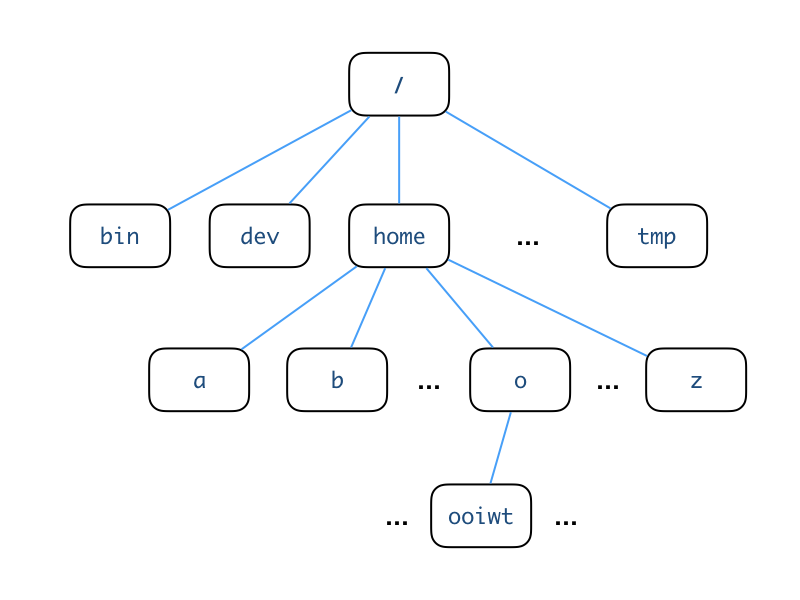

# Unix CLI: The Essentials

This article is adapted from the notes of the [Unix@Home Workshop](https://nus-unix-workshop.github.io/2021-s1) held in August 2020.  It contains the essential knowledge that a CS2030S students need to survive using the PE nodes to do the labs (and to use a Unix CLI in general).

!!! abstract "Learning Objectives"

    Students should

    - be able to navigate comfortably in a Unix file system using shell commands `cd`, `pwd`, and `ls`.
    - be able to use `.`, `..`, `~` or `/` to form a relative or absolute path name to a file.
    - be able to organize files in a Unix file system using shell commands `mkdir`, `rmdir`, `mv`, `rm`, and `cp`.
    - be able to view the content of the file using `cat`, `more` or `less`.
    - be able to manage the permission of a file using `chmod`.
    - be able to perform standard input/output redirection with `<` and `>`.


## Unix Directory

Unix organizes files according to a directory structure.  The following shows an example.



This structure is also known as a _directory tree_.  There are two important directories that you need to know.

### Root Directory
The root directory is the directory at the top of the directory tree[^1]. It is simply referred to as `/`, without any name.  Under the root directory are many other system directory, which a casual user does not normally need to (_and have no permission to_) modify.

[^1]: In computing, trees are upside down with the root at the top and leaves at the bottom!

### Home Directory
Each user has his/her own _home_ directory.  The above figure shows where the home directory of the user `ooiwt` resides in the directory tree. The user `ooiwt` may create files or directories in his/her home directory, but not elsewhere unless permission is given.

The home directory is referred to with the symbol `~` in `bash`.  Sometimes we add the username behind `~` to indicate the home directory of the other user. E.g., `~bob` means the home directory of a user named `bob`.

### Current Working Directory

A user can navigate around the directory tree.  The _current working directory_ is the directory that the user is currently in.  In contrast to the root and home directory, which are fixed[^2], the current working directory changes as the user moves around.  Knowing the current working directory is important since this is the default location in the directory tree a command executes.  As such, many systems by default display the current working directory as part of the `bash` command prompt.

The current working directory is referred to with the symbol `.` in `bash`.

[^2]: Not exactly true -- since Unix is designed to be flexible, even the root and the home directory can be changed!  But let's not worry about that for now since there is no good reason to do that as a beginner.

### Parent Directory

The _parent directory_ is directory one layer up from the current directory.

The parent directory is referred to with the symbol `..` in `bash`.

To summarize, here are the short form representations:

Symbol|Meaning
------|-----------------------------
  `/` |the root directory           
  `~` |the home directory           
  `.` |the current working directory
  `..`|the parent directory         

## Specifying a Path

To specify a directory or a file in the Unix directory tree, we can use either the _absolute path_ or the _relative path_.

### Absolute path

The absolute path is constructed as follows, starting from the root of the directory structure, find a path (_a sequence of directories_) to the location that you want to specify, then concatenate the names of the directories together, separated by the forward-slash `/`.  This is a similar notation used for Website URLs, so you should already be familiar with it.  For instance, the path `/home/o/ooiwt` is the absolute path of the directory named `ooiwt` in the figure above.

An absolute path is independent of the current working directory and always start with `/` or `~`

### Relative path

The relative path is dependent on the current working directory.  To refer to another location, start from the current directory, and find a path (_a sequence of directories_) to the location that you refer to.  When we go up a tree, we use `..` to represent the directory.

For example, referring to the figure above, if we are in the directory `/home/b`, and we wish to refer to `/home/o/ooiwt`, we can use the relative path `../o/ooiwt`.  If we wish to refer to `/home/b/bob`, we can use the relative path `bob`.

A relative path never starts with `/`.

## Directory-related Commands

Now, let's take a look at some basic commands available in `bash` that deals with navigation and directories.

### `pwd`: Print Current Working directory

`pwd` shows you which directory you are currently in.  Type `pwd` into the command prompt, and it will print the absolute path to your current working directory. For instance, Suppose you are in `/home/o/ooiwt`, entering

```Bash
pwd
```

will give the output

```Bash
/home/o/ooiwt
```

### `ls`: LiSt content of a directory

The `ls` list the content in the current working directory.

!!! note "Rule of Silence"
    Unix follows the economical _rule of silence_: programs should not print unnecessary output, to allow other programs and users to easily parse the output from one program.  So, if `ls` has nothing to list, it will list nothing (_as opposed to, say, printing "This is an empty directory."_)

In Unix, a file or directory with a name that starts with `.` is hidden from `ls`.  Common hidden files are `.vimrc`, the configuration file for `vim`, and `.ssh`, the directory to store your SSH keys and configuration.  To view all the files, including hidden files, run `ls` with the `-a` flag (_`a` stands for all_).

### `mkdir`: MaKe a subDIRectory

The `mkdir` command creates a subdirectory with the given name in the current directory.

In the example below, we assume that we start with an empty directory.  

```Bash
$ ls
$ mkdir workshop
$ ls
workshop
$ ls -F
workshop/
```

Here, we create a directory called `workshop`.  Now, when we `ls`, you can see the directory listed.  

You may also use `ls -F` for more information (_`-F` is one of the many _options_/_flags_ available for the `ls` command. To see a complete list of the options, refer to the man pages, i.e., `man ls`_).

The slash `/` beside the filename tells you that the file is a directory.  A normal file does not have a slash beside its name when "ls -F" is used.

You may also use the `ls -l` command (_hyphen el, not hyphen one_) to display almost all the file information, include the size of the file and the date of modification.

!!! tip "Use Up Arrow for Command History"
    `bash` maintains a history of your previously executed commands, and you may use the ++control+p++ (_previous_) and ++control+n++ (_next_) to go through it. Press the ++control+p++ until you find a previously executed command. You may then press ++enter++ to execute it or edit the command before executing it. This is handy when you need to repeatedly execute a long `bash` command.

### `cd`: Change Directory

To navigate in the directory tree, changing the current working directory from one to another, we use the `cd` command.

```Bash
$ pwd
/home/o/ooiwt
$ cd workshop
$ pwd
/home/o/ooiwt/workshop
```

Suppose our starting working directory is `/home/o/ooiwt`, after we `cd` into `workshop`, the current working directory becomes `/home/o/ooiwt/workshop`.  Note that `cd` can take in either an absolute path or a relative path.  The example above takes in a relative path as the argument.

As mentioned in "[Unix CLI: Background](background.md)", it is common to include the current working directory into the shell's prompt.  So, you may see your command prompt updated to include the new working directory.

Entering `cd` alone (_without argument_) brings you back to your home directory.  

### `rmdir`: ReMove a subDIRectory

`rmdir` removes a subDIRectory in the current directory -- note that a directory must be empty before it can be removed.

The command

```Bash
$ rmdir workshop
```

will remove the directory that you just created.

## File Management

This note assumes that you are familiar with navigation with the Unix directory structure.

We will now learn some commands to help us deal with files.

Let's recreate the `workshop` directory in case you have already deleted it with the `rmdir` at the end of the last unit.

```Bash
$ mkdir -p workshop
$ cd workshop
$ ls
```

All the above commands should complete successfully and _silently_.  Let's populate the directory with a new file.  Cut-and-paste the command below into the command prompt:

```Bash
wget https://www.comp.nus.edu.sg/~ooiwt/unix-workshop/test.txt
```

You should see a file being downloaded and saved with an output similar to below:

```
--2020-07-27 15:26:49--  https://raw.githubusercontent.com/nus-unix-workshop/2021-s1/master/test.txt
Resolving raw.githubusercontent.com (raw.githubusercontent.com)... 151.101.0.133, 151.101.64.133, 151.101.128.133, ...
Connecting to raw.githubusercontent.com (raw.githubusercontent.com)|151.101.0.133|:443... connected.
HTTP request sent, awaiting response... 200 OK
Length: 64 [text/plain]
Saving to: ‘test.txt’

test.txt              100%[======================>]      64  --.-KB/s    in 0s

2020-07-27 15:26:50 (2.35 MB/s) - ‘test.txt’ saved [64/64]
```

Now run `ls`, and you should see that `ls` returns `test.txt` as the content of the current working directory.

```Bash
$ ls
test.txt
```

### `cp`: CoPy files

Now let's try to copy this file to another name.

```Bash
$ cp test.txt foo.txt
$ ls
test.txt foo.txt
```

The command above copies the file `test.txt` into `foo.txt`.

If you want to copy the whole directory, use `-r` flag, where `r` stands for copying recursively.

Now let's create another directory called `copy`.

```Bash
$ cd ..
$ mkdir copy
$ cd copy
$ ls
```

Run `pwd` to double-check that you are in the directory called `copy` that is at the same level as `workshop`.

Now, we are going to use `cp` with the `-r` flag, to copy recursively the whole of `workshop` directory over.

```Bash
$ cp -r ../workshop .
```

The command `cp` takes in two arguments, the first is the source, and the second is the destination.

Note that we use `.` above to indicate that we wish to copy the whole subtree of `workshop` over the current directory.  The command should complete without any message.  Upon completion, you can run `ls` to double-check that the workshop directory exists under `workshop`.

!!! warning "`cp` Overwrites"
    If there is an existing file with the same name, `cp` will overwrite
    the existing file without warning.

### `mv`: MoVe or rename files

Now, let's change directory back to `workshop`.

```Bash
$ cd ../workshop
```

and use the `mv` command to rename `foo.txt` into `bar.txt`.

```Bash
$ ls
foo.txt test.txt
$ mv foo.txt bar.txt
$ ls
bar.txt test.txt
```

As you can see above, just like `cp`, `mv` takes in two arguments, the first is the source and the second is the destination.

If the destination of `mv` is a directory, however, instead of renaming, the `mv` commands move the source to the destination directory.

```bash
$ ls
bar.txt test.txt
$ mv ../copy/workshop/foo.txt .
$ ls
bar.txt foo.txt test.txt
```

Here, you can see that we have moved `foo.txt` over to the current directory.

!!! warning "`mv` Overwrites"
    If there is an existing file with the same name, `mv` will overwrite
    the existing file without warning. `mv` comes with a `-i` flag that interactively asks you if you are sure if you want to overwrite a file.  It is a good idea to always run `mv -i`. Hit ++y++ to continue overwriting the existing file.  You can look up on the Internet on how to make `-i` the default using `alias` command in `.bashrc`.

!!! tip "Use ++tab++ for Name Completion"
    If you have a very long file name, you may use the `bash` auto-completion feature to reduce typing. For instance, you may type:
    
    ```Bash
    $ mv t
    ```
    
    and press the ++tab++ key, `bash` will complete the filename for you if there is only one filename with the prefix "t". Otherwise, it will fill up the filename to the point where you need to type in more characters for disambiguation.
	The ++tab++ key can also complete the name of a command.

### `rm`: ReMove files

We can use `rm` to remove files.  Be careful with this command -- files deleted cannot be restored.  There is no trash or recycled bin like in Mac or Windows.

```bash
$ ls
bar.txt foo.txt test.txt
$ rm foo.txt
$ ls
bar.txt test.txt
```

!!! warning "`rm -rf`"
    While the Unix command line provides lots of flexibility and power, with great power comes great responsibility.  Some commands are extremely dangerous.  `rm -rf *` is the most famous one.  The notation `*` refers to all files, and the flag `-f` means forceful deletion (___no question asked!___), and `-r` means remove recursively everything under the current directory tree.  Accidentally running this command has ruined many lives.  [Read more here](https://www.quora.com/What-are-some-crazy-rm-rf-stories-you-have-heard-about)

`rm` comes with a `-i` flag that interactively asks you if you are sure if you want to delete a file.  It is a good idea to always run `rm -i`.

```
$ rm -i bar.txt
rm: remove regular file 'bar.txt'?
```

Type `y` or `n` to answer yes or no respectively.


### `cat`: CATenate file content to screen

To quickly take a look at the content of the file, use the `cat` command.

```
$ cat test.txt
This is a test file for learning Unix file management commands.
```

`less` is a variant of `cat` that includes features to read each page leisurely and is useful for long files.

```bash
$ less test.txt
```

In `less`, use `<space>` to move down one page, `b` to move Back up one page, and `q` to Quit.

### `man`: Online MANual

An online help facility is available in Unix via the `man` command (_`man` stands for MANual_). To look for more information about any Unix command, for example, `ls`, type `man ls`. Type `man man` and refer to Man Pages to find out more about the facility. To exit `man`, press `q`.

## File Permission Management

File permissions determine _who_ can do _what_ to a file.  Typically, you do not need to fiddle with the file permission, but when you need to, it is usually for an important reason, and it is critical to do it right.

### The _What_ of File Permissions
Let's look at _what_ you can do to a file first.  Unix file permissions allow control of three actions: `r` (_read_), `w` (_write_) and `x` (_execute_).  These permission settings allow the following different actions to be done for regular files and directories.

permission | effect on file | effect on directory
-----------|----------------|--------------------
`r`| reading the content of a file | read the names of the files in the directory
`w`| writing into a file | create/delete/rename files in the directory
`x`| executing a file | access contents and meta-info (_size, creation time_) of files in the directory

These three actions can be controlled independently.  

The permissions on a file can be expressed in two ways:

- using symbolic notation.  For instance,  `rwx`, `r-x`, `-wx`, where a `-` means that the corresponding permission is not given (_in the order of `r`, `w`, `x`_).

- using a numerical notation. This notation uses a digit between 0 and 7, which is computed as a sum of the individual digit representing the permissions: `r` is represented with 4, `w` is represented with 2, and `x` is represented with 1.
For instance, `r-x` has a numerical representation of 5, and `-wx` has a numerical representation of 3.

### The _Who_ of File Permissions

Unix divides the users into three classes: `u` is the <b>u</b>ser who owns the file; `g` refers to the users in the same <b>g</b>roup as the user; and `o` are all the <b>o</b>ther users.

The permissions can be controlled separately for these classes of users.  The permission notation simply concatenates the file permissions of each class of users together, in the order of `u`, `g`, and `o`.

For instance, the permission of 644, or `rw-r--r--`, on a file means that:

- the owner can read and write
- the group users can only read
- all the other users can only read

### Checking file permission

You can view the permission of a file by using the `ls -l` command (_`l` for long format_):

```
$ ls -l test.txt
-rw-r--r--@ 1 ooiwt  staff  64 Jul 28 09:52 test.txt
```

Ignoring the first `-` and the last `@`, you can see that the permission of `test.txt` is 644.

### The `chmod` command

You can use `chmod` command to change the permissions of a file or a directory.

For instance,

```
$ chmod 666 test.txt
$ ls -l test.txt
-rw-rw-rw-@ 1 ooiwt  staff  64 Jul 28 09:52 test.txt
```

would change add the permission `w` to both group and other users[^1].

An alternative way is to just specify the changes.  To remove the permission to write from others, you can run:

```
$ chmod o-w test.txt
$ ls -l test.txt
-rw-rw-r--@ 1 ooiwt  staff  64 Jul 28 09:52 test.txt
```

[^1]: Giving write permission to other users is a security risk.  You should not do this unless you know what you are doing.

### Common Scenarios for `chmod`

Here are some scenarios where you might need to use the `chmod` command:

- If you use the SoC Unix server to do your homework, you should prevent the directory that stores your homework from being accessible by other users.  Make sure that your homework directory as the permission of `700`.

- If you download a file from the Internet and you do not have the permission to read it, you should do a `u+r` to give yourself the read permission.

- A program should have execution permission to run.  If you have a script or an executable file that you can't run, give yourself the execution permission `u+x`.

## Standard Input/Output

### History

Two of the design decisions of Unix that lead to its simplicity are the decisions to (i) decouple the physical input/output devices from the programs, allowing programs written for Unix to read from _abstract_ input and output devices; and (ii) make all programs read and write from these abstract input and output devices by default.  Before Unix, the older operating systems often require programmers to painstakingly set up connections to the teletype machines and other devices for reading inputs and printing outputs.   With Unix, programmers can now focus on solving the tasks at hand and let Unix takes care of the input and output.

The two abstract devices that Unix provides are called _standard input_ and _standard output_.  By default, the standard input refers to the _keyboard_ and the standard output is the _terminal_.

### Examples using `cat` and `wc`

Let's look at these concepts closer, by examining some examples.

Remember `cat`?  The `cat` command takes in a filename and it prints the content of the file to the standard output.

```
$ cat test.txt
This is a test file for learning Unix file management commands.
```

If no filename is given, `cat` by default try to read from the standard input.  Try running:

```Bash
$ cat
```

You will see that the command is waiting for you to type in something.  Type in anything, as soon as you press ++enter++, `cat` is going to read in the text from the standard input, as if it is the content of a file, and then prints the content to the standard output.  You can keep typing, supplying text to `cat`, or you can type ++control+d++ to send the end-of-input command to `cat`.

Let's look at another command, `wc`.  `wc` is a utility that counts the number of lines, words, characters.  If we call `wc` and supply it a file name, it will count the number of lines, words, and characters in that given file.

```
$ wc test.txt
       1      11      64 test.txt
```

The output means that there is 1 line, 11 words, and 64 characters in the file `test.txt`.

But if you do not pass in any file name, `wc` is going to read in the text from the standard input, as if it is the content of a file, and prints the three counters to the standard output.  Go ahead and try:

```Bash
$ wc
```

You will see that the `wc` command is waiting for you to type in something.  Type in a few sentences, you can hit ++enter++ for a new line.  When you are done, type ++control+d++.  `wc` will count the number of lines, words, and characters for the text that you just entered.

### Output Redirection

By defining two abstract input and output devices (_or channels_), Unix frees the programmers from worrying about where to read the input from and write the output to.  Most of the time, we can write the output of the program to the standard output.  In instances where we need to write the output to another location, we can just _redirect_ the output.

The operators `>` and `>>` are used to redirect the standard output to a file.  The difference is that `>` will overwrite the given file, while `>>` will concatenate into the given file.

For example:

```
$ wc test.txt > test.count
$ cat test.count
       1      11      64 test.txt
```

The first command redirects the output from `wc` to a file named `test.count`, so you do not see anything printed to the output anymore.  We can check by running `cat` on the new file `test.count` -- indeed the original output from `wc` is now stored in the file `test.count`.

If we repeat the command `wc test.txt > test.count` again, you can see that the file has been
overwritten with the output from `wc` again.  But if we replace `>` with `>>`, a new line is concatenated into `test.count`.   So the file now has two lines.

```
$ wc test.txt > test.count
$ cat test.count
       1      11      64 test.txt
$ wc test.txt >> test.count
$ cat test.count
       1      11      64 test.txt
       1      11      64 test.txt
```

### Input Redirection

The operator `<` is used to redirect a file into the standard input. So, instead of reading from the keyboard, we can now read from a file.  Commands such as `cat` and `wc` already support from a file directly, so there is no difference in terms of functionality to run the commands by passing in the file name, or by using the `<` operator.

```
$ wc test.txt
       1      11      64 test.txt
$ wc < test.txt
       1      11      64
$ cat test.txt
This is a test file for learning Unix file management commands.
$ cat < test.txt
This is a test file for learning Unix file management commands.
```

Note the slight difference in the output format of the second `wc` above -- it no longer prints the file name since from `wc` points of view, it is read from the standard input and not from a file, so it is not aware of the file named `test.txt`

In most CS programming assignments, however, to keep things simple, you will be asked to read from the standard input only, so the `<` is a great time-saver -- you do not have to repeatedly type in the same input data over and over from the keyboard.  You can just save the input data in a file, then redirect it to standard input with the `<` operator.

## Other Useful Online Tools

- [explainshell](https://explainshell.com/) explain each shell command for you
