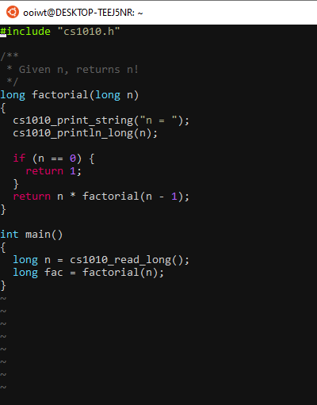

# Vim Extensions on PE Hosts

!!! abstract "Learning Objectives"

    Students should

    - understand plugins and color schemes.

## Background

CS2030S provides a minimal set of vim extensions (_i.e., plugins and color schemes_) officially.  At the beginning of the semester, students can install the same set of extensions following the [vim setup](setup.md) procedure.  The same set of official extensions will be made available during the practical exams.

Students are free to install any additional color schemes or plugins if they wish.  These additional extensions, however, are not allowed and will not be available during the practical exams.

The following are the officially supported vim extensions in CS2030S.

## Color Schemes

We installed three color schemes `~cs2030s/.vim/colors`.


The three color schemes are:

- [gruvbox](https://github.com/morhetz/gruvbox)
- [molokai](https://github.com/tomasr/molokai)
- [onedark](https://github.com/joshdick/onedark.vim)

You can change your vim color scheme using the `:color` command.  For instance,

```
:color gruvbox
```

You can add the line `color gruvbox` (without `:`) to your `~/.vimrc` so that the color scheme is loaded at the start of every vim session.

Some color schemes display differently depending on whether the background is set to `dark` or `light`

Some examples, with `set background=dark` in `~/.vimrc`:

The Vim default color scheme:


The molokai (CS2030S default) color scheme:



The gruvbox color scheme 


## Plugins

We support the [Airline plugin](https://vimawesome.com/plugin/vim-airline-superman), which provides an informative status bar in vim.
