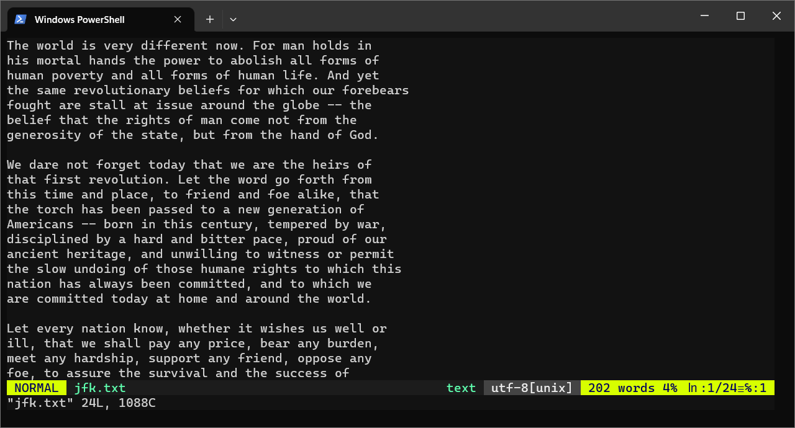
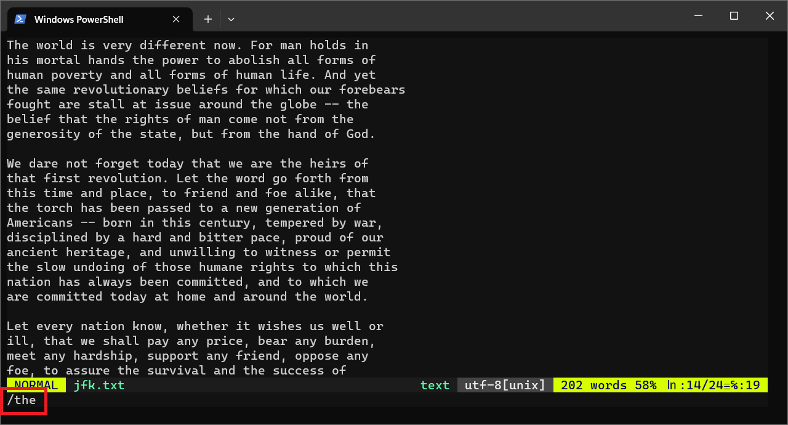

# Quick `vim` Lessons

!!! abstract "Learning Objectives"

    Students should

    - have a basic familiarity with `vim`.

Here is a quick walkthrough to get a taste of `vim`.

## Lesson 1: Preparation

### Step 1: Download

Download the following file for practice using `vim` in this session.

```Bash
$ cp ~cs2030s/jfk.txt .
```

The file named `jfk.txt` should be copied to your currentw orking directory.  You can check that the file is created by typing the following

```Bash
$ ls
```

### Step 2: Open

Now let's start your first `vim` session.  Open `vim` and load the downloaded `jfk.txt` using the following command

```bash
$ vim jfk.txt
```



## Lesson 2: Navigation

### Step 1: Moving

When you start, you will be in `NORMAL` mode.  Do not go into the `INSERT` mode yet.  Try the following exercise to get comfortable with the keys.

- Move the cursor around step-by-step backward (++h++), down (++j++), forward (++k++), and up (++l++).
- Move the cursor sentence-by-sentence forward (++parenthesis-right++) and backward (++parenthesis-left++).
- Move the cursor paragraph-by-paragraph forward (++brace-right++) and backward (++brace-left++).
- Move the cursor page-by-page forward (++control+f++) and backward (++control+b++).
- Move the cursor to the beginning of the line with ++0++.
- Move the cursor to the end of the line with ++shift+4++ (_i.e., `$`_).
- Move the cursor to the beginning of the file with ++g++ ++g++.
- Move the cursor to the end of the file with ++shift+g++ (_i.e., `G`_).

### Step 2: Searching

Now try the following steps in `NORMAL` mode:

1. Press ++slash++.
2. Type in any word (_or prefix of a word_), we recommend the word `the`.
3. Press ++enter++.

After step 2, you should see the following with your command highlighted in a red box.



This should move the cursor to the beginning of the word.  You can use ++n++ and ++shift+n++ to move to the next match and the previous match.

When you are comfortable moving around, you can type ++shift+z+z++ to exit.

Congratulations, you have just completed your first session in `vim`!

## Lesson 3: Manipulating Text

Now, we are going to open up the same file again and try to manipulate the text.  We are going to stay in the `NORMAL` mode still.

```bash
$ vim jfk.txt
```

### Step 1: Deletion

Deletion is closer to _cut_.  The deleted characters are stored in a _clipboard_.  Try the following:

- Press ++0++ ++d++ ++3++ ++w++ to move the cursor to the beginning of the line and delete three words.
- Press ++u++ to undo.  This is another lifesaver that you should remember.

In `vim`, repeating the same command twice usually means applying it to the whole line.  Pairing a command with ++shift++ (_or the capital letter version_) usually means applying the action until the end of the line.  

- Press ++d++ ++d++ to delete the current line.
- Press ++shift+d++ to delete from the current cursor until the end of the line.

### Step 2: Copy-Pasting

Pasting recovers what was stored in the clipboard.  Try the following:

- Press ++p++ to paste back what you just deleted.
- Move the cursor to somewhere else.
- Press ++p++ to paste again.

We can also copy instead of cut (or delete and put into the clipboard).

- Press ++y++ ++y++ to copy (or yank) the current line.
- Move the cursor to somewhere else.
- Press ++p++ to paste the copied line.

Remember that all these commands can be composed using the movement-action-movement pattern.

- Press ++shift+9++ ++y++ ++shift+0++ to
    - move to the beginning of the sentence: ++shift+9++ (_i.e.,_ ++brace-left++) 
    - copy (_i.e., yank_): ++y++
    - until the end of the sentence: ++shift+0++ (_i.e.,_ ++brace-right++)

As you have seen in the ++d++ ++2++ ++w++ example, you can precede an action with a number to repeat an action multiple times.

- Press ++y++ ++y++ ++9++ ++p++.
    - You should be able to understand what just happened!

### Step 3: Deleting a Character

The ++x++ command deletes the current character.

Try this exercise: At the end of the file `jfk.txt`, there are some typos:

```
libertyi. liberty.
```

Change `libertyi. liberty.` to `libtery.` by positioning the cursor on the second `i` and deleting it.  Then use ++shift+d++ to delete the extra `liberty.` at the end of the sentence.

### Step 4: Visual Mode

In addition to the `INSERT` and `NORMAL` modes, `vim` has a third mode, the `VISUAL` mode.  You can enter the `VISUAL` mode by hitting ++v++.  Once in visual mode, you can move your cursor to select the text and perform some actions on it (_e.g.,_ ++d++ or ++x++ to delete, ++y++ to yank).

Hitting ++shift+v++ will allow you to select line-by-line.

The `VISUAL` mode allows us to pipe the selected text to another Unix command, and replace it with the result of that command.

Go ahead and try the following:

1. Select a paragraph in `jfk.txt`.
2. Press ++colon++.

You will see that

```bash
:'<,'>
```

appears in the last line of the terminal.  At this point, you can type in actions that you want to perform on the selected text.  For instance,

```bash
:'<,'>w john.txt
```

will write it to a file named `john.txt`.

But, let's try the following:

```bash
:'<,'>!fmt
```

`!fmt` tells `vim` to invoke the shell and run `fmt`.  `fmt` is another simple small Unix utility that takes in a text (from standard input) and spews out formatted text in the standard output.  You will see that the width of the text has changed to the default of 65.

You can try something that we have seen before.  Select the text again, and hit

```bash
:'<,'>!wc
```

The selected text will be replaced with the output from `wc`.

### Step 5: The `:` command

You have seen examples of `:` commands for writing to a file or piping selected text to an external command.

The `:` command also enables many actions that you can do in `vim`.  Here are a few essential yet simple commands.

- To jump to a line, hit ++colon++ followed by the line number.
- To open another file, hit ++colon++ and then type in `e <filename>`
- To find help on a topic, hit ++colon++ and then type in `help <keyword>`

Other advanced features such as search-and-replace, changing preferences, splitting windows, and opening new tabs, are also accessible from the `:` command.

The `:` command prompt supports ++control+p++ and ++control+n++ for navigating back and forth your command history, just like `bash`.  It also supports ++tab++ for auto-completion.

## Lesson 3: Insert mode!

Finally, we are going to try inserting some text.  Remember, to use `INSERT` mode, we always start with the command ++i++ ++a++ ++o++ or ++s++ (may pair with ++shift++) followed by the text that
you want to insert, followed by ++esc++.

### Step 1: Insert

Let's try ++i++ (_insert_).

1. Place your cursor anywhere.
2. Press ++i++ to go into `INSERT` mode
3. Start typing.
4. When you are done, press ++esc++.

You just added some text to the file.

### Step 2: Append

Now let's try ++a++ (append).

1. Place your cursor anywhere.
2. Press ++a++.
3. Start typing.
4. When you are done, press ++esc++.

++a++ appends the text to the end of the current line.

### Step 3: Open

Now let's try ++o++ (_open_).

1. Place your cursor anywhere.
2. Press ++o++.
3. Start typing.
4. When you are done, press ++esc++.

++o++ opens up a new line for your text.

### Step 4: Substitute

Now let's try ++o++ (_open_).

1. Place your cursor anywhere.
2. Press ++s++.
3. Start typing.
4. When you are done, press ++esc++.

++s++ substitute the current character with your text.

### Step 5: Shift

Now try it with ++shift++ and see the difference in behavior.

## Learning More

You can run `vimtutor` to learn more about `vim`.

You can also check out [the tips that we have collected for CS1010](tips.md) or watch the various tutorials online.  

Here are some useful resources on `vim`:

- [Learn vim Progressively](http://yannesposito.com/Scratch/en/blog/Learn-Vim-Progressively/).
- [Vim: Precision Editing at the Speed of Thought](https://vimeo.com/53144573): A talk by Drew Neil
- [Vim Adventure](https://www.vim-adventures.com): An adventure game for learning `vim`
- [Vim Casts](http://vimcasts.org/episodes/archive/): Videos and articles for teaching `vim`
- [Vim Video Tutorials](http://derekwyatt.org/vim/tutorials/) by Derek Wyatt
- [Vim Awesome](https://vimawesome.com/): Directory of plugins.
